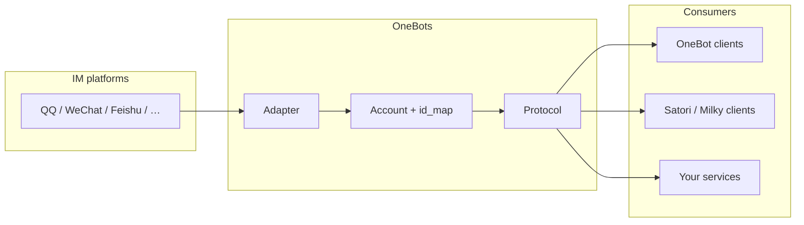

<div align="center">

# OneBots

**A multi-platform, multi-protocol IM bot gateway and framework (TypeScript / Node.js)**

*One `CommonEvent` abstraction, many platform adapters, many wire protocols (OneBot / Satori / Milky).*

[](https://github.com/lc-cn/onebots/actions/workflows/release.yml)
[](https://github.com/lc-cn/onebots/blob/master/LICENSE)
[](https://www.npmjs.com/package/onebots)
[](https://nodejs.org)
[](https://github.com/lc-cn/onebots/pkgs/container/onebots)

**[Docs](https://onebots.pages.dev)** · **[中文 README](./README.md)** · **[Issues](https://github.com/lc-cn/onebots/issues)**

</div>

---

## What problem does it solve?

You often want:

> **One process talks to many IM platforms, and exposes one or more standard protocols to plugins or your own backend**—without rewriting glue code per platform.

OneBots provides:

| Layer | Role |
|--------|------|
| **Adapter** | Maps each platform’s events & APIs to **`CommonEvent` + shared Adapter APIs** |
| **Protocol** | Turns `CommonEvent` into **OneBot v11/v12, Satori, Milky** wire formats and handles inbound API calls |
| **`@onebots/core`** | Accounts, ID map (`createId` / `resolveId`), routing, protocol registry |
| **`onebots` app** | Config, plugin loading, HTTP/WS gateway, optional **Web UI** |

### Architecture (high level)



---

## Who it is / isn’t for

**Good fit if you:**

- Need **multiple IM platforms** and a **unified internal event model** before exporting to protocols
- Want **multiple protocols on the same account** (e.g. OneBot + Satori) for different ecosystems
- Prefer **Node.js ≥24 (`.node-version` recommended) / TypeScript** and a **self-hosted gateway**

**Maybe not if you:**

- Only target **one platform with one official SDK** (e.g. Discord.js only)—that can be simpler
- Rely heavily on **Python stacks** (e.g. NoneBot plugins)—stay there or bridge explicitly

---

## Comparison (neutral)

| Aspect | Raw platform SDKs | Other bot frameworks | **OneBots** |
|--------|--------------------|----------------------|------------|
| Multi-platform abstraction | DIY | Often yes | `CommonEvent` + adapters |
| Multi-protocol export | DIY | Varies | Same account, multiple protocols |
| Stack | Any | Often Python/TS | **TS / ESM / pnpm monorepo** |
| Ecosystem size | — | Some larger | **Infrastructure-style**; grows with contributors |

---

## Features (summary)

- **15+ adapters**: QQ official, ICQQ, WeChat OA, DingTalk, Feishu, WeCom, Telegram, Slack, Discord, Kook, Teams, Line, Email, WhatsApp, Zulip, Mock, …  
- **Protocols**: OneBot v11/v12, Satori v1, Milky v1  
- **Monorepo**: `pnpm workspace` (`packages/*`, `adapters/*`, `protocols/*`)  
- **Optional Web UI**: `@onebots/web`  
- **Client SDKs**: `imhelper` + `@imhelper/*`  
- **Event flow**: `account.dispatch(commonEvent)` → each `protocol.dispatch`

---

## Quick start

### A) Docker (recommended)

**Mount a data volume** or config is lost on restart:

```bash
docker run -d -p 6727:6727 -v $(pwd)/data:/data --name onebots ghcr.io/lc-cn/onebots:master
```

See **[Docker guide](https://onebots.pages.dev/guide/docker)**.

### B) npm + Mock (no real IM)

`config.yaml` in the working directory (minimal example):

```yaml
port: 6727
log_level: info

general:
  onebot.v11:
    use_http: true
    use_ws: true

mock.demo:
  onebot.v11:
    use_http: true
    use_ws: true
```

```bash
pnpm add onebots @onebots/adapter-mock @onebots/protocol-onebot-v11
npx onebots -r mock -p onebot-v11 -c config.yaml
```

With an explicit subcommand, put **`-r` / `-p` / `-c` before `gateway`** (they attach to the root command):

```bash
npx onebots -r mock -p onebot-v11 -c config.yaml gateway start
```

Invoking `npx onebots` **with no subcommand** starts the gateway in the foreground.

**CLI flags** (see `App.loadAdapterFactory` / `App.loadProtocolFactory` in source):

| Flag | Meaning | Examples | Resolved package |
|------|---------|----------|------------------|
| `-r <name>` | Adapter short name (`AdapterRegistry`) | `mock`, `kook`, `wechat` | `@onebots/adapter-<name>` → fallbacks |
| `-p <name>` | Protocol suffix | `onebot-v11`, `onebot-v12`, `satori-v1`, `milky-v1` | `@onebots/protocol-<name>` → fallbacks |

### C) From source

```bash
git clone https://github.com/lc-cn/onebots.git
cd onebots
pnpm install
pnpm dev
pnpm build && pnpm test
```

**Requires Node.js ≥ 22.**

---

## Production usage

```bash
pnpm add onebots @onebots/adapter-<platform> @onebots/protocol-<protocol>
```

Configure **`{platform}.{account_id}`** in `general` + per-account blocks. Full reference: **[documentation](https://onebots.pages.dev)**.

Start:

```bash
npx onebots -r kook -p onebot-v11 -c config.yaml
```

Downstream **imhelper** clients: **[Client SDK guide](https://onebots.pages.dev/guide/client-sdk)**.

---

## Repo layout

- `packages/core` — `@onebots/core`  
- `packages/onebots` — CLI & gateway  
- `packages/web` — Web admin  
- `packages/imhelper` — client SDK core  
- `adapters/*` — `@onebots/adapter-*`  
- `protocols/*` — `@onebots/protocol-*` + `@imhelper/*` SDKs  
- `docs/` — VitePress source  

More: [packages/core/ARCHITECTURE.md](./packages/core/ARCHITECTURE.md)

---

## Contributing

```bash
pnpm build
pnpm test
pnpm changeset
```

[CONTRIBUTING.md](./CONTRIBUTING.md)

---

## License

[MIT](./LICENSE)

---

## Acknowledgements

- [icqqjs/icqq](https://github.com/icqqjs/icqq)  
- [takayama-lily/node-onebot](https://github.com/takayama-lily/node-onebot)  
- [zhinjs/kook-client](https://github.com/zhinjs/kook-client)  
- [zhinjs/qq-official-bot](https://github.com/zhinjs/qq-official-bot)  

---

<div align="center">

If OneBots helps you, consider a ⭐ on [GitHub](https://github.com/lc-cn/onebots).

Made with ❤️ by 凉菜 & contributors

</div>
