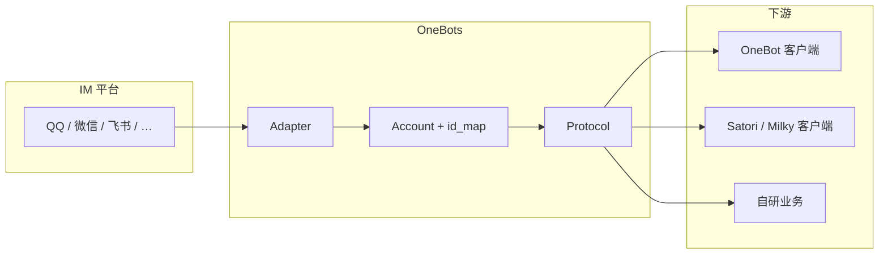

<div align="center">

# OneBots

**多平台、多协议的即时通讯机器人网关与框架（TypeScript / Node.js）**

*One multi-platform bot gateway: one `CommonEvent` model, many adapters, many wire protocols (OneBot / Satori / Milky).*

[](https://github.com/lc-cn/onebots/actions/workflows/release.yml)
[](https://github.com/lc-cn/onebots/blob/master/LICENSE)
[](https://www.npmjs.com/package/onebots)
[](https://nodejs.org)
[](https://www.typescriptlang.org/)
[](https://github.com/lc-cn/onebots/pkgs/container/onebots)

[](https://onebot.dev/)
[](https://12.onebot.dev/)
[](https://satori.js.org/)
[](https://github.com/aspect-y/milky)

**[📚 在线文档](https://onebots.pages.dev)** · **[English README](./README.en.md)** · **[Issues](https://github.com/lc-cn/onebots/issues)** · **QQ 群 [860669870](https://jq.qq.com/?_wv=1027&k=B22VGXov)**

</div>

---

## 它解决什么问题？

你想做的往往是这件事：

> **在一个进程里接多个 IM 平台，又用同一套（或多套）开放协议暴露给下游插件 / 业务**——而不是每个平台写一遍胶水代码。

OneBots 提供：

| 层次 | 作用 |
|------|------|
| **Adapter（适配器）** | 把各平台原始事件与 API，变成统一的 **`CommonEvent` + 通用 Adapter API** |
| **Protocol（协议）** | 把 `CommonEvent` 转成 **OneBot v11/v12、Satori、Milky** 等对外报文，并处理入站调用 |
| **`@onebots/core`** | 账号、ID 映射（`createId` / `resolveId`）、路由、协议注册等 **共用内核** |
| **`onebots` 主包** | 配置、加载插件、HTTP/WS 网关、可选 **Web 管理端** |

### 架构一瞥



---

## 适合谁？不适合谁？

**更适合：**

- 要 **多平台接入**，且希望事件与 ID 在框架内 **先统一、再按协议导出**
- 要 **同一账号同时开 OneBot + Satori + Milky** 等，给不同生态用
- 技术栈是 **Node.js 22+ / TypeScript**，接受 **自部署网关**

**未必适合：**

- 只做 **单一平台、单一 SDK**（例如只做 Discord.js）——直接官方 SDK 更简单
- 强依赖 **Python 生态**（如大量 NoneBot 插件）——更适合留在 NoneBot / 桥接方案

---

## 和其他方案怎么选？（中性对比）

| 维度 | 直连各平台 SDK | 其他机器人框架 | **OneBots** |
|------|----------------|----------------|------------|
| 多平台抽象 | 自己封装 | 多数有 | ✅ `CommonEvent` + 多适配器 |
| 多协议对外 | 自己实现 | 视项目 | ✅ 同账号多协议 |
| 技术栈 | 任意 | 多为 Python/TS | **TS / ESM / pnpm monorepo** |
| 社区与插件量 | — | 部分更成熟 | 偏 **基础设施定位**，插件生态靠社区增长 |

没有「唯一正确」选型；OneBots 更偏 **自托管的 IM 机器人中台 + 协议出口**。

---

## 核心特性（摘要）

- **15+ 平台适配器**：QQ 官方、ICQQ、微信、钉钉、飞书、企业微信、Telegram、Slack、Discord、Kook、Teams、Line、邮件、WhatsApp、Zulip 等（详见下文列表）
- **多协议**：OneBot v11 / v12、Satori v1、Milky v1
- **Monorepo**：`pnpm workspace` — `packages/*`、`adapters/*`、`protocols/*`
- **可选 Web 管理界面**：`@onebots/web`
- **客户端 SDK 体系**：`imhelper` + `@imhelper/*` 协议客户端（连本网关或其他兼容实现）
- **事件驱动**：适配器 `account.dispatch(commonEvent)` → 各协议 `dispatch`

---

## 五分钟上手

### 方式 A：Docker（推荐）

**务必挂载数据目录**，否则重启丢配置：

```bash
docker run -d -p 6727:6727 -v $(pwd)/data:/data --name onebots ghcr.io/lc-cn/onebots:master
```

首次运行后在 `./data` 生成 `config.yaml`。详见 **[文档：Docker 部署](https://onebots.pages.dev/guide/docker)**（含 Hugging Face Spaces）。

### 方式 B：npm 安装（Mock 试跑）

安装依赖后，与同目录下 **`config.yaml`** 一起启动（无文件时会自动生成模板，建议先手写最小 Mock 配置如下）：

```yaml
port: 6727
log_level: info

general:
  onebot.v11:
    use_http: true
    use_ws: true

# 平台名 mock + 账号名 demo，对应适配器注册的 platform「mock」
mock.demo:
  onebot.v11:
    use_http: true
    use_ws: true
```

```bash
pnpm add onebots @onebots/adapter-mock @onebots/protocol-onebot-v11
npx onebots -r mock -p onebot-v11 -c config.yaml
```

无子命令时，上述命令即 **前台启动网关**。若要写子命令，请把 **`-r` / `-p` / `-c` 放在 `gateway` 之前**（Commander 把它们挂在根命令上），例如：

```bash
npx onebots -r mock -p onebot-v11 -c config.yaml gateway start
```

**CLI `-r` / `-p` 与包名对应关系**（源码：`App.loadAdapterFactory` / `App.loadProtocolFactory`）：

| 参数 | 含义 | 示例 | 将尝试加载的模块 |
|------|------|------|------------------|
| `-r <name>` | 适配器短名（与 `AdapterRegistry` 一致） | `mock`、`kook`、`wechat` | `@onebots/adapter-<name>` → `onebots-adapter-<name>` → `<name>` |
| `-p <name>` | 协议包名去掉前缀后的后缀 | `onebot-v11`、`satori-v1`、`milky-v1` | `@onebots/protocol-<name>` → … |

`adapter-mock` 仅用于本地打通 HTTP/WS 与协议层，**不接真实 IM**。

### 方式 C：源码开发

```bash
git clone https://github.com/lc-cn/onebots.git
cd onebots
pnpm install
pnpm dev              # 网关
pnpm docs:dev         # 文档站点（可选）
pnpm web:dev          # Web 前端（可选）
pnpm build && pnpm test
```

**要求：Node.js ≥ 22**（见 `package.json` engines）。

---

## 使用指南（生产路径）

### 1. 安装主包与插件

```bash
pnpm add onebots
pnpm add @onebots/adapter-<platform>
# 如需多协议，继续安装 @onebots/protocol-onebot-v11 等
```

### 2. 配置文件 `config.yaml`

最小思路：`general` 里写协议默认；**`{platform}.{account_id}`** 下写账号与平台密钥。完整字段见 **[官方文档 - 配置](https://onebots.pages.dev)**。

```yaml
port: 6727
log_level: info

general:
  onebot.v11:
    use_http: true
    use_ws: true
    access_token: ''

kook.zhin:
  token: 'your_kook_token'
  onebot.v11:
    access_token: 'optional'
```

### 3. 启动

```bash
npx onebots -r kook -r qq -p onebot-v11 -p onebot-v12 -c config.yaml
```

或以代码 `App` 启动（见 [`packages/onebots/README.md`](./packages/onebots/README.md)）。

### 4. 下游客户端（imhelper）

```bash
pnpm add imhelper @imhelper/onebot-v11
```

示例与更多协议见 **[客户端 SDK 指南](https://onebots.pages.dev/guide/client-sdk)**。

---

## 支持的平台与协议

**平台（节选）**

| 平台 | 包 |
|------|-----|
| QQ 官方机器人 | `@onebots/adapter-qq` |
| ICQQ | `@onebots/adapter-icqq`（私有源配置见文档） |
| Kook | `@onebots/adapter-kook` |
| 微信公众号 | `@onebots/adapter-wechat` |
| Discord / Telegram / Slack / … | `@onebots/adapter-discord` 等 |
| 飞书 / 钉钉 / 企业微信 | `@onebots/adapter-feishu` 等 |

完整列表见 **仓库目录 [`adapters/`](./adapters/)** 与 **[文档](https://onebots.pages.dev)**。

**协议**

| 协议 | 包 |
|------|-----|
| OneBot v11 | `@onebots/protocol-onebot-v11` |
| OneBot v12 | `@onebots/protocol-onebot-v12` |
| Satori v1 | `@onebots/protocol-satori-v1` |
| Milky v1 | `@onebots/protocol-milky-v1` |

---

## 仓库结构（Monorepo）

<details>
<summary><b>展开目录树（与包命名）</b></summary>

```
onebots/
├── packages/
│   ├── core/           # @onebots/core — 适配器、协议、账号、ID、路由
│   ├── onebots/        # onebots — 网关主程序、CLI
│   ├── web/            # @onebots/web — 管理端
│   └── imhelper/       # 客户端 SDK 核心
├── adapters/           # @onebots/adapter-*
├── protocols/          # @onebots/protocol-* + @imhelper/* SDK
├── docs/               # VitePress 文档源码
└── __tests__/          # 集成/协议测试
```

**命名约定**

- 服务端：`@onebots/*`
- 协议客户端：`imhelper`、`@imhelper/*`

</details>

---

## 文档与链接

| 资源 | 链接 |
|------|------|
| 在线文档 | https://onebots.pages.dev |
| 架构说明 | [packages/core/ARCHITECTURE.md](./packages/core/ARCHITECTURE.md) |
| 核心包 | [packages/core/README.md](./packages/core/README.md) |
| 主应用包 | [packages/onebots/README.md](./packages/onebots/README.md) |

---

## 开发与贡献

```bash
pnpm build
pnpm test
pnpm changeset          # 发版前变更集
```

- 添加适配器：继承 `Adapter`，注册到 `AdapterRegistry`（参见现有 `adapters/*`）
- 添加协议：实现 `Protocol`，注册到 `ProtocolRegistry`（参见 `protocols/*`）
- 贡献指南：[CONTRIBUTING.md](./CONTRIBUTING.md)

---

## 许可证

[MIT](./LICENSE)

---

## 鸣谢

- [icqqjs/icqq](https://github.com/icqqjs/icqq)
- [takayama-lily/node-onebot](https://github.com/takayama-lily/node-onebot)
- [zhinjs/kook-client](https://github.com/zhinjs/kook-client)
- [zhinjs/qq-official-bot](https://github.com/zhinjs/qq-official-bot)

---

<div align="center">

**如果觉得有用，欢迎在 [GitHub](https://github.com/lc-cn/onebots) 点一颗 ⭐**

Made with ❤️ by 凉菜 & contributors

</div>
