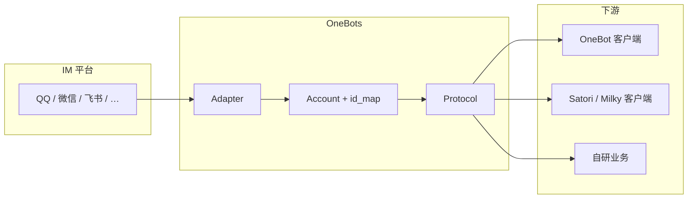

<div align="center">

# OneBots

**多平台、多协议的即时通讯机器人网关与框架（TypeScript / Node.js）**

_One multi-platform bot gateway: one `CommonEvent` model, many adapters, many wire protocols (OneBot / Satori / Milky)._

[](https://github.com/lc-cn/onebots/actions/workflows/release.yml) [](https://github.com/lc-cn/onebots/blob/master/LICENSE) [](https://www.npmjs.com/package/onebots) [](https://nodejs.org) [](https://www.typescriptlang.org/) [](https://github.com/lc-cn/onebots/pkgs/container/onebots)

[](https://onebot.dev/) [](https://12.onebot.dev/) [](https://satori.js.org/) [](https://github.com/aspect-y/milky)

**[📚 在线文档](https://onebots.pages.dev)** · **[English README](./README.en.md)** · **[Issues](https://github.com/lc-cn/onebots/issues)** · **QQ 群 [860669870](https://jq.qq.com/?_wv=1027&k=B22VGXov)**

</div>

---

## 它解决什么问题？

你想做的往往是这件事：

> **在一个进程里接多个 IM 平台，又用同一套（或多套）开放协议暴露给下游插件 / 业务**——而不是每个平台写一遍胶水代码。

OneBots 提供：

| 层次                  | 作用                                                                               |
| --------------------- | ---------------------------------------------------------------------------------- |
| **Adapter（适配器）** | 把各平台原始事件与 API，变成统一的 **`CommonEvent` + 通用 Adapter API**            |
| **Protocol（协议）**  | 把 `CommonEvent` 转成 **OneBot v11/v12、Satori、Milky** 等对外报文，并处理入站调用 |
| **`@onebots/core`**   | 账号、ID 映射（`createId` / `resolveId`）、路由、协议注册等 **共用内核**           |
| **`onebots` 主包**    | 配置、加载插件、HTTP/WS 网关、可选 **Web 管理端**                                  |

### 架构一瞥


```mermaid
flowchart LR
  subgraph IM["IM 平台"]
        A1[QQ / 微信 / 飞书 / …]
  end
  subgraph OB["OneBots"]
        B[Adapter]
        C[Account + id_map]
        D[Protocol]
  end
  subgraph Down["下游"]
        E[OneBot 客户端]
        F[Satori / Milky 客户端]
        G[自研业务]
  end
  A1 --> B --> C --> D
  D --> E
  D --> F
  D --> G
```

---

## 适合谁？不适合谁？

**更适合：**

- 要 **多平台接入**，且希望事件与 ID 在框架内 **先统一、再按协议导出**
- 要 **同一账号同时开 OneBot + Satori + Milky** 等，给不同生态用
- 技术栈是 **Node.js ≥24（推荐与 `.node-version` 一致）/ TypeScript**，接受 **自部署网关**

**未必适合：**

- 只做 **单一平台、单一 SDK**（例如只做 Discord.js）——直接官方 SDK 更简单
- 强依赖 **Python 生态**（如大量 NoneBot 插件）——更适合留在 NoneBot / 桥接方案

---

## 和其他方案怎么选？（中性对比）

| 维度         | 直连各平台 SDK | 其他机器人框架 | **OneBots**                             |
| ------------ | -------------- | -------------- | --------------------------------------- |
| 多平台抽象   | 自己封装       | 多数有         | ✅ `CommonEvent` + 多适配器             |
| 多协议对外   | 自己实现       | 视项目         | ✅ 同账号多协议                         |
| 技术栈       | 任意           | 多为 Python/TS | **TS / ESM / pnpm monorepo**            |
| 社区与插件量 | —              | 部分更成熟     | 偏 **基础设施定位**，插件生态靠社区增长 |

没有「唯一正确」选型；OneBots 更偏 **自托管的 IM 机器人中台 + 协议出口**。

---

## 核心特性（摘要）

- **20+ 平台适配器**：QQ 官方、ICQQ、微信、钉钉、飞书、企业微信、Telegram、Slack、Discord、Kook、黑盒语音、Teams、Line、邮件、WhatsApp、Zulip、Matrix、Google Chat、Facebook Messenger 等（详见下文列表）
- **多协议**：OneBot v11 / v12、Satori v1、Milky v1
- **Monorepo**：`pnpm workspace` — `packages/*`、`adapters/*`、`protocols/*`
- **可选 Web 管理界面**：`@onebots/web`
- **客户端 SDK 体系**：`imhelper` + `@imhelper/*` 协议客户端（连本网关或其他兼容实现）
- **事件驱动**：适配器 `account.dispatch(commonEvent)` → 各协议 `dispatch`

---

<!-- protocol-api-matrix:start -->

## 协议 API × 平台支持矩阵

这里展示各协议标准 API 在不同平台适配器上的默认能力。`✅` 平台原生支持，`◐` 由 OneBots 组合或有损模拟，`◆` 由协议层直接提供，`—` 当前不支持。账号权限、套餐、事件订阅和会话上下文可能进一步限制实际可用性；平台原生扩展动作未列入此表。

矩阵由协议动作目录和适配器能力清单自动生成，可运行 `pnpm readme:capabilities` 更新。

<details open>
<summary><b>OneBot v11（40 个标准 API）</b></summary>

| API | <span title="钉钉">钉<br>钉</span> | <span title="Discord">D<br>i<br>s<br>c<br>o<br>r<br>d</span> | <span title="邮件">邮<br>件</span> | <span title="Messenger">M<br>e<br>s<br>s<br>e<br>n<br>g<br>e<br>r</span> | <span title="飞书">飞<br>书</span> | <span title="Google Chat">G<br>o<br>o<br>g<br>l<br>e<br>C<br>h<br>a<br>t</span> | <span title="黑盒">黑<br>盒</span> | <span title="ICQQ">I<br>C<br>Q<br>Q</span> | <span title="KOOK">K<br>O<br>O<br>K</span> | <span title="LINE">L<br>I<br>N<br>E</span> | <span title="Matrix">M<br>a<br>t<br>r<br>i<br>x</span> | <span title="QQ">Q<br>Q</span> | <span title="Slack">S<br>l<br>a<br>c<br>k</span> | <span title="Teams">T<br>e<br>a<br>m<br>s</span> | <span title="TG">T<br>G</span> | <span title="微信">微<br>信</span> | <span title="ClawBot">C<br>l<br>a<br>w<br>B<br>o<br>t</span> | <span title="企微">企<br>微</span> | <span title="企微客服">企<br>微<br>客<br>服</span> | <span title="WA">W<br>A</span> | <span title="Zulip">Z<br>u<br>l<br>i<br>p</span> |
| :--- | :---: | :---: | :---: | :---: | :---: | :---: | :---: | :---: | :---: | :---: | :---: | :---: | :---: | :---: | :---: | :---: | :---: | :---: | :---: | :---: | :---: |
| `send_private_msg` | — | — | ✅ | ✅ | — | ✅ | — | — | — | — | ✅ | ✅ | ✅ | ✅ | — | — | — | ✅ | ✅ | — | ✅ |
| `send_group_msg` | ✅ | — | — | — | ✅ | ✅ | — | ✅ | — | ✅ | ✅ | ✅ | — | ✅ | ✅ | — | — | ✅ | — | ✅ | ✅ |
| `send_msg` | ✅ | ✅ | ✅ | ✅ | ✅ | ✅ | ✅ | ✅ | ✅ | ✅ | ✅ | ✅ | ✅ | ✅ | ✅ | ✅ | ✅ | ✅ | ✅ | ✅ | ✅ |
| `delete_msg` | ✅ | ✅ | ✅ | — | ✅ | ✅ | ✅ | ✅ | ✅ | — | ✅ | ✅ | ✅ | ✅ | ✅ | — | — | ✅ | — | — | ✅ |
| `get_msg` | — | ✅ | ✅ | ✅ | ✅ | ✅ | — | ✅ | ✅ | — | ✅ | ✅ | ✅ | — | — | — | — | — | — | — | ✅ |
| `get_forward_msg` | — | — | — | — | — | — | — | ✅ | — | — | — | — | — | — | — | — | — | — | — | — | — |
| `send_like` | — | — | — | — | — | — | — | ✅ | — | — | — | — | — | — | — | — | — | — | — | — | — |
| `set_group_kick` | ✅ | — | — | — | ✅ | ✅ | ✅ | ✅ | — | — | ✅ | — | — | — | ✅ | — | — | — | — | ✅ | ✅ |
| `invite_friend_to_group` | ✅ | — | — | — | — | ✅ | — | ✅ | — | — | ✅ | — | — | — | — | — | — | — | — | — | ✅ |
| `set_group_ban` | — | — | — | — | — | — | ✅ | ✅ | — | — | — | — | — | — | ✅ | — | — | — | — | — | — |
| `set_group_anonymous_ban` | — | — | — | — | — | — | — | ✅ | — | — | — | — | — | — | — | — | — | — | — | — | — |
| `set_group_whole_ban` | — | — | — | — | — | — | — | ✅ | — | — | — | — | — | — | — | — | — | — | — | — | — |
| `set_group_admin` | — | — | — | — | — | — | — | ✅ | — | — | — | — | — | — | ✅ | — | — | — | — | — | — |
| `set_group_anonymous` | — | — | — | — | — | — | — | ✅ | — | — | — | — | — | — | — | — | — | — | — | — | — |
| `set_group_card` | — | — | — | — | — | — | ✅ | ✅ | — | — | — | — | — | — | — | — | — | — | — | — | — |
| `set_group_name` | ✅ | — | — | — | ✅ | ✅ | — | ✅ | — | — | ✅ | — | — | — | ✅ | — | — | — | — | ✅ | ✅ |
| `set_group_leave` | — | — | — | — | ✅ | ✅ | ✅ | ✅ | — | ✅ | ✅ | — | — | — | ✅ | — | — | — | — | — | ✅ |
| `set_group_special_title` | — | — | — | — | — | — | — | ✅ | — | — | — | — | — | — | ✅ | — | — | — | — | — | — |
| `set_friend_add_request` | — | — | — | — | — | — | — | ✅ | ✅ | — | — | — | — | — | — | — | — | — | — | — | — |
| `accept_friend_request` | — | — | — | — | — | — | — | ✅ | ✅ | — | — | — | — | — | — | — | — | — | — | — | — |
| `set_group_add_request` | — | — | — | — | — | — | — | ✅ | — | — | ✅ | — | — | — | ✅ | — | — | — | — | ✅ | — |
| `get_login_info` | ◆ | ◆ | ◆ | ◆ | ◆ | ◆ | ◆ | ◆ | ◆ | ◆ | ◆ | ◆ | ◆ | ◆ | ◆ | ◆ | ◆ | ◆ | ◆ | ◆ | ◆ |
| `get_stranger_info` | ✅ | ✅ | ◐ | ✅ | ✅ | ✅ | — | ✅ | ✅ | ✅ | ✅ | — | ✅ | — | — | ✅ | — | ✅ | ✅ | ◐ | ✅ |
| `get_friend_list` | ◐ | — | — | — | ✅ | — | — | ✅ | ✅ | ✅ | — | — | ✅ | — | — | ✅ | — | — | — | — | — |
| `get_group_info` | ✅ | — | — | — | ✅ | ✅ | ✅ | ✅ | — | ✅ | ✅ | ✅ | — | ✅ | ✅ | — | — | ✅ | — | ✅ | ◐ |
| `get_group_list` | — | — | — | — | ✅ | ✅ | ✅ | ✅ | — | ◐ | ✅ | — | — | ✅ | — | — | — | — | — | ✅ | ◐ |
| `get_group_member_info` | ◐ | — | — | — | ✅ | ✅ | ✅ | ✅ | — | ✅ | ✅ | — | — | ✅ | ✅ | — | — | ✅ | — | ✅ | ✅ |
| `get_group_member_list` | ✅ | — | — | — | ✅ | ✅ | ✅ | ✅ | — | ✅ | ✅ | — | — | ✅ | — | — | — | ✅ | — | ✅ | ✅ |
| `get_group_honor_info` | — | — | — | — | — | — | — | — | — | — | — | — | — | — | — | — | — | — | — | — | — |
| `get_cookies` | — | — | — | — | — | — | — | ✅ | — | — | — | — | — | — | — | — | — | — | — | — | — |
| `get_csrf_token` | — | — | — | — | — | — | — | ✅ | — | — | — | — | — | — | — | — | — | — | — | — | — |
| `get_credentials` | — | — | — | — | — | — | — | ✅ | — | — | — | — | — | — | — | — | — | — | — | — | — |
| `get_record` | — | — | — | — | — | — | — | — | — | — | — | — | — | — | — | — | — | — | — | — | — |
| `get_image` | — | — | — | — | — | — | — | — | — | — | — | — | — | — | — | — | — | — | — | — | — |
| `can_send_image` | — | ✅ | ✅ | ✅ | — | ✅ | ✅ | ✅ | — | ✅ | ✅ | ✅ | — | — | — | ✅ | ✅ | ✅ | ✅ | ✅ | ✅ |
| `can_send_record` | — | ✅ | ✅ | ✅ | — | ✅ | ✅ | ✅ | — | ✅ | ✅ | ✅ | — | — | — | ✅ | ✅ | ✅ | ✅ | ✅ | ✅ |
| `get_status` | ✅ | ✅ | ✅ | ✅ | ✅ | ✅ | ✅ | ✅ | ✅ | ✅ | ✅ | ✅ | ✅ | ✅ | ✅ | ✅ | ✅ | ✅ | ✅ | ✅ | ✅ |
| `get_version_info` | ✅ | ✅ | ✅ | ✅ | ✅ | ✅ | ✅ | ✅ | ✅ | ✅ | ✅ | ✅ | ✅ | ✅ | ✅ | ✅ | ✅ | ✅ | ✅ | ✅ | ✅ |
| `set_restart` | — | — | — | — | — | — | — | — | — | — | — | — | — | — | — | — | — | — | — | — | — |
| `clean_cache` | — | — | — | — | — | — | — | ✅ | — | — | — | — | — | — | — | — | — | — | — | — | — |

</details>

<details>
<summary><b>OneBot v12（27 个标准 API）</b></summary>

| API | <span title="钉钉">钉<br>钉</span> | <span title="Discord">D<br>i<br>s<br>c<br>o<br>r<br>d</span> | <span title="邮件">邮<br>件</span> | <span title="Messenger">M<br>e<br>s<br>s<br>e<br>n<br>g<br>e<br>r</span> | <span title="飞书">飞<br>书</span> | <span title="Google Chat">G<br>o<br>o<br>g<br>l<br>e<br>C<br>h<br>a<br>t</span> | <span title="黑盒">黑<br>盒</span> | <span title="ICQQ">I<br>C<br>Q<br>Q</span> | <span title="KOOK">K<br>O<br>O<br>K</span> | <span title="LINE">L<br>I<br>N<br>E</span> | <span title="Matrix">M<br>a<br>t<br>r<br>i<br>x</span> | <span title="QQ">Q<br>Q</span> | <span title="Slack">S<br>l<br>a<br>c<br>k</span> | <span title="Teams">T<br>e<br>a<br>m<br>s</span> | <span title="TG">T<br>G</span> | <span title="微信">微<br>信</span> | <span title="ClawBot">C<br>l<br>a<br>w<br>B<br>o<br>t</span> | <span title="企微">企<br>微</span> | <span title="企微客服">企<br>微<br>客<br>服</span> | <span title="WA">W<br>A</span> | <span title="Zulip">Z<br>u<br>l<br>i<br>p</span> |
| :--- | :---: | :---: | :---: | :---: | :---: | :---: | :---: | :---: | :---: | :---: | :---: | :---: | :---: | :---: | :---: | :---: | :---: | :---: | :---: | :---: | :---: |
| `send_message` | ✅ | ✅ | ✅ | ✅ | ✅ | ✅ | ✅ | ✅ | ✅ | ✅ | ✅ | ✅ | ✅ | ✅ | ✅ | ✅ | ✅ | ✅ | ✅ | ✅ | ✅ |
| `delete_message` | ✅ | ✅ | ✅ | — | ✅ | ✅ | ✅ | ✅ | ✅ | — | ✅ | ✅ | ✅ | ✅ | ✅ | — | — | ✅ | — | — | ✅ |
| `get_self_info` | ◆ | ◆ | ◆ | ◆ | ◆ | ◆ | ◆ | ◆ | ◆ | ◆ | ◆ | ◆ | ◆ | ◆ | ◆ | ◆ | ◆ | ◆ | ◆ | ◆ | ◆ |
| `get_supported_actions` | ◆ | ◆ | ◆ | ◆ | ◆ | ◆ | ◆ | ◆ | ◆ | ◆ | ◆ | ◆ | ◆ | ◆ | ◆ | ◆ | ◆ | ◆ | ◆ | ◆ | ◆ |
| `get_status` | ✅ | ✅ | ✅ | ✅ | ✅ | ✅ | ✅ | ✅ | ✅ | ✅ | ✅ | ✅ | ✅ | ✅ | ✅ | ✅ | ✅ | ✅ | ✅ | ✅ | ✅ |
| `get_version` | ✅ | ✅ | ✅ | ✅ | ✅ | ✅ | ✅ | ✅ | ✅ | ✅ | ✅ | ✅ | ✅ | ✅ | ✅ | ✅ | ✅ | ✅ | ✅ | ✅ | ✅ |
| `get_user_info` | ✅ | ✅ | ◐ | ✅ | ✅ | ✅ | — | ✅ | ✅ | ✅ | ✅ | — | ✅ | — | — | ✅ | — | ✅ | ✅ | ◐ | ✅ |
| `get_friend_list` | ◐ | — | — | — | ✅ | — | — | ✅ | ✅ | ✅ | — | — | ✅ | — | — | ✅ | — | — | — | — | — |
| `get_group_info` | ✅ | — | — | — | ✅ | ✅ | ✅ | ✅ | — | ✅ | ✅ | ✅ | — | ✅ | ✅ | — | — | ✅ | — | ✅ | ◐ |
| `get_group_list` | — | — | — | — | ✅ | ✅ | ✅ | ✅ | — | ◐ | ✅ | — | — | ✅ | — | — | — | — | — | ✅ | ◐ |
| `get_group_member_info` | ◐ | — | — | — | ✅ | ✅ | ✅ | ✅ | — | ✅ | ✅ | — | — | ✅ | ✅ | — | — | ✅ | — | ✅ | ✅ |
| `get_group_member_list` | ✅ | — | — | — | ✅ | ✅ | ✅ | ✅ | — | ✅ | ✅ | — | — | ✅ | — | — | — | ✅ | — | ✅ | ✅ |
| `set_group_name` | ✅ | — | — | — | ✅ | ✅ | — | ✅ | — | — | ✅ | — | — | — | ✅ | — | — | — | — | ✅ | ✅ |
| `leave_group` | — | — | — | — | ✅ | ✅ | ✅ | ✅ | — | ✅ | ✅ | — | — | — | ✅ | — | — | — | — | — | ✅ |
| `invite_friend_to_group` | ✅ | — | — | — | — | ✅ | — | ✅ | — | — | ✅ | — | — | — | — | — | — | — | — | — | ✅ |
| `accept_friend_request` | — | — | — | — | — | — | — | ✅ | ✅ | — | — | — | — | — | — | — | — | — | — | — | — |
| `handle_friend_request` | — | — | — | — | — | — | — | ✅ | ✅ | — | — | — | — | — | — | — | — | — | — | — | — |
| `handle_group_request` | — | — | — | — | — | — | — | ✅ | — | — | ✅ | — | — | — | ✅ | — | — | — | — | ✅ | — |
| `get_guild_info` | — | ✅ | — | — | — | — | ✅ | ✅ | ✅ | — | — | ✅ | — | — | — | — | — | — | — | — | — |
| `get_guild_list` | — | ✅ | — | — | — | — | ✅ | ✅ | ✅ | — | — | ✅ | — | — | — | — | — | — | — | — | — |
| `get_guild_member_info` | — | ✅ | — | — | — | — | ✅ | ✅ | ✅ | — | — | ✅ | — | — | — | — | — | — | — | — | — |
| `get_guild_member_list` | — | ✅ | — | — | — | — | ✅ | ✅ | ✅ | — | — | ✅ | — | — | — | — | — | — | — | — | — |
| `get_channel_info` | — | ✅ | — | — | — | — | ✅ | ✅ | ✅ | — | — | ✅ | ✅ | — | — | — | — | — | — | — | — |
| `get_channel_list` | — | ✅ | — | — | — | — | ✅ | ✅ | ✅ | — | — | ✅ | ✅ | — | — | — | — | — | — | — | — |
| `set_channel_name` | — | ✅ | — | — | — | — | ✅ | — | ✅ | — | — | ✅ | ✅ | — | — | — | — | — | — | — | — |
| `get_channel_member_info` | — | — | — | — | — | — | — | — | — | — | — | — | ✅ | — | — | — | — | — | — | — | — |
| `get_channel_member_list` | — | — | — | — | — | — | — | — | ✅ | — | — | — | ✅ | — | — | — | — | — | — | — | — |

</details>

<details>
<summary><b>Satori v1（26 个标准 API）</b></summary>

| API | <span title="钉钉">钉<br>钉</span> | <span title="Discord">D<br>i<br>s<br>c<br>o<br>r<br>d</span> | <span title="邮件">邮<br>件</span> | <span title="Messenger">M<br>e<br>s<br>s<br>e<br>n<br>g<br>e<br>r</span> | <span title="飞书">飞<br>书</span> | <span title="Google Chat">G<br>o<br>o<br>g<br>l<br>e<br>C<br>h<br>a<br>t</span> | <span title="黑盒">黑<br>盒</span> | <span title="ICQQ">I<br>C<br>Q<br>Q</span> | <span title="KOOK">K<br>O<br>O<br>K</span> | <span title="LINE">L<br>I<br>N<br>E</span> | <span title="Matrix">M<br>a<br>t<br>r<br>i<br>x</span> | <span title="QQ">Q<br>Q</span> | <span title="Slack">S<br>l<br>a<br>c<br>k</span> | <span title="Teams">T<br>e<br>a<br>m<br>s</span> | <span title="TG">T<br>G</span> | <span title="微信">微<br>信</span> | <span title="ClawBot">C<br>l<br>a<br>w<br>B<br>o<br>t</span> | <span title="企微">企<br>微</span> | <span title="企微客服">企<br>微<br>客<br>服</span> | <span title="WA">W<br>A</span> | <span title="Zulip">Z<br>u<br>l<br>i<br>p</span> |
| :--- | :---: | :---: | :---: | :---: | :---: | :---: | :---: | :---: | :---: | :---: | :---: | :---: | :---: | :---: | :---: | :---: | :---: | :---: | :---: | :---: | :---: |
| `message.create` | ✅ | ✅ | ✅ | ✅ | ✅ | ✅ | ✅ | ✅ | ✅ | ✅ | ✅ | ✅ | ✅ | ✅ | ✅ | ✅ | ✅ | ✅ | ✅ | ✅ | ✅ |
| `message.get` | — | ✅ | ✅ | ✅ | ✅ | ✅ | — | ✅ | ✅ | — | ✅ | ✅ | ✅ | — | — | — | — | — | — | — | ✅ |
| `message.delete` | ✅ | ✅ | ✅ | — | ✅ | ✅ | ✅ | ✅ | ✅ | — | ✅ | ✅ | ✅ | ✅ | ✅ | — | — | ✅ | — | — | ✅ |
| `message.update` | — | — | — | — | ✅ | ✅ | ✅ | — | ✅ | — | ✅ | — | ✅ | ✅ | ✅ | — | — | — | — | — | ✅ |
| `message.list` | — | ✅ | ✅ | ✅ | — | ✅ | — | ✅ | — | — | ✅ | — | — | — | — | — | — | — | — | — | ✅ |
| `reaction.create` | — | — | — | — | — | ✅ | — | ✅ | ✅ | — | ✅ | — | — | ✅ | — | — | — | — | — | — | — |
| `reaction.delete` | — | — | — | — | — | ✅ | — | ✅ | ✅ | — | ✅ | — | — | ✅ | — | — | — | — | — | — | — |
| `channel.get` | — | ✅ | — | — | — | — | ✅ | ✅ | ✅ | — | — | ✅ | ✅ | — | — | — | — | — | — | — | — |
| `channel.list` | — | ✅ | — | — | — | — | ✅ | ✅ | ✅ | — | — | ✅ | ✅ | — | — | — | — | — | — | — | — |
| `channel.create` | — | ✅ | — | — | — | — | ✅ | — | ✅ | — | — | ✅ | ✅ | — | — | — | — | — | — | — | — |
| `channel.update` | — | ✅ | — | — | — | — | ✅ | — | ✅ | — | — | ✅ | ✅ | — | — | — | — | — | — | — | — |
| `channel.delete` | — | ✅ | — | — | — | — | ✅ | — | ✅ | — | — | ✅ | ✅ | — | — | — | — | — | — | — | — |
| `guild.get` | — | ✅ | — | — | — | — | ✅ | ✅ | ✅ | — | — | ✅ | — | — | — | — | — | — | — | — | — |
| `guild.list` | — | ✅ | — | — | — | — | ✅ | ✅ | ✅ | — | — | ✅ | — | — | — | — | — | — | — | — | — |
| `guild.member.get` | — | ✅ | — | — | — | — | ✅ | ✅ | ✅ | — | — | ✅ | — | — | — | — | — | — | — | — | — |
| `guild.member.list` | — | ✅ | — | — | — | — | ✅ | ✅ | ✅ | — | — | ✅ | — | — | — | — | — | — | — | — | — |
| `guild.member.kick` | — | ✅ | — | — | — | — | — | — | ✅ | — | — | ✅ | — | — | — | — | — | — | — | — | — |
| `guild.member.mute` | — | — | — | — | — | — | — | — | — | — | — | ✅ | — | — | — | — | — | — | — | — | — |
| `user.get` | ✅ | ✅ | ◐ | ✅ | ✅ | ✅ | — | ✅ | ✅ | ✅ | ✅ | — | ✅ | — | — | ✅ | — | ✅ | ✅ | ◐ | ✅ |
| `user.channel.create` | — | — | — | — | — | ✅ | — | — | — | — | — | ✅ | — | — | — | — | — | — | — | — | — |
| `friend.list` | ◐ | — | — | — | ✅ | — | — | ✅ | ✅ | ✅ | — | — | ✅ | — | — | ✅ | — | — | — | — | — |
| `friend.delete` | — | — | — | — | — | — | — | ✅ | ✅ | — | — | — | — | — | — | — | — | — | — | — | — |
| `friend.approve` | — | — | — | — | — | — | — | ✅ | ✅ | — | — | — | — | — | — | — | — | — | — | — | — |
| `guild.approve` | — | — | — | — | — | — | — | ✅ | — | — | ✅ | — | — | — | ✅ | — | — | — | — | ✅ | — |
| `guild.member.approve` | — | — | — | — | — | — | — | ✅ | — | — | ✅ | — | — | — | ✅ | — | — | — | — | ✅ | — |
| `login.get` | ✅ | ✅ | ✅ | ✅ | ✅ | ✅ | ◐ | ✅ | ✅ | ✅ | ✅ | ✅ | ✅ | ✅ | ✅ | ✅ | ✅ | ✅ | ✅ | ✅ | ✅ |

</details>

<details>
<summary><b>Milky v1（67 个标准 API）</b></summary>

| API | <span title="钉钉">钉<br>钉</span> | <span title="Discord">D<br>i<br>s<br>c<br>o<br>r<br>d</span> | <span title="邮件">邮<br>件</span> | <span title="Messenger">M<br>e<br>s<br>s<br>e<br>n<br>g<br>e<br>r</span> | <span title="飞书">飞<br>书</span> | <span title="Google Chat">G<br>o<br>o<br>g<br>l<br>e<br>C<br>h<br>a<br>t</span> | <span title="黑盒">黑<br>盒</span> | <span title="ICQQ">I<br>C<br>Q<br>Q</span> | <span title="KOOK">K<br>O<br>O<br>K</span> | <span title="LINE">L<br>I<br>N<br>E</span> | <span title="Matrix">M<br>a<br>t<br>r<br>i<br>x</span> | <span title="QQ">Q<br>Q</span> | <span title="Slack">S<br>l<br>a<br>c<br>k</span> | <span title="Teams">T<br>e<br>a<br>m<br>s</span> | <span title="TG">T<br>G</span> | <span title="微信">微<br>信</span> | <span title="ClawBot">C<br>l<br>a<br>w<br>B<br>o<br>t</span> | <span title="企微">企<br>微</span> | <span title="企微客服">企<br>微<br>客<br>服</span> | <span title="WA">W<br>A</span> | <span title="Zulip">Z<br>u<br>l<br>i<br>p</span> |
| :--- | :---: | :---: | :---: | :---: | :---: | :---: | :---: | :---: | :---: | :---: | :---: | :---: | :---: | :---: | :---: | :---: | :---: | :---: | :---: | :---: | :---: |
| `send_private_message` | — | — | ✅ | ✅ | — | ✅ | — | — | — | — | ✅ | ✅ | ✅ | ✅ | — | — | — | ✅ | ✅ | — | ✅ |
| `send_group_message` | ✅ | — | — | — | ✅ | ✅ | — | ✅ | — | ✅ | ✅ | ✅ | — | ✅ | ✅ | — | — | ✅ | — | ✅ | ✅ |
| `recall_private_message` | — | — | ✅ | — | ✅ | ✅ | — | — | — | — | ✅ | ✅ | ✅ | ✅ | ✅ | — | — | ✅ | — | — | ✅ |
| `recall_group_message` | ✅ | — | ✅ | — | ✅ | ✅ | — | ✅ | — | — | ✅ | ✅ | ✅ | ✅ | ✅ | — | — | — | — | — | ✅ |
| `get_message` | — | ✅ | ✅ | ✅ | ✅ | ✅ | — | ✅ | ✅ | — | ✅ | ✅ | ✅ | — | — | — | — | — | — | — | ✅ |
| `get_history_messages` | — | ✅ | ✅ | ✅ | — | ✅ | — | ✅ | — | — | ✅ | — | — | — | — | — | — | — | — | — | ✅ |
| `get_resource_temp_url` | ✅ | — | — | — | — | — | — | ◐ | — | — | — | — | — | — | — | — | — | — | — | — | — |
| `get_forwarded_messages` | — | — | — | — | — | — | — | ✅ | — | — | — | — | — | — | — | — | — | — | — | — | — |
| `mark_message_as_read` | — | — | ✅ | ✅ | — | ✅ | — | ✅ | — | ✅ | ✅ | — | — | — | — | — | — | — | — | ✅ | ✅ |
| `delete_friend` | — | — | — | — | — | — | — | ✅ | ✅ | — | — | — | — | — | — | — | — | — | — | — | — |
| `set_avatar` | — | — | — | — | — | — | — | ✅ | — | — | — | — | — | — | — | — | — | — | — | — | — |
| `set_nickname` | — | — | — | — | — | — | — | ✅ | — | — | — | — | — | — | — | — | — | — | — | — | — |
| `set_bio` | — | — | — | — | — | — | — | ✅ | — | — | — | — | — | — | — | — | — | — | — | — | — |
| `get_custom_face_url_list` | — | — | — | — | — | — | — | ✅ | — | — | — | — | — | — | — | — | — | — | — | — | — |
| `get_peer_pins` | — | — | — | — | — | — | — | — | — | — | — | — | — | — | — | — | — | — | — | — | — |
| `set_peer_pin` | — | — | — | — | — | — | — | — | — | — | — | — | — | — | — | — | — | — | — | — | — |
| `kick_group_member` | ✅ | — | — | — | ✅ | ✅ | ✅ | ✅ | — | — | ✅ | — | — | — | ✅ | — | — | — | — | ✅ | ✅ |
| `invite_friend_to_group` | ✅ | — | — | — | — | ✅ | — | ✅ | — | — | ✅ | — | — | — | — | — | — | — | — | — | ✅ |
| `set_group_member_mute` | — | — | — | — | — | — | ✅ | ✅ | — | — | — | — | — | — | ✅ | — | — | — | — | — | — |
| `set_group_member_admin` | — | — | — | — | — | — | — | ✅ | — | — | — | — | — | — | ✅ | — | — | — | — | — | — |
| `set_group_member_card` | — | — | — | — | — | — | ✅ | ✅ | — | — | — | — | — | — | — | — | — | — | — | — | — |
| `set_group_member_special_title` | — | — | — | — | — | — | — | ✅ | — | — | — | — | — | — | ✅ | — | — | — | — | — | — |
| `set_group_name` | ✅ | — | — | — | ✅ | ✅ | — | ✅ | — | — | ✅ | — | — | — | ✅ | — | — | — | — | ✅ | ✅ |
| `quit_group` | — | — | — | — | ✅ | ✅ | ✅ | ✅ | — | ✅ | ✅ | — | — | — | ✅ | — | — | — | — | — | ✅ |
| `send_group_nudge` | — | — | — | — | — | — | — | ✅ | — | — | — | — | — | — | — | — | — | — | — | — | — |
| `set_group_avatar` | — | — | — | — | — | — | — | ✅ | — | — | — | — | — | — | — | — | — | — | — | — | — |
| `set_group_whole_mute` | — | — | — | — | — | — | — | ✅ | — | — | — | — | — | — | — | — | — | — | — | — | — |
| `send_group_announcement` | — | — | — | — | — | — | — | ✅ | — | — | — | — | — | — | — | — | — | — | — | — | — |
| `set_group_essence_message` | — | — | — | — | — | — | — | ✅ | — | — | — | — | — | — | — | — | — | — | — | — | — |
| `send_group_message_reaction` | — | — | — | — | — | ✅ | — | ✅ | — | — | ✅ | — | — | — | — | — | — | — | — | — | — |
| `get_group_announcements` | — | — | — | — | — | — | — | — | — | — | — | — | — | — | — | — | — | — | — | — | — |
| `delete_group_announcement` | — | — | — | — | — | — | — | — | — | — | — | — | — | — | — | — | — | — | — | — | — |
| `get_group_essence_messages` | — | — | — | — | — | — | — | — | — | — | — | — | — | — | — | — | — | — | — | — | — |
| `accept_group_request` | — | — | — | — | — | — | — | ✅ | — | — | ✅ | — | — | — | ✅ | — | — | — | — | ✅ | — |
| `reject_group_request` | — | — | — | — | — | — | — | ✅ | — | — | ✅ | — | — | — | ✅ | — | — | — | — | ✅ | — |
| `accept_group_invitation` | — | — | — | — | — | — | — | ✅ | — | — | ✅ | — | — | — | ✅ | — | — | — | — | ✅ | — |
| `reject_group_invitation` | — | — | — | — | — | — | — | ✅ | — | — | ✅ | — | — | — | ✅ | — | — | — | — | ✅ | — |
| `accept_friend_request` | — | — | — | — | — | — | — | ✅ | ✅ | — | — | — | — | — | — | — | — | — | — | — | — |
| `reject_friend_request` | — | — | — | — | — | — | — | ✅ | ✅ | — | — | — | — | — | — | — | — | — | — | — | — |
| `upload_private_file` | — | — | — | ✅ | — | ✅ | ✅ | — | — | — | ✅ | — | — | — | — | — | — | ✅ | ✅ | — | ✅ |
| `upload_group_file` | — | — | — | — | — | ✅ | ✅ | ✅ | — | — | ✅ | ✅ | — | — | — | — | — | ✅ | — | — | ✅ |
| `get_private_file_download_url` | — | — | — | — | — | — | — | — | — | — | — | — | — | — | — | — | — | — | — | — | — |
| `get_group_file_download_url` | — | — | — | — | — | — | — | ✅ | — | — | — | — | — | — | — | — | — | — | — | — | — |
| `get_group_files` | — | — | — | — | — | — | — | ✅ | — | — | — | — | — | — | — | — | — | — | — | — | — |
| `move_group_file` | — | — | — | — | — | — | — | ✅ | — | — | — | — | — | — | — | — | — | — | — | — | — |
| `rename_group_file` | — | — | — | — | — | — | — | ✅ | — | — | — | — | — | — | — | — | — | — | — | — | — |
| `delete_group_file` | — | — | — | — | — | — | — | ✅ | — | — | — | — | ✅ | — | — | — | — | — | — | — | — |
| `persist_group_file` | — | — | — | — | — | — | — | — | — | — | — | — | — | — | — | — | — | — | — | — | — |
| `create_group_folder` | — | — | — | — | — | — | — | ✅ | — | — | — | — | — | — | — | — | — | — | — | — | — |
| `rename_group_folder` | — | — | — | — | — | — | — | ✅ | — | — | — | — | — | — | — | — | — | — | — | — | — |
| `delete_group_folder` | — | — | — | — | — | — | — | ✅ | — | — | — | — | — | — | — | — | — | — | — | — | — |
| `get_login_info` | ✅ | ✅ | ✅ | ✅ | ✅ | ✅ | ◐ | ✅ | ✅ | ✅ | ✅ | ✅ | ✅ | ✅ | ✅ | ✅ | ✅ | ✅ | ✅ | ✅ | ✅ |
| `get_impl_info` | ✅ | ✅ | ✅ | ✅ | ✅ | ✅ | ✅ | ✅ | ✅ | ✅ | ✅ | ✅ | ✅ | ✅ | ✅ | ✅ | ✅ | ✅ | ✅ | ✅ | ✅ |
| `get_status` | ✅ | ✅ | ✅ | ✅ | ✅ | ✅ | ✅ | ✅ | ✅ | ✅ | ✅ | ✅ | ✅ | ✅ | ✅ | ✅ | ✅ | ✅ | ✅ | ✅ | ✅ |
| `get_user_profile` | ✅ | ✅ | ◐ | ✅ | ✅ | ✅ | — | ✅ | ✅ | ✅ | ✅ | — | ✅ | — | — | ✅ | — | ✅ | ✅ | ◐ | ✅ |
| `get_friend_info` | ◐ | — | — | — | ◐ | — | — | ✅ | ✅ | ✅ | — | — | ◐ | — | — | ✅ | — | — | — | — | — |
| `get_friend_list` | ◐ | — | — | — | ✅ | — | — | ✅ | ✅ | ✅ | — | — | ✅ | — | — | ✅ | — | — | — | — | — |
| `get_group_info` | ✅ | — | — | — | ✅ | ✅ | ✅ | ✅ | — | ✅ | ✅ | ✅ | — | ✅ | ✅ | — | — | ✅ | — | ✅ | ◐ |
| `get_group_list` | — | — | — | — | ✅ | ✅ | ✅ | ✅ | — | ◐ | ✅ | — | — | ✅ | — | — | — | — | — | ✅ | ◐ |
| `get_group_member_info` | ◐ | — | — | — | ✅ | ✅ | ✅ | ✅ | — | ✅ | ✅ | — | — | ✅ | ✅ | — | — | ✅ | — | ✅ | ✅ |
| `get_group_member_list` | ✅ | — | — | — | ✅ | ✅ | ✅ | ✅ | — | ✅ | ✅ | — | — | ✅ | — | — | — | ✅ | — | ✅ | ✅ |
| `get_cookies` | — | — | — | — | — | — | — | ✅ | — | — | — | — | — | — | — | — | — | — | — | — | — |
| `get_csrf_token` | — | — | — | — | — | — | — | ✅ | — | — | — | — | — | — | — | — | — | — | — | — | — |
| `send_friend_nudge` | — | — | — | — | — | — | — | ✅ | — | — | — | — | — | — | — | — | — | — | — | — | — |
| `send_profile_like` | — | — | — | — | — | — | — | ✅ | — | — | — | — | — | — | — | — | — | — | — | — | — |
| `get_friend_requests` | — | — | — | — | — | — | — | ✅ | ✅ | — | — | — | — | — | — | — | — | — | — | — | — |
| `get_group_notifications` | — | — | — | — | — | — | — | ✅ | — | — | — | — | — | — | — | — | — | — | — | — | — |

</details>

<!-- protocol-api-matrix:end -->

---

## 五分钟上手

### 方式 A：Docker（推荐）

**务必挂载数据目录**，否则重启丢配置：

```bash
docker run -d -p 6727:6727 -v $(pwd)/data:/data --name onebots ghcr.io/lc-cn/onebots:master
```

首次运行后会在 `./data` 生成一个不含平台账号的安全起步配置，避免用空凭据连接外部平台；随机管理鉴权码只写入 `./data/config.yaml`，不会输出到日志。无法读取配置文件的托管平台可预先通过 Secret 设置 `ONEBOTS_ACCESS_TOKEN`。登录后再添加账号并设置协议访问令牌。详见 **[文档：Docker 部署](https://onebots.pages.dev/guide/docker)**（含 Hugging Face Spaces）。

### 方式 B：npm 安装（Mock 试跑）

安装依赖后，与同目录下 **`config.yaml`** 一起启动（无文件时会自动生成模板，建议先手写最小 Mock 配置如下）：

```yaml
port: 6727
log_level: info

general:
  onebot.v11:
    use_http: true
    use_ws: true

# 平台名 mock + 账号名 demo，对应适配器注册的 platform「mock」
mock.demo:
  onebot.v11:
    use_http: true
    use_ws: true
```

```bash
pnpm add onebots @onebots/adapter-mock @onebots/protocol-onebot-v11
npx onebots -r mock -p onebot-v11 -c config.yaml
```

无子命令时，上述命令即 **前台启动桥接服务**。也可使用显式的 `run`；`-r` / `-p` / `-c` 可放在命令前后：

```bash
npx onebots run -r mock -p onebot-v11 -c config.yaml
```

安装用户级守护服务（安装后手动启动）：

```bash
npx onebots install -r mock -p onebot-v11 -c config.yaml
npx onebots start
npx onebots status
npx onebots logs --follow
```

同样的命令加 `--system` 即操作系统级服务。`setup` 创建配置，`ui` 打开终端/Web 管理界面，`doctor` 诊断环境，`update` 更新主程序与已用插件。

**CLI `-r` / `-p` 与包名对应关系**（源码：`App.loadAdapterFactory` / `App.loadProtocolFactory`）：

| 参数        | 含义                                    | 示例                                  | 将尝试加载的模块                                                |
| ----------- | --------------------------------------- | ------------------------------------- | --------------------------------------------------------------- |
| `-r <name>` | 适配器短名（与 `AdapterRegistry` 一致） | `mock`、`kook`、`wechat`              | `@onebots/adapter-<name>` → `onebots-adapter-<name>` → `<name>` |
| `-p <name>` | 协议包名去掉前缀后的后缀                | `onebot-v11`、`satori-v1`、`milky-v1` | `@onebots/protocol-<name>` → …                                  |

`adapter-mock` 仅用于本地打通 HTTP/WS 与协议层，**不接真实 IM**。

### 方式 C：源码开发

```bash
git clone https://github.com/lc-cn/onebots.git
cd onebots
pnpm install
pnpm dev              # 网关
pnpm docs:dev         # 文档站点（可选）
pnpm web:dev          # Web 前端（可选）
pnpm build && pnpm test
```

**要求：Node.js ≥24**（`package.json#engines`；`.node-version` / `.nvmrc` 为推荐本地版本，可用 `fnm use` / `nvm use`）。

---

## 使用指南（生产路径）

### 1. 安装主包与插件

```bash
pnpm add onebots
pnpm add @onebots/adapter-<platform>
# 如需多协议，继续安装 @onebots/protocol-onebot-v11 等
```

### 2. 配置文件 `config.yaml`

最小思路：`general` 里写协议默认；**`{platform}.{account_id}`** 下写账号与平台密钥。完整字段见 **[官方文档 - 配置](https://onebots.pages.dev)**。

```yaml
port: 6727
log_level: info

general:
  onebot.v11:
    use_http: true
    use_ws: true
    access_token: ""

kook.zhin:
  token: "your_kook_token"
  onebot.v11:
    access_token: "optional"
```

### 3. 启动

```bash
npx onebots -r kook -r qq -p onebot-v11 -p onebot-v12 -c config.yaml
```

或以代码 `App` 启动（见 [`packages/onebots/README.md`](./packages/onebots/README.md)）。

### 4. 下游客户端（imhelper）

```bash
pnpm add imhelper @imhelper/onebot-v11
```

示例与更多协议见 **[客户端 SDK 指南](https://onebots.pages.dev/guide/client-sdk)**。

---

## 支持的平台与协议

**平台（节选）**

| 平台                           | 包                                                         |
| ------------------------------ | ---------------------------------------------------------- |
| QQ 官方机器人                  | `@onebots/adapter-qq`                                      |
| ICQQ                           | `@onebots/adapter-icqq`（私有源配置见文档）                |
| Kook                           | `@onebots/adapter-kook`                                    |
| 黑盒语音                       | `@onebots/adapter-heychat`                                 |
| 微信公众号                     | `@onebots/adapter-wechat`                                  |
| Discord / Telegram / Slack / … | `@onebots/adapter-discord` 等                              |
| 飞书 / 钉钉 / 企业微信         | `@onebots/adapter-feishu` 等                               |
| Matrix / Google Chat           | `@onebots/adapter-matrix` / `@onebots/adapter-google-chat` |
| Facebook Messenger             | `@onebots/adapter-facebook-messenger`                      |

完整列表见 **仓库目录 [`adapters/`](./adapters/)** 与 **[文档](https://onebots.pages.dev)**。

**协议**

| 协议       | 包                             |
| ---------- | ------------------------------ |
| OneBot v11 | `@onebots/protocol-onebot-v11` |
| OneBot v12 | `@onebots/protocol-onebot-v12` |
| Satori v1  | `@onebots/protocol-satori-v1`  |
| Milky v1   | `@onebots/protocol-milky-v1`   |

---

## 仓库结构（Monorepo）

<details>
<summary><b>展开目录树（与包命名）</b></summary>

```
onebots/
├── packages/
│   ├── core/           # @onebots/core — 适配器、协议、账号、ID、路由
│   ├── onebots/        # onebots — 网关主程序、CLI
│   ├── web/            # @onebots/web — 管理端
│   └── imhelper/       # 客户端 SDK 核心
├── adapters/           # @onebots/adapter-*
├── protocols/          # @onebots/protocol-* + @imhelper/* SDK
├── docs/               # VitePress 文档源码
└── __tests__/          # 集成/协议测试
```

**命名约定**

- 服务端：`@onebots/*`
- 协议客户端：`imhelper`、`@imhelper/*`

</details>

---

## 文档与链接

| 资源     | 链接                                                             |
| -------- | ---------------------------------------------------------------- |
| 在线文档 | https://onebots.pages.dev                                        |
| 架构说明 | [packages/core/ARCHITECTURE.md](./packages/core/ARCHITECTURE.md) |
| 核心包   | [packages/core/README.md](./packages/core/README.md)             |
| 主应用包 | [packages/onebots/README.md](./packages/onebots/README.md)       |

---

## 开发与贡献

```bash
pnpm build
pnpm test
pnpm changeset          # 发版前变更集
```

- 添加适配器：继承 `Adapter`，注册到 `AdapterRegistry`（参见现有 `adapters/*`）
- 添加协议：实现 `Protocol`，注册到 `ProtocolRegistry`（参见 `protocols/*`）
- 贡献指南：[CONTRIBUTING.md](./CONTRIBUTING.md)

---

## 许可证

[MIT](./LICENSE)

---

## 鸣谢

- [icqqjs/icqq](https://github.com/icqqjs/icqq)
- [takayama-lily/node-onebot](https://github.com/takayama-lily/node-onebot)
- [zhinjs/kook-client](https://github.com/zhinjs/kook-client)
- [zhinjs/qq-official-bot](https://github.com/zhinjs/qq-official-bot)

---

<div align="center">

**如果觉得有用，欢迎在 [GitHub](https://github.com/lc-cn/onebots) 点一颗 ⭐**

Made with ❤️ by 凉菜 & contributors

</div>
