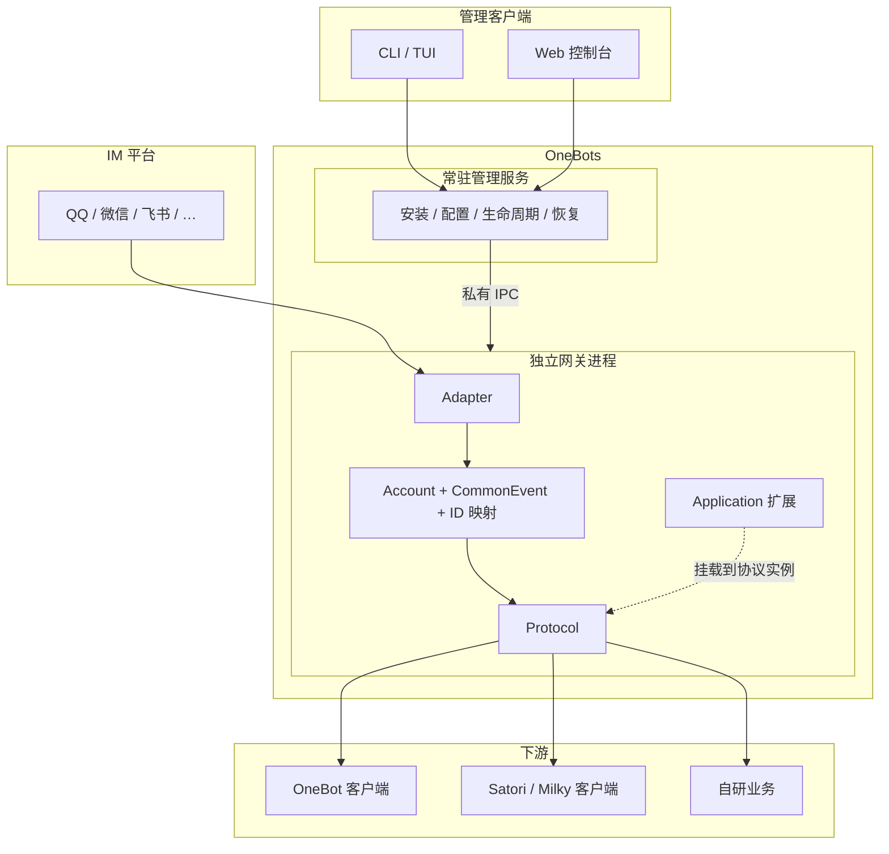

<div align="center">

# OneBots

**可扩展的多平台、多协议即时通讯网关运行时（TypeScript / Node.js）**

_Connect many IM platforms, normalize events once, and expose one or more protocol endpoints from the same account._

[](https://github.com/lc-cn/onebots/actions/workflows/release.yml) [](https://github.com/lc-cn/onebots/blob/master/LICENSE) [](https://www.npmjs.com/package/onebots) [](https://nodejs.org) [](https://www.typescriptlang.org/) [](https://github.com/lc-cn/onebots/pkgs/container/onebots)

[](https://onebot.dev/) [](https://12.onebot.dev/) [](https://satori.js.org/) [](https://github.com/aspect-y/milky)

**[📚 在线文档](https://onebots.pages.dev)** · **[English README](./README.en.md)** · **[Issues](https://github.com/lc-cn/onebots/issues)** · **QQ 群 [756653776](https://qm.qq.com/q/SytiyzBPyI)**

</div>

---

## OneBots 是什么？

OneBots 是一个自托管的 IM 网关产品。常驻管理服务负责安装、配置、认证、运维和恢复，独立网关进程负责平台连接、账号生命周期、统一事件与协议出口：

```text
IM 平台 → Adapter → Account + CommonEvent → Protocol → 下游客户端 / 业务
                                  ↑
                         Application 扩展层
```

它解决的是：**同一网关实例接入多个 IM 平台，并让同一账号同时暴露给一个或多个开放协议**，从而避免每个平台重复实现一套事件、ID 和 API 胶水。

### 核心运行模型

| 组件                        | 实际职责                                                                                                   |
| --------------------------- | ---------------------------------------------------------------------------------------------------------- |
| **Adapter（适配器）**       | 连接一个 IM 平台，管理平台客户端和账号，接收平台事件，并实现平台 API 能力。                                |
| **Account（账号）**         | 表示一个平台账号，负责账号启动/停止、平台 ID 映射，以及向多个协议投递统一事件。                            |
| **CommonEvent**             | OneBots 内部的统一事件模型；平台差异在适配器边界处理。                                                     |
| **Protocol（协议）**        | 把统一事件和 API 转换成 OneBot、Satori、Milky 等协议的 HTTP、WebSocket、Webhook 或其他出口。               |
| **Application（应用扩展）** | 附着在协议实例上的运行时扩展，可包装协议的启动、停止、事件分发和动作调用。它不是传统意义上的消息处理插件。 |
| **`@onebots/core`**         | 提供 `BaseApp`、注册表、路由、账号/协议基类、ID 映射、数据库、生命周期、错误、限流和可靠投递等基础设施。   |
| **`onebots` 主包**          | 提供 CLI、配置加载、插件事务、管理 API、管理 WebSocket、认证、日志/验证流、诊断和系统服务管理。            |

### 架构一瞥


```mermaid
flowchart TB
  subgraph IM["IM 平台"]
        A1[QQ / 微信 / 飞书 / …]
  end
  subgraph CLIENTS["管理客户端"]
      CLI[CLI / TUI]
      WEB[Web 控制台]
  end
  subgraph OB["OneBots"]
    subgraph CONTROL["常驻管理服务"]
      MANAGER[安装 / 配置 / 生命周期 / 恢复]
    end
    subgraph GATEWAY["独立网关进程"]
      B[Adapter]
      C[Account + CommonEvent + ID 映射]
      D[Protocol]
      X[Application 扩展]
    end
  end
  subgraph Down["下游"]
        E[OneBot 客户端]
        F[Satori / Milky 客户端]
        G[自研业务]
  end
  CLI --> MANAGER
  WEB --> MANAGER
  MANAGER -->|私有 IPC| GATEWAY
  A1 --> B --> C --> D
  X -.挂载到协议实例.-> D
  D --> E
  D --> F
  D --> G
```

### 建议阅读顺序

- 想先跑起来：直接看[五分钟上手](#五分钟上手)。
- 想判断是否适合你的系统：先看[适合谁？不适合谁？](#适合谁不适合谁)和[生态与集成](#生态与集成)。
- 想开发适配器、协议或应用扩展：先理解[核心运行模型](#核心运行模型)，再看[开发与贡献](#开发与贡献)和各包 README。
- 想核对某个平台到底支持哪些动作：以[协议 API × 平台支持矩阵](#协议-api--平台支持矩阵)和对应适配器文档为准，不要只看平台名称列表。

---

## 适合谁？不适合谁？

**更适合：**

- 要 **多平台接入**，且希望事件与 ID 在网关内 **先统一、再按协议导出**
- 要 **同一账号同时开启多个协议出口**，供不同客户端或业务使用
- 要通过管理端或 CLI 管理账号、配置、日志、验证流程和服务生命周期
- 技术栈是 **Node.js ≥24（推荐与 `.node-version` 一致）/ TypeScript**，接受 **自部署网关**

**未必适合：**

- 只做 **单一平台、单一 SDK**（例如只做 Discord.js）——直接使用官方 SDK 通常更简单
- 需要成熟的业务插件生态、消息处理 DSL 或 Python 插件兼容——应使用 NoneBot、Koishi 等上层框架，或通过协议接入 OneBots
- 只需要一个协议服务且不需要多平台账号管理——使用更专用的实现可能更轻量

---

## 和其他方案怎么选？（中性对比）

| 维度         | 直连各平台 SDK | 其他机器人框架 | **OneBots**                             |
| ------------ | -------------- | -------------- | --------------------------------------- |
| 多平台抽象   | 自己封装       | 多数有         | ✅ `CommonEvent` + 多适配器             |
| 多协议对外   | 自己实现       | 视项目         | ✅ 同账号多协议                         |
| 技术栈       | 任意           | 多为 Python/TS | **TS / ESM / pnpm monorepo**            |
| 网关运维能力 | 自己实现       | 视项目而定     | ✅ 管理 API、日志、认证、诊断、服务管理 |
| 业务插件生态 | —              | 部分更成熟     | 偏 **网关基础设施**，不是业务插件框架   |

没有「唯一正确」选型；OneBots 更偏 **自托管的 IM 协议网关运行时**，而不是 NoneBot 或 Koishi 的替代品。

---

## 能力概览

- **多平台适配器**：通过独立包连接 QQ、微信、钉钉、飞书、Telegram、Discord、Slack、Matrix、Mattermost、Zulip 等平台。平台能力以适配器能力清单为准，不同平台并不提供完全相同的 API。
- **多协议出口**：OneBot v11、OneBot v12、Satori v1、Milky v1，以及面向 AI Agent 的 MCP v1；同一账号可以配置多个协议实例。
- **多种传输方式**：协议和适配器按实现提供 HTTP、WebSocket、反向 WebSocket、Webhook、SSE 等连接方式。
- **插件运行时**：适配器、协议和应用扩展通过注册表加载；插件入口、包身份、配置 Schema 和注册范围会被宿主校验，失败时回滚。
- **账号与配置管理**：支持账号增删改、运行时配置校验、原子持久化、热更新边界和账号启动/停止事务。
- **管理控制面**：管理 Web API、管理 WebSocket、Web 管理端、日志流、验证事件流、终端、健康检查、指标和安全审计。
- **运维能力**：CLI、TUI、doctor 诊断、Docker 部署，以及 macOS launchd、Linux systemd 和 Windows 服务管理。
- **客户端 SDK**：`imhelper` 与 `@imhelper/*` 可连接 OneBots 或其他兼容协议服务。
- **Monorepo**：`pnpm workspace` 管理核心包、主应用、适配器、协议、SDK、Web 管理端和文档。

### 消息和调用的主路径

平台事件进入适配器后，会被转换为 `CommonEvent` 并投递到账号；账号再把事件分发给该账号上的所有协议实例。下游通过协议调用 API，协议根据动作和目标账号转回适配器，并由适配器完成平台 ID 还原和实际调用。

协议实例失败不会阻止其他协议实例获得同一事件；可靠接入可以使用等待式投递结果，让 Webhook、队列或流式入口决定是否重试。

---

## 生态与集成

OneBots 的生态分成三层，职责不同：

| 层次           | 当前内容                                                                                            | 作用                                                                                  |
| -------------- | --------------------------------------------------------------------------------------------------- | ------------------------------------------------------------------------------------- |
| 平台适配器     | `adapters/` 下的 `@onebots/adapter-*`                                                               | 连接具体 IM 平台，提供平台事件和 API。                                                |
| 协议与客户端   | OneBot v11/v12、Satori、Milky、MCP；`imhelper` 和 `@imhelper/*`                                     | 把同一账号暴露给机器人框架、业务服务或 AI Agent。                                     |
| 框架集成与桥接 | `applications/zhin`、`interop/`，以及文档中的 NoneBot、Koishi、Karin、Zhin、AstrBot、LangBot 等方案 | 说明如何把现有框架接入 OneBots；并不表示这些框架由 OneBots 内置、维护或拥有同等支持。 |

### 关于“支持”的含义

- **目录中存在包**：表示仓库包含对应实现，不代表平台账号、套餐、地区或权限一定可用。
- **能力矩阵中的 `✅`**：表示适配器声明并实现了该动作；实际结果仍受平台 API、账号权限和配置影响。
- **`◐`**：表示由组合、模拟或有损映射提供，不应与平台原生语义等同。
- **协议支持**：表示 OneBots 提供该协议出口，不代表所有平台都能提供该协议的全部动作。
- **框架集成**：通常依赖框架自身的连接器和协议配置；Application 扩展只声明或补充运行时契约，不会自动替框架开启协议连接。

生态中的平台 SDK、框架、协议和第三方服务各自受其项目许可、服务条款和 API 政策约束。使用前请阅读对应平台和上游项目的官方文档。

---

<!-- protocol-api-matrix:start -->

## 协议 API × 平台支持矩阵

这里展示各协议标准 API 在不同平台适配器上的默认能力。`✅` 平台原生支持，`◐` 由 OneBots 组合或有损模拟，`◆` 由协议层直接提供，`—` 当前不支持。账号权限、套餐、事件订阅和会话上下文可能进一步限制实际可用性；平台原生扩展动作未列入此表。

矩阵由协议动作目录和适配器能力清单自动生成，可运行 `pnpm readme:capabilities` 更新。

<details open>
<summary><b>OneBot v11（45 个标准 API）</b></summary>

| API | <span title="钉钉">钉<br>钉</span> | <span title="Discord">D<br>i<br>s<br>c<br>o<br>r<br>d</span> | <span title="邮件">邮<br>件</span> | <span title="Messenger">M<br>e<br>s<br>s<br>e<br>n<br>g<br>e<br>r</span> | <span title="飞书">飞<br>书</span> | <span title="Google Chat">G<br>o<br>o<br>g<br>l<br>e<br>C<br>h<br>a<br>t</span> | <span title="黑盒">黑<br>盒</span> | <span title="ICQQ">I<br>C<br>Q<br>Q</span> | <span title="Instagram">I<br>n<br>s<br>t<br>a<br>g<br>r<br>a<br>m</span> | <span title="ircv3">i<br>r<br>c<br>v<br>3</span> | <span title="KOOK">K<br>O<br>O<br>K</span> | <span title="LINE">L<br>I<br>N<br>E</span> | <span title="Matrix">M<br>a<br>t<br>r<br>i<br>x</span> | <span title="Mattermost">M<br>a<br>t<br>t<br>e<br>r<br>m<br>o<br>s<br>t</span> | <span title="mock">m<br>o<br>c<br>k</span> | <span title="QQ">Q<br>Q</span> | <span title="Slack">S<br>l<br>a<br>c<br>k</span> | <span title="Teams">T<br>e<br>a<br>m<br>s</span> | <span title="TG">T<br>G</span> | <span title="twitch">t<br>w<br>i<br>t<br>c<br>h</span> | <span title="微信">微<br>信</span> | <span title="ClawBot">C<br>l<br>a<br>w<br>B<br>o<br>t</span> | <span title="企微">企<br>微</span> | <span title="企微客服">企<br>微<br>客<br>服</span> | <span title="WA">W<br>A</span> | <span title="Zulip">Z<br>u<br>l<br>i<br>p</span> |
| :--- | :---: | :---: | :---: | :---: | :---: | :---: | :---: | :---: | :---: | :---: | :---: | :---: | :---: | :---: | :---: | :---: | :---: | :---: | :---: | :---: | :---: | :---: | :---: | :---: | :---: | :---: |
| `send_private_msg` | — | — | ✅ | ✅ | — | ✅ | — | — | ✅ | ✅ | — | — | ✅ | ✅ | — | ✅ | ✅ | ✅ | — | ✅ | — | — | ✅ | ✅ | — | ✅ |
| `send_group_msg` | ✅ | — | — | — | ✅ | ✅ | — | ✅ | — | — | — | ✅ | ✅ | ✅ | ✅ | ✅ | — | ✅ | ✅ | ✅ | — | — | ✅ | — | ✅ | ✅ |
| `send_msg` | ✅ | ✅ | ✅ | ✅ | ✅ | ✅ | ✅ | ✅ | ✅ | ✅ | ✅ | ✅ | ✅ | ✅ | ✅ | ✅ | ✅ | ✅ | ✅ | ✅ | ✅ | ✅ | ✅ | ✅ | ✅ | ✅ |
| `delete_msg` | ✅ | ✅ | ✅ | — | ✅ | ✅ | ✅ | ✅ | — | — | ✅ | — | ✅ | ✅ | ✅ | ✅ | ✅ | ✅ | ✅ | ✅ | — | — | ✅ | — | — | ✅ |
| `get_msg` | — | ✅ | ✅ | ✅ | ✅ | ✅ | — | ✅ | ✅ | — | ✅ | — | ✅ | ✅ | ✅ | ✅ | ✅ | — | — | — | — | — | — | — | — | ✅ |
| `get_forward_msg` | — | — | — | — | — | — | — | ✅ | — | — | — | — | — | — | — | — | — | — | — | — | — | — | — | — | — | — |
| `get_friend_msg_history` | — | ✅ | ✅ | — | — | ✅ | — | ✅ | — | ✅ | — | — | ✅ | ✅ | ✅ | — | — | — | — | — | — | — | — | — | — | ✅ |
| `get_group_msg_history` | — | — | — | — | — | ✅ | — | ✅ | — | ✅ | — | — | ✅ | ✅ | ✅ | — | — | — | — | — | — | — | — | — | — | ✅ |
| `send_private_forward_msg` | — | — | — | — | — | — | — | ✅ | — | — | — | — | — | — | — | — | — | — | — | — | — | — | — | — | — | — |
| `send_group_forward_msg` | — | — | — | — | — | — | — | ✅ | — | — | — | — | — | — | — | — | — | — | — | — | — | — | — | — | — | — |
| `send_like` | — | — | — | — | — | — | — | ✅ | — | — | — | — | — | — | — | — | — | — | — | — | — | — | — | — | — | — |
| `set_group_kick` | ✅ | — | — | — | ✅ | ✅ | ✅ | ✅ | — | ✅ | — | — | ✅ | — | — | — | — | — | ✅ | — | — | — | — | — | ✅ | ✅ |
| `invite_friend_to_group` | ✅ | — | — | — | — | ✅ | — | ✅ | — | ✅ | — | — | ✅ | — | — | — | — | — | — | — | — | — | — | — | — | ✅ |
| `set_group_ban` | — | — | — | — | — | — | ✅ | ✅ | — | — | — | — | — | — | — | — | — | — | ✅ | ✅ | — | — | — | — | — | — |
| `set_group_anonymous_ban` | — | — | — | — | — | — | — | ✅ | — | — | — | — | — | — | — | — | — | — | — | — | — | — | — | — | — | — |
| `set_group_whole_ban` | — | — | — | — | — | — | — | ✅ | — | — | — | — | — | — | — | — | — | — | — | — | — | — | — | — | — | — |
| `set_group_admin` | — | — | — | — | — | — | — | ✅ | — | ✅ | — | — | — | — | — | — | — | — | ✅ | ✅ | — | — | — | — | — | — |
| `set_group_anonymous` | — | — | — | — | — | — | — | ✅ | — | — | — | — | — | — | — | — | — | — | — | — | — | — | — | — | — | — |
| `set_group_card` | — | — | — | — | — | — | ✅ | ✅ | — | — | — | — | — | — | — | — | — | — | — | — | — | — | — | — | — | — |
| `set_group_name` | ✅ | — | — | — | ✅ | ✅ | — | ✅ | — | — | — | — | ✅ | — | — | — | — | — | ✅ | — | — | — | — | — | ✅ | ✅ |
| `set_group_leave` | — | — | — | — | ✅ | ✅ | ✅ | ✅ | — | ✅ | — | ✅ | ✅ | — | — | — | — | — | ✅ | — | — | — | — | — | — | ✅ |
| `set_group_special_title` | — | — | — | — | — | — | — | ✅ | — | — | — | — | — | — | — | — | — | — | ✅ | — | — | — | — | — | — | — |
| `set_friend_add_request` | — | — | — | — | — | — | — | ✅ | — | — | ✅ | — | — | — | — | — | — | — | — | — | — | — | — | — | — | — |
| `accept_friend_request` | — | — | — | — | — | — | — | ✅ | — | — | ✅ | — | — | — | — | — | — | — | — | — | — | — | — | — | — | — |
| `set_group_add_request` | — | — | — | — | — | — | — | ✅ | — | ✅ | — | — | ✅ | — | — | — | — | — | ✅ | — | — | — | — | — | ✅ | — |
| `get_login_info` | ◆ | ◆ | ◆ | ◆ | ◆ | ◆ | ◆ | ◆ | ◆ | ◆ | ◆ | ◆ | ◆ | ◆ | ◆ | ◆ | ◆ | ◆ | ◆ | ◆ | ◆ | ◆ | ◆ | ◆ | ◆ | ◆ |
| `get_stranger_info` | ✅ | ✅ | ◐ | ✅ | ✅ | ✅ | — | ✅ | ✅ | ✅ | ✅ | ✅ | ✅ | ✅ | ✅ | — | ✅ | — | — | ✅ | ✅ | — | ✅ | ✅ | ◐ | ✅ |
| `get_friend_list` | ◐ | — | — | — | ✅ | — | — | ✅ | — | — | ✅ | ✅ | — | — | ✅ | — | ✅ | — | — | — | ✅ | — | — | — | — | — |
| `delete_friend` | — | — | — | — | — | — | — | ✅ | — | — | ✅ | — | — | — | — | — | — | — | — | — | — | — | — | — | — | — |
| `get_group_info` | ✅ | — | — | — | ✅ | ✅ | ✅ | ✅ | — | ✅ | — | ✅ | ✅ | ✅ | ✅ | ✅ | — | ✅ | ✅ | ✅ | — | — | ✅ | — | ✅ | ◐ |
| `get_group_list` | — | — | — | — | ✅ | ✅ | ✅ | ✅ | — | ✅ | — | ◐ | ✅ | — | ✅ | — | — | ✅ | — | ✅ | — | — | — | — | ✅ | ◐ |
| `get_group_member_info` | ◐ | — | — | — | ✅ | ✅ | ✅ | ✅ | — | ✅ | — | ✅ | ✅ | ✅ | ✅ | — | — | ✅ | ✅ | ✅ | — | — | ✅ | — | ✅ | ✅ |
| `get_group_member_list` | ✅ | — | — | — | ✅ | ✅ | ✅ | ✅ | — | ✅ | — | ✅ | ✅ | ✅ | ✅ | — | — | ✅ | — | ✅ | — | — | ✅ | — | ✅ | ✅ |
| `get_group_honor_info` | — | — | — | — | — | — | — | — | — | — | — | — | — | — | — | — | — | — | — | — | — | — | — | — | — | — |
| `get_cookies` | — | — | — | — | — | — | — | ✅ | — | — | — | — | — | — | — | — | — | — | — | — | — | — | — | — | — | — |
| `get_csrf_token` | — | — | — | — | — | — | — | ✅ | — | — | — | — | — | — | — | — | — | — | — | — | — | — | — | — | — | — |
| `get_credentials` | — | — | — | — | — | — | — | ✅ | — | — | — | — | — | — | — | — | — | — | — | — | — | — | — | — | — | — |
| `get_record` | — | — | — | — | — | — | — | — | — | — | — | — | — | — | — | — | — | — | — | — | — | — | — | — | — | — |
| `get_image` | — | — | — | — | — | — | — | — | — | — | — | — | — | — | — | — | — | — | — | — | — | — | — | — | — | — |
| `can_send_image` | — | ✅ | ✅ | ✅ | — | ✅ | ✅ | ✅ | ✅ | ✅ | — | ✅ | ✅ | ✅ | — | ✅ | — | — | — | ✅ | ✅ | ✅ | ✅ | ✅ | ✅ | ✅ |
| `can_send_record` | — | ✅ | ✅ | ✅ | — | ✅ | ✅ | ✅ | ✅ | ✅ | — | ✅ | ✅ | ✅ | — | ✅ | — | — | — | ✅ | ✅ | ✅ | ✅ | ✅ | ✅ | ✅ |
| `get_status` | ✅ | ✅ | ✅ | ✅ | ✅ | ✅ | ✅ | ✅ | ✅ | ✅ | ✅ | ✅ | ✅ | ✅ | ✅ | ✅ | ✅ | ✅ | ✅ | ✅ | ✅ | ✅ | ✅ | ✅ | ✅ | ✅ |
| `get_version_info` | ✅ | ✅ | ✅ | ✅ | ✅ | ✅ | ✅ | ✅ | ✅ | ✅ | ✅ | ✅ | ✅ | ✅ | ✅ | ✅ | ✅ | ✅ | ✅ | ✅ | ✅ | ✅ | ✅ | ✅ | ✅ | ✅ |
| `set_restart` | — | — | — | — | — | — | — | — | — | — | — | — | — | — | — | — | — | — | — | — | — | — | — | — | — | — |
| `clean_cache` | — | — | — | — | — | — | — | ✅ | — | — | — | — | — | — | — | — | — | — | — | — | — | — | — | — | — | — |

</details>

<details>
<summary><b>OneBot v12（27 个标准 API）</b></summary>

| API | <span title="钉钉">钉<br>钉</span> | <span title="Discord">D<br>i<br>s<br>c<br>o<br>r<br>d</span> | <span title="邮件">邮<br>件</span> | <span title="Messenger">M<br>e<br>s<br>s<br>e<br>n<br>g<br>e<br>r</span> | <span title="飞书">飞<br>书</span> | <span title="Google Chat">G<br>o<br>o<br>g<br>l<br>e<br>C<br>h<br>a<br>t</span> | <span title="黑盒">黑<br>盒</span> | <span title="ICQQ">I<br>C<br>Q<br>Q</span> | <span title="Instagram">I<br>n<br>s<br>t<br>a<br>g<br>r<br>a<br>m</span> | <span title="ircv3">i<br>r<br>c<br>v<br>3</span> | <span title="KOOK">K<br>O<br>O<br>K</span> | <span title="LINE">L<br>I<br>N<br>E</span> | <span title="Matrix">M<br>a<br>t<br>r<br>i<br>x</span> | <span title="Mattermost">M<br>a<br>t<br>t<br>e<br>r<br>m<br>o<br>s<br>t</span> | <span title="mock">m<br>o<br>c<br>k</span> | <span title="QQ">Q<br>Q</span> | <span title="Slack">S<br>l<br>a<br>c<br>k</span> | <span title="Teams">T<br>e<br>a<br>m<br>s</span> | <span title="TG">T<br>G</span> | <span title="twitch">t<br>w<br>i<br>t<br>c<br>h</span> | <span title="微信">微<br>信</span> | <span title="ClawBot">C<br>l<br>a<br>w<br>B<br>o<br>t</span> | <span title="企微">企<br>微</span> | <span title="企微客服">企<br>微<br>客<br>服</span> | <span title="WA">W<br>A</span> | <span title="Zulip">Z<br>u<br>l<br>i<br>p</span> |
| :--- | :---: | :---: | :---: | :---: | :---: | :---: | :---: | :---: | :---: | :---: | :---: | :---: | :---: | :---: | :---: | :---: | :---: | :---: | :---: | :---: | :---: | :---: | :---: | :---: | :---: | :---: |
| `send_message` | ✅ | ✅ | ✅ | ✅ | ✅ | ✅ | ✅ | ✅ | ✅ | ✅ | ✅ | ✅ | ✅ | ✅ | ✅ | ✅ | ✅ | ✅ | ✅ | ✅ | ✅ | ✅ | ✅ | ✅ | ✅ | ✅ |
| `delete_message` | ✅ | ✅ | ✅ | — | ✅ | ✅ | ✅ | ✅ | — | — | ✅ | — | ✅ | ✅ | ✅ | ✅ | ✅ | ✅ | ✅ | ✅ | — | — | ✅ | — | — | ✅ |
| `get_self_info` | ◆ | ◆ | ◆ | ◆ | ◆ | ◆ | ◆ | ◆ | ◆ | ◆ | ◆ | ◆ | ◆ | ◆ | ◆ | ◆ | ◆ | ◆ | ◆ | ◆ | ◆ | ◆ | ◆ | ◆ | ◆ | ◆ |
| `get_supported_actions` | ◆ | ◆ | ◆ | ◆ | ◆ | ◆ | ◆ | ◆ | ◆ | ◆ | ◆ | ◆ | ◆ | ◆ | ◆ | ◆ | ◆ | ◆ | ◆ | ◆ | ◆ | ◆ | ◆ | ◆ | ◆ | ◆ |
| `get_status` | ✅ | ✅ | ✅ | ✅ | ✅ | ✅ | ✅ | ✅ | ✅ | ✅ | ✅ | ✅ | ✅ | ✅ | ✅ | ✅ | ✅ | ✅ | ✅ | ✅ | ✅ | ✅ | ✅ | ✅ | ✅ | ✅ |
| `get_version` | ✅ | ✅ | ✅ | ✅ | ✅ | ✅ | ✅ | ✅ | ✅ | ✅ | ✅ | ✅ | ✅ | ✅ | ✅ | ✅ | ✅ | ✅ | ✅ | ✅ | ✅ | ✅ | ✅ | ✅ | ✅ | ✅ |
| `get_user_info` | ✅ | ✅ | ◐ | ✅ | ✅ | ✅ | — | ✅ | ✅ | ✅ | ✅ | ✅ | ✅ | ✅ | ✅ | — | ✅ | — | — | ✅ | ✅ | — | ✅ | ✅ | ◐ | ✅ |
| `get_friend_list` | ◐ | — | — | — | ✅ | — | — | ✅ | — | — | ✅ | ✅ | — | — | ✅ | — | ✅ | — | — | — | ✅ | — | — | — | — | — |
| `get_group_info` | ✅ | — | — | — | ✅ | ✅ | ✅ | ✅ | — | ✅ | — | ✅ | ✅ | ✅ | ✅ | ✅ | — | ✅ | ✅ | ✅ | — | — | ✅ | — | ✅ | ◐ |
| `get_group_list` | — | — | — | — | ✅ | ✅ | ✅ | ✅ | — | ✅ | — | ◐ | ✅ | — | ✅ | — | — | ✅ | — | ✅ | — | — | — | — | ✅ | ◐ |
| `get_group_member_info` | ◐ | — | — | — | ✅ | ✅ | ✅ | ✅ | — | ✅ | — | ✅ | ✅ | ✅ | ✅ | — | — | ✅ | ✅ | ✅ | — | — | ✅ | — | ✅ | ✅ |
| `get_group_member_list` | ✅ | — | — | — | ✅ | ✅ | ✅ | ✅ | — | ✅ | — | ✅ | ✅ | ✅ | ✅ | — | — | ✅ | — | ✅ | — | — | ✅ | — | ✅ | ✅ |
| `set_group_name` | ✅ | — | — | — | ✅ | ✅ | — | ✅ | — | — | — | — | ✅ | — | — | — | — | — | ✅ | — | — | — | — | — | ✅ | ✅ |
| `leave_group` | — | — | — | — | ✅ | ✅ | ✅ | ✅ | — | ✅ | — | ✅ | ✅ | — | — | — | — | — | ✅ | — | — | — | — | — | — | ✅ |
| `invite_friend_to_group` | ✅ | — | — | — | — | ✅ | — | ✅ | — | ✅ | — | — | ✅ | — | — | — | — | — | — | — | — | — | — | — | — | ✅ |
| `accept_friend_request` | — | — | — | — | — | — | — | ✅ | — | — | ✅ | — | — | — | — | — | — | — | — | — | — | — | — | — | — | — |
| `handle_friend_request` | — | — | — | — | — | — | — | ✅ | — | — | ✅ | — | — | — | — | — | — | — | — | — | — | — | — | — | — | — |
| `handle_group_request` | — | — | — | — | — | — | — | ✅ | — | ✅ | — | — | ✅ | — | — | — | — | — | ✅ | — | — | — | — | — | ✅ | — |
| `get_guild_info` | — | ✅ | — | — | — | — | ✅ | ✅ | — | — | ✅ | — | — | ✅ | — | ✅ | — | — | — | — | — | — | — | — | — | — |
| `get_guild_list` | — | ✅ | — | — | — | — | ✅ | ✅ | — | — | ✅ | — | — | ✅ | — | ✅ | — | — | — | — | — | — | — | — | — | — |
| `get_guild_member_info` | — | ✅ | — | — | — | — | ✅ | ✅ | — | — | ✅ | — | — | ✅ | — | ✅ | — | — | — | — | — | — | — | — | — | — |
| `get_guild_member_list` | — | ✅ | — | — | — | — | ✅ | ✅ | — | — | ✅ | — | — | ✅ | — | ✅ | — | — | — | — | — | — | — | — | — | — |
| `get_channel_info` | — | ✅ | — | — | — | — | ✅ | ✅ | — | ✅ | ✅ | — | — | ✅ | — | ✅ | ✅ | — | — | ✅ | — | — | — | — | — | — |
| `get_channel_list` | — | ✅ | — | — | — | — | ✅ | ✅ | — | ✅ | ✅ | — | — | ✅ | — | ✅ | ✅ | — | — | ✅ | — | — | — | — | — | — |
| `set_channel_name` | — | ✅ | — | — | — | — | ✅ | — | — | — | ✅ | — | — | ✅ | — | ✅ | ✅ | — | — | — | — | — | — | — | — | — |
| `get_channel_member_info` | — | — | — | — | — | — | — | — | — | — | — | — | — | ✅ | — | — | ✅ | — | — | — | — | — | — | — | — | — |
| `get_channel_member_list` | — | — | — | — | — | — | — | — | — | — | ✅ | — | — | ✅ | — | — | ✅ | — | — | — | — | — | — | — | — | — |

</details>

<details>
<summary><b>Satori v1（26 个标准 API）</b></summary>

| API | <span title="钉钉">钉<br>钉</span> | <span title="Discord">D<br>i<br>s<br>c<br>o<br>r<br>d</span> | <span title="邮件">邮<br>件</span> | <span title="Messenger">M<br>e<br>s<br>s<br>e<br>n<br>g<br>e<br>r</span> | <span title="飞书">飞<br>书</span> | <span title="Google Chat">G<br>o<br>o<br>g<br>l<br>e<br>C<br>h<br>a<br>t</span> | <span title="黑盒">黑<br>盒</span> | <span title="ICQQ">I<br>C<br>Q<br>Q</span> | <span title="Instagram">I<br>n<br>s<br>t<br>a<br>g<br>r<br>a<br>m</span> | <span title="ircv3">i<br>r<br>c<br>v<br>3</span> | <span title="KOOK">K<br>O<br>O<br>K</span> | <span title="LINE">L<br>I<br>N<br>E</span> | <span title="Matrix">M<br>a<br>t<br>r<br>i<br>x</span> | <span title="Mattermost">M<br>a<br>t<br>t<br>e<br>r<br>m<br>o<br>s<br>t</span> | <span title="mock">m<br>o<br>c<br>k</span> | <span title="QQ">Q<br>Q</span> | <span title="Slack">S<br>l<br>a<br>c<br>k</span> | <span title="Teams">T<br>e<br>a<br>m<br>s</span> | <span title="TG">T<br>G</span> | <span title="twitch">t<br>w<br>i<br>t<br>c<br>h</span> | <span title="微信">微<br>信</span> | <span title="ClawBot">C<br>l<br>a<br>w<br>B<br>o<br>t</span> | <span title="企微">企<br>微</span> | <span title="企微客服">企<br>微<br>客<br>服</span> | <span title="WA">W<br>A</span> | <span title="Zulip">Z<br>u<br>l<br>i<br>p</span> |
| :--- | :---: | :---: | :---: | :---: | :---: | :---: | :---: | :---: | :---: | :---: | :---: | :---: | :---: | :---: | :---: | :---: | :---: | :---: | :---: | :---: | :---: | :---: | :---: | :---: | :---: | :---: |
| `message.create` | ✅ | ✅ | ✅ | ✅ | ✅ | ✅ | ✅ | ✅ | ✅ | ✅ | ✅ | ✅ | ✅ | ✅ | ✅ | ✅ | ✅ | ✅ | ✅ | ✅ | ✅ | ✅ | ✅ | ✅ | ✅ | ✅ |
| `message.get` | — | ✅ | ✅ | ✅ | ✅ | ✅ | — | ✅ | ✅ | — | ✅ | — | ✅ | ✅ | ✅ | ✅ | ✅ | — | — | — | — | — | — | — | — | ✅ |
| `message.delete` | ✅ | ✅ | ✅ | — | ✅ | ✅ | ✅ | ✅ | — | — | ✅ | — | ✅ | ✅ | ✅ | ✅ | ✅ | ✅ | ✅ | ✅ | — | — | ✅ | — | — | ✅ |
| `message.update` | — | — | — | — | ✅ | ✅ | ✅ | — | — | — | ✅ | — | ✅ | ✅ | — | — | ✅ | ✅ | ✅ | — | — | — | — | — | — | ✅ |
| `message.list` | — | ✅ | ✅ | ✅ | — | ✅ | — | ✅ | ✅ | ✅ | — | — | ✅ | ✅ | ✅ | — | — | — | — | — | — | — | — | — | — | ✅ |
| `reaction.create` | — | — | — | — | — | ✅ | — | ✅ | — | — | ✅ | — | ✅ | ✅ | — | — | — | ✅ | — | — | — | — | — | — | — | — |
| `reaction.delete` | — | — | — | — | — | ✅ | — | ✅ | — | — | ✅ | — | ✅ | ✅ | — | — | — | ✅ | — | — | — | — | — | — | — | — |
| `channel.get` | — | ✅ | — | — | — | — | ✅ | ✅ | — | ✅ | ✅ | — | — | ✅ | — | ✅ | ✅ | — | — | ✅ | — | — | — | — | — | — |
| `channel.list` | — | ✅ | — | — | — | — | ✅ | ✅ | — | ✅ | ✅ | — | — | ✅ | — | ✅ | ✅ | — | — | ✅ | — | — | — | — | — | — |
| `channel.create` | — | ✅ | — | — | — | — | ✅ | — | — | — | ✅ | — | — | ✅ | — | ✅ | ✅ | — | — | — | — | — | — | — | — | — |
| `channel.update` | — | ✅ | — | — | — | — | ✅ | — | — | — | ✅ | — | — | ✅ | — | ✅ | ✅ | — | — | — | — | — | — | — | — | — |
| `channel.delete` | — | ✅ | — | — | — | — | ✅ | — | — | — | ✅ | — | — | ✅ | — | ✅ | ✅ | — | — | — | — | — | — | — | — | — |
| `guild.get` | — | ✅ | — | — | — | — | ✅ | ✅ | — | — | ✅ | — | — | ✅ | — | ✅ | — | — | — | — | — | — | — | — | — | — |
| `guild.list` | — | ✅ | — | — | — | — | ✅ | ✅ | — | — | ✅ | — | — | ✅ | — | ✅ | — | — | — | — | — | — | — | — | — | — |
| `guild.member.get` | — | ✅ | — | — | — | — | ✅ | ✅ | — | — | ✅ | — | — | ✅ | — | ✅ | — | — | — | — | — | — | — | — | — | — |
| `guild.member.list` | — | ✅ | — | — | — | — | ✅ | ✅ | — | — | ✅ | — | — | ✅ | — | ✅ | — | — | — | — | — | — | — | — | — | — |
| `guild.member.kick` | — | ✅ | — | — | — | — | — | — | — | — | ✅ | — | — | — | — | ✅ | — | — | — | — | — | — | — | — | — | — |
| `guild.member.mute` | — | — | — | — | — | — | — | — | — | — | — | — | — | — | — | ✅ | — | — | — | — | — | — | — | — | — | — |
| `user.get` | ✅ | ✅ | ◐ | ✅ | ✅ | ✅ | — | ✅ | ✅ | ✅ | ✅ | ✅ | ✅ | ✅ | ✅ | — | ✅ | — | — | ✅ | ✅ | — | ✅ | ✅ | ◐ | ✅ |
| `user.channel.create` | — | — | — | — | — | ✅ | — | — | — | ◐ | — | — | — | ✅ | — | ✅ | — | — | — | ◐ | — | — | — | — | — | — |
| `friend.list` | ◐ | — | — | — | ✅ | — | — | ✅ | — | — | ✅ | ✅ | — | — | ✅ | — | ✅ | — | — | — | ✅ | — | — | — | — | — |
| `friend.delete` | — | — | — | — | — | — | — | ✅ | — | — | ✅ | — | — | — | — | — | — | — | — | — | — | — | — | — | — | — |
| `friend.approve` | — | — | — | — | — | — | — | ✅ | — | — | ✅ | — | — | — | — | — | — | — | — | — | — | — | — | — | — | — |
| `guild.approve` | — | — | — | — | — | — | — | ✅ | — | ✅ | — | — | ✅ | — | — | — | — | — | ✅ | — | — | — | — | — | ✅ | — |
| `guild.member.approve` | — | — | — | — | — | — | — | ✅ | — | ✅ | — | — | ✅ | — | — | — | — | — | ✅ | — | — | — | — | — | ✅ | — |
| `login.get` | ✅ | ✅ | ✅ | ✅ | ✅ | ✅ | ◐ | ✅ | ✅ | ✅ | ✅ | ✅ | ✅ | ✅ | ✅ | ✅ | ✅ | ✅ | ✅ | ✅ | ✅ | ✅ | ✅ | ✅ | ✅ | ✅ |

</details>

<details>
<summary><b>Milky v1（67 个标准 API）</b></summary>

| API | <span title="钉钉">钉<br>钉</span> | <span title="Discord">D<br>i<br>s<br>c<br>o<br>r<br>d</span> | <span title="邮件">邮<br>件</span> | <span title="Messenger">M<br>e<br>s<br>s<br>e<br>n<br>g<br>e<br>r</span> | <span title="飞书">飞<br>书</span> | <span title="Google Chat">G<br>o<br>o<br>g<br>l<br>e<br>C<br>h<br>a<br>t</span> | <span title="黑盒">黑<br>盒</span> | <span title="ICQQ">I<br>C<br>Q<br>Q</span> | <span title="Instagram">I<br>n<br>s<br>t<br>a<br>g<br>r<br>a<br>m</span> | <span title="ircv3">i<br>r<br>c<br>v<br>3</span> | <span title="KOOK">K<br>O<br>O<br>K</span> | <span title="LINE">L<br>I<br>N<br>E</span> | <span title="Matrix">M<br>a<br>t<br>r<br>i<br>x</span> | <span title="Mattermost">M<br>a<br>t<br>t<br>e<br>r<br>m<br>o<br>s<br>t</span> | <span title="mock">m<br>o<br>c<br>k</span> | <span title="QQ">Q<br>Q</span> | <span title="Slack">S<br>l<br>a<br>c<br>k</span> | <span title="Teams">T<br>e<br>a<br>m<br>s</span> | <span title="TG">T<br>G</span> | <span title="twitch">t<br>w<br>i<br>t<br>c<br>h</span> | <span title="微信">微<br>信</span> | <span title="ClawBot">C<br>l<br>a<br>w<br>B<br>o<br>t</span> | <span title="企微">企<br>微</span> | <span title="企微客服">企<br>微<br>客<br>服</span> | <span title="WA">W<br>A</span> | <span title="Zulip">Z<br>u<br>l<br>i<br>p</span> |
| :--- | :---: | :---: | :---: | :---: | :---: | :---: | :---: | :---: | :---: | :---: | :---: | :---: | :---: | :---: | :---: | :---: | :---: | :---: | :---: | :---: | :---: | :---: | :---: | :---: | :---: | :---: |
| `send_private_message` | — | — | ✅ | ✅ | — | ✅ | — | — | ✅ | ✅ | — | — | ✅ | ✅ | — | ✅ | ✅ | ✅ | — | ✅ | — | — | ✅ | ✅ | — | ✅ |
| `send_group_message` | ✅ | — | — | — | ✅ | ✅ | — | ✅ | — | — | — | ✅ | ✅ | ✅ | ✅ | ✅ | — | ✅ | ✅ | ✅ | — | — | ✅ | — | ✅ | ✅ |
| `recall_private_message` | — | — | ✅ | — | ✅ | ✅ | — | — | — | — | — | — | ✅ | ✅ | — | ✅ | ✅ | ✅ | ✅ | ✅ | — | — | ✅ | — | — | ✅ |
| `recall_group_message` | ✅ | — | ✅ | — | ✅ | ✅ | — | ✅ | — | — | — | — | ✅ | ✅ | ✅ | ✅ | ✅ | ✅ | ✅ | ✅ | — | — | — | — | — | ✅ |
| `get_message` | — | ✅ | ✅ | ✅ | ✅ | ✅ | — | ✅ | ✅ | — | ✅ | — | ✅ | ✅ | ✅ | ✅ | ✅ | — | — | — | — | — | — | — | — | ✅ |
| `get_history_messages` | — | ✅ | ✅ | ✅ | — | ✅ | — | ✅ | ✅ | ✅ | — | — | ✅ | ✅ | ✅ | — | — | — | — | — | — | — | — | — | — | ✅ |
| `get_resource_temp_url` | ✅ | — | — | — | — | — | — | ◐ | — | — | — | — | — | — | — | — | — | — | — | — | — | — | — | — | — | — |
| `get_forwarded_messages` | — | — | — | — | — | — | — | ✅ | — | — | — | — | — | — | — | — | — | — | — | — | — | — | — | — | — | — |
| `mark_message_as_read` | — | — | ✅ | ✅ | — | ✅ | — | ✅ | — | — | — | ✅ | ✅ | ✅ | — | — | — | — | — | — | — | — | — | — | ✅ | ✅ |
| `delete_friend` | — | — | — | — | — | — | — | ✅ | — | — | ✅ | — | — | — | — | — | — | — | — | — | — | — | — | — | — | — |
| `set_avatar` | — | — | — | — | — | — | — | ✅ | — | — | — | — | — | — | — | — | — | — | — | — | — | — | — | — | — | — |
| `set_nickname` | — | — | — | — | — | — | — | ✅ | — | ✅ | — | — | — | — | — | — | — | — | — | — | — | — | — | — | — | — |
| `set_bio` | — | — | — | — | — | — | — | ✅ | — | — | — | — | — | — | — | — | — | — | — | — | — | — | — | — | — | — |
| `get_custom_face_url_list` | — | — | — | — | — | — | — | ✅ | — | — | — | — | — | — | — | — | — | — | — | — | — | — | — | — | — | — |
| `get_peer_pins` | — | — | — | — | — | — | — | — | — | — | — | — | — | — | — | — | — | — | — | — | — | — | — | — | — | — |
| `set_peer_pin` | — | — | — | — | — | — | — | — | — | — | — | — | — | — | — | — | — | — | — | — | — | — | — | — | — | — |
| `kick_group_member` | ✅ | — | — | — | ✅ | ✅ | ✅ | ✅ | — | ✅ | — | — | ✅ | — | — | — | — | — | ✅ | — | — | — | — | — | ✅ | ✅ |
| `invite_friend_to_group` | ✅ | — | — | — | — | ✅ | — | ✅ | — | ✅ | — | — | ✅ | — | — | — | — | — | — | — | — | — | — | — | — | ✅ |
| `set_group_member_mute` | — | — | — | — | — | — | ✅ | ✅ | — | — | — | — | — | — | — | — | — | — | ✅ | ✅ | — | — | — | — | — | — |
| `set_group_member_admin` | — | — | — | — | — | — | — | ✅ | — | ✅ | — | — | — | — | — | — | — | — | ✅ | ✅ | — | — | — | — | — | — |
| `set_group_member_card` | — | — | — | — | — | — | ✅ | ✅ | — | — | — | — | — | — | — | — | — | — | — | — | — | — | — | — | — | — |
| `set_group_member_special_title` | — | — | — | — | — | — | — | ✅ | — | — | — | — | — | — | — | — | — | — | ✅ | — | — | — | — | — | — | — |
| `set_group_name` | ✅ | — | — | — | ✅ | ✅ | — | ✅ | — | — | — | — | ✅ | — | — | — | — | — | ✅ | — | — | — | — | — | ✅ | ✅ |
| `quit_group` | — | — | — | — | ✅ | ✅ | ✅ | ✅ | — | ✅ | — | ✅ | ✅ | — | — | — | — | — | ✅ | — | — | — | — | — | — | ✅ |
| `send_group_nudge` | — | — | — | — | — | — | — | ✅ | — | — | — | — | — | — | — | — | — | — | — | — | — | — | — | — | — | — |
| `set_group_avatar` | — | — | — | — | — | — | — | ✅ | — | — | — | — | — | — | — | — | — | — | — | — | — | — | — | — | — | — |
| `set_group_whole_mute` | — | — | — | — | — | — | — | ✅ | — | — | — | — | — | — | — | — | — | — | — | — | — | — | — | — | — | — |
| `send_group_announcement` | — | — | — | — | — | — | — | ✅ | — | ✅ | — | — | — | — | — | — | — | — | — | ✅ | — | — | — | — | — | — |
| `set_group_essence_message` | — | — | — | — | — | — | — | ✅ | — | — | — | — | — | ✅ | — | — | — | — | — | — | — | — | — | — | — | — |
| `send_group_message_reaction` | — | — | — | — | — | ✅ | — | ✅ | — | — | — | — | ✅ | ✅ | — | — | — | — | — | — | — | — | — | — | — | — |
| `get_group_announcements` | — | — | — | — | — | — | — | — | — | — | — | — | — | — | — | — | — | — | — | — | — | — | — | — | — | — |
| `delete_group_announcement` | — | — | — | — | — | — | — | — | — | — | — | — | — | — | — | — | — | — | — | — | — | — | — | — | — | — |
| `get_group_essence_messages` | — | — | — | — | — | — | — | — | — | — | — | — | — | ✅ | — | — | — | — | — | — | — | — | — | — | — | — |
| `accept_group_request` | — | — | — | — | — | — | — | ✅ | — | ✅ | — | — | ✅ | — | — | — | — | — | ✅ | — | — | — | — | — | ✅ | — |
| `reject_group_request` | — | — | — | — | — | — | — | ✅ | — | ✅ | — | — | ✅ | — | — | — | — | — | ✅ | — | — | — | — | — | ✅ | — |
| `accept_group_invitation` | — | — | — | — | — | — | — | ✅ | — | ✅ | — | — | ✅ | — | — | — | — | — | ✅ | — | — | — | — | — | ✅ | — |
| `reject_group_invitation` | — | — | — | — | — | — | — | ✅ | — | ✅ | — | — | ✅ | — | — | — | — | — | ✅ | — | — | — | — | — | ✅ | — |
| `accept_friend_request` | — | — | — | — | — | — | — | ✅ | — | — | ✅ | — | — | — | — | — | — | — | — | — | — | — | — | — | — | — |
| `reject_friend_request` | — | — | — | — | — | — | — | ✅ | — | — | ✅ | — | — | — | — | — | — | — | — | — | — | — | — | — | — | — |
| `upload_private_file` | — | — | — | ✅ | — | ✅ | ✅ | — | ✅ | — | — | — | ✅ | ✅ | — | — | — | — | — | — | — | — | ✅ | ✅ | — | ✅ |
| `upload_group_file` | — | — | — | — | — | ✅ | ✅ | ✅ | — | — | — | — | ✅ | ✅ | — | ✅ | — | — | — | — | — | — | ✅ | — | — | ✅ |
| `get_private_file_download_url` | — | — | — | — | — | — | — | — | — | — | — | — | — | — | — | — | — | — | — | — | — | — | — | — | — | — |
| `get_group_file_download_url` | — | — | — | — | — | — | — | ✅ | — | — | — | — | — | — | — | — | — | — | — | — | — | — | — | — | — | — |
| `get_group_files` | — | — | — | — | — | — | — | ✅ | — | — | — | — | — | — | — | — | — | — | — | — | — | — | — | — | — | — |
| `move_group_file` | — | — | — | — | — | — | — | ✅ | — | — | — | — | — | — | — | — | — | — | — | — | — | — | — | — | — | — |
| `rename_group_file` | — | — | — | — | — | — | — | ✅ | — | — | — | — | — | — | — | — | — | — | — | — | — | — | — | — | — | — |
| `delete_group_file` | — | — | — | — | — | — | — | ✅ | — | — | — | — | — | — | — | — | ✅ | — | — | — | — | — | — | — | — | — |
| `persist_group_file` | — | — | — | — | — | — | — | — | — | — | — | — | — | — | — | — | — | — | — | — | — | — | — | — | — | — |
| `create_group_folder` | — | — | — | — | — | — | — | ✅ | — | — | — | — | — | — | — | — | — | — | — | — | — | — | — | — | — | — |
| `rename_group_folder` | — | — | — | — | — | — | — | ✅ | — | — | — | — | — | — | — | — | — | — | — | — | — | — | — | — | — | — |
| `delete_group_folder` | — | — | — | — | — | — | — | ✅ | — | — | — | — | — | — | — | — | — | — | — | — | — | — | — | — | — | — |
| `get_login_info` | ✅ | ✅ | ✅ | ✅ | ✅ | ✅ | ◐ | ✅ | ✅ | ✅ | ✅ | ✅ | ✅ | ✅ | ✅ | ✅ | ✅ | ✅ | ✅ | ✅ | ✅ | ✅ | ✅ | ✅ | ✅ | ✅ |
| `get_impl_info` | ✅ | ✅ | ✅ | ✅ | ✅ | ✅ | ✅ | ✅ | ✅ | ✅ | ✅ | ✅ | ✅ | ✅ | ✅ | ✅ | ✅ | ✅ | ✅ | ✅ | ✅ | ✅ | ✅ | ✅ | ✅ | ✅ |
| `get_status` | ✅ | ✅ | ✅ | ✅ | ✅ | ✅ | ✅ | ✅ | ✅ | ✅ | ✅ | ✅ | ✅ | ✅ | ✅ | ✅ | ✅ | ✅ | ✅ | ✅ | ✅ | ✅ | ✅ | ✅ | ✅ | ✅ |
| `get_user_profile` | ✅ | ✅ | ◐ | ✅ | ✅ | ✅ | — | ✅ | ✅ | ✅ | ✅ | ✅ | ✅ | ✅ | ✅ | — | ✅ | — | — | ✅ | ✅ | — | ✅ | ✅ | ◐ | ✅ |
| `get_friend_info` | ◐ | — | — | — | ◐ | — | — | ✅ | — | — | ✅ | ✅ | — | — | ✅ | — | ◐ | — | — | — | ✅ | — | — | — | — | — |
| `get_friend_list` | ◐ | — | — | — | ✅ | — | — | ✅ | — | — | ✅ | ✅ | — | — | ✅ | — | ✅ | — | — | — | ✅ | — | — | — | — | — |
| `get_group_info` | ✅ | — | — | — | ✅ | ✅ | ✅ | ✅ | — | ✅ | — | ✅ | ✅ | ✅ | ✅ | ✅ | — | ✅ | ✅ | ✅ | — | — | ✅ | — | ✅ | ◐ |
| `get_group_list` | — | — | — | — | ✅ | ✅ | ✅ | ✅ | — | ✅ | — | ◐ | ✅ | — | ✅ | — | — | ✅ | — | ✅ | — | — | — | — | ✅ | ◐ |
| `get_group_member_info` | ◐ | — | — | — | ✅ | ✅ | ✅ | ✅ | — | ✅ | — | ✅ | ✅ | ✅ | ✅ | — | — | ✅ | ✅ | ✅ | — | — | ✅ | — | ✅ | ✅ |
| `get_group_member_list` | ✅ | — | — | — | ✅ | ✅ | ✅ | ✅ | — | ✅ | — | ✅ | ✅ | ✅ | ✅ | — | — | ✅ | — | ✅ | — | — | ✅ | — | ✅ | ✅ |
| `get_cookies` | — | — | — | — | — | — | — | ✅ | — | — | — | — | — | — | — | — | — | — | — | — | — | — | — | — | — | — |
| `get_csrf_token` | — | — | — | — | — | — | — | ✅ | — | — | — | — | — | — | — | — | — | — | — | — | — | — | — | — | — | — |
| `send_friend_nudge` | — | — | — | — | — | — | — | ✅ | — | — | — | — | — | — | — | — | — | — | — | — | — | — | — | — | — | — |
| `send_profile_like` | — | — | — | — | — | — | — | ✅ | — | — | — | — | — | — | — | — | — | — | — | — | — | — | — | — | — | — |
| `get_friend_requests` | — | — | — | — | — | — | — | ✅ | — | — | ✅ | — | — | — | — | — | — | — | — | — | — | — | — | — | — | — |
| `get_group_notifications` | — | — | — | — | — | — | — | ✅ | — | — | — | — | — | — | — | — | — | — | — | — | — | — | — | — | — | — |

</details>

<!-- protocol-api-matrix:end -->

---

## 五分钟上手

### 方式 A：Docker（推荐）

**务必挂载整个 `/data`**，否则容器重建后会丢失配置、账号数据、管理会话和已验证运行版本：

```bash
docker run -d --name onebots --restart unless-stopped \
  -p 6727:6727 -v "$(pwd)/data:/data" ghcr.io/lc-cn/onebots:master
```

空数据卷会直接启动常驻管理服务并提供 Web 控制台，不预填平台账号、协议或框架。首次使用时在宿主终端签发五分钟有效的一次性设备码：

```bash
docker exec --user 1000:1000 onebots \
  node /app/packages/onebots/lib/bin.js auth bootstrap --data-dir /data
```

打开 `http://127.0.0.1:6727` 并输入设备码。之后在 Web 中选择适配器、输出协议和框架，确认依赖与必需 peer，安装并激活候选运行版本，再填写账号和协议配置。安装扩展不会自动连接平台或开启协议。

ICQQ 等私有模块也走同一安装流程；下载授权只交给本次安装操作，不要写进镜像、业务配置或挂载到容器的 `.npmrc`。网关停止、崩溃或配置失败时，管理端仍保持在线。部署、权限、恢复和无终端配对见 **[Docker 部署](https://onebots.pages.dev/guide/docker)**。

### 方式 B：npm 安装（Mock 试跑）

Node.js 需要 24 或更高版本。安装主程序并以前台方式启动空白管理服务：

```bash
npm install --global onebots
onebots serve --data-dir ./onebots-data
```

另开终端完成首次配对，并启动 TUI 安装向导：

```bash
onebots auth bootstrap --data-dir ./onebots-data
onebots ui --data-dir ./onebots-data
```

在向导中选择 `mock` 适配器和需要的输出协议，确认计划、安装并显式激活，然后创建配置草稿并应用。最后启动独立网关：

```bash
onebots control start --data-dir ./onebots-data
onebots control status --data-dir ./onebots-data
```

`adapter-mock` 只用于打通安装、配置、HTTP/WS 与协议层，**不会连接真实 IM**。公开前台入口 `serve`（别名 `run`）只启动管理服务，不接受旧 `-c/-r/-p/-t` 参数。

需要系统托管时执行：

```bash
onebots install --data-dir ./onebots-data
onebots start
onebots status
onebots logs
```

默认安装用户级服务；加 `--system` 操作系统级服务。已有旧版服务先运行 `onebots migrate`，不要覆盖原服务定义。

也可直接从文档站下载首次安装脚本，无需克隆仓库：

```sh
curl -fsSL https://onebots.pages.dev/install.sh -o install.sh && sh install.sh
```

Windows 请在管理员 PowerShell 中下载，确认成功后执行：

```powershell
Invoke-WebRequest https://onebots.pages.dev/install.ps1 -OutFile install.ps1 -ErrorAction Stop
powershell -NoProfile -ExecutionPolicy Bypass -File .\install.ps1
```

可先检查下载的脚本再执行；`Bypass` 仅影响本次 PowerShell 进程。脚本只安装并确认管理端，不会预填平台、协议、框架或账号；Windows 管理服务固定为系统级。脚本源码统一位于 `docs/public`。首次安装仍要求公开 npm 已发布包含新管理服务的版本，详见[快速开始](https://onebots.pages.dev/guide/start)。

### 方式 C：源码开发

```bash
git clone https://github.com/lc-cn/onebots.git
cd onebots
pnpm install --frozen-lockfile
pnpm build
pnpm dev              # 启动当前开发工作区的管理服务
pnpm docs:dev         # 文档站点（可选）
pnpm web:dev          # Web 前端（可选）
pnpm test
```

**要求：Node.js ≥24**（`.node-version` / `.nvmrc` 为推荐版本）和仓库锁定的 pnpm 版本。

---

## 使用指南（生产路径）

### 1. 安装管理服务

```bash
npm install --global onebots
onebots install --data-dir /path/to/onebots-data
onebots start
```

`install` 建立系统托管和不可变管理程序候选，不预选插件、不生成账号，也不启动网关。Docker 直接运行同一个前台管理服务，无需在容器内安装系统服务。

Windows 原生安装须在管理员 PowerShell 中使用 `install.ps1`；后续服务命令追加 `--system`。

### 2. 配对、安装扩展与配置

```bash
onebots auth bootstrap --data-dir /path/to/onebots-data
onebots ui --data-dir /path/to/onebots-data
```

也可以在浏览器中使用 Web 控制台。CLI、TUI 和 Web 共用同一套扩展目录、安装计划、必需 peer、配置草稿、校验、激活和恢复语义。未配置 Bot 时仍可查看适配器能力清单。

业务配置由管理服务提交。空白工作区的初始配置不含账号、协议或框架：

```yaml
plugins:
  adapters: []
  protocols: []
  applications: []

general: {}
```

账号仍使用 `{platform}.{account_id}` 键，协议默认值放在 `general` 中；完整字段由已安装扩展的 Schema 提供。平台密钥和协议 `access_token` 属于业务配置，不用于登录 Web 管理端。手工修改 YAML 会作为待导入变更处理，不会绕过管理服务直接覆盖运行快照。

### 3. 管理服务与网关

系统托管命令管理常驻管理服务：

```bash
onebots start
onebots stop
onebots restart
onebots status --json
onebots logs
onebots uninstall
```

运行中的管理服务独占网关生命周期：

```bash
onebots control status --data-dir /path/to/onebots-data
onebots control start --data-dir /path/to/onebots-data
onebots control stop --data-dir /path/to/onebots-data
onebots control restart --data-dir /path/to/onebots-data
```

停止网关不会关闭 Web；管理服务重启后会按持久化的期望状态恢复。`onebots update --manager` 更新本机管理程序，网关扩展升级则通过管理端生成并验证新的不可变运行版本。

### 4. 下游客户端（imhelper）

```bash
pnpm add imhelper @imhelper/onebot-v11
```

下游框架和业务通过已启用的 OneBot、Satori、Milky 或 MCP 连接 OneBots，不在业务进程中构造旧 `App`。示例与更多协议见 **[客户端 SDK 指南](https://onebots.pages.dev/guide/client-sdk)**，框架接入见 **[解决方案](https://onebots.pages.dev/solution/)**。

---

## 支持的平台与协议

**平台（节选）**

| 平台                           | 包                                                                   |
| ------------------------------ | -------------------------------------------------------------------- |
| QQ 官方机器人                  | `@onebots/adapter-qq`                                                |
| ICQQ                           | `@onebots/adapter-icqq`（私有源配置见文档）                          |
| Kook                           | `@onebots/adapter-kook`                                              |
| 黑盒语音                       | `@onebots/adapter-heychat`                                           |
| 微信公众号                     | `@onebots/adapter-wechat`                                            |
| Discord / Telegram / Slack / … | `@onebots/adapter-discord` 等                                        |
| 飞书 / 钉钉 / 企业微信         | `@onebots/adapter-feishu` 等                                         |
| Matrix / Google Chat           | `@onebots/adapter-matrix` / `@onebots/adapter-google-chat`           |
| Facebook Messenger / Instagram | `@onebots/adapter-facebook-messenger` / `@onebots/adapter-instagram` |
| Mattermost                     | `@onebots/adapter-mattermost`                                        |
| Twitch                         | `@onebots/adapter-twitch`                                            |

这里只列出仓库中的部分适配器。完整列表、安装方式和平台差异见 **仓库目录 [`adapters/`](./adapters/)** 与 **[文档](https://onebots.pages.dev)**；实际可用动作以能力矩阵和运行时能力报告为准。

**协议**

| 协议       | 包                             |
| ---------- | ------------------------------ |
| OneBot v11 | `@onebots/protocol-onebot-v11` |
| OneBot v12 | `@onebots/protocol-onebot-v12` |
| Satori v1  | `@onebots/protocol-satori-v1`  |
| Milky v1   | `@onebots/protocol-milky-v1`   |
| MCP v1     | `@onebots/protocol-mcp-v1`     |

MCP 将平台能力暴露为标准化工具，可通过 stdio 或 HTTP/SSE 供 Cursor、Claude Code、Cline 等 AI Agent 使用。它涉及真实账号操作，启用前请配置鉴权并限制工具范围；详见 [MCP 协议文档](https://onebots.pages.dev/protocol/mcp)。

---

## 仓库结构（Monorepo）

<details>
<summary><b>展开目录树（与包命名）</b></summary>

```
onebots/
├── packages/
│   ├── core/           # @onebots/core — 适配器、协议、账号、ID、路由
│   ├── onebots/        # onebots — 网关主程序、CLI
│   ├── web/            # @onebots/web — 管理端
│   └── imhelper/       # 客户端 SDK 核心
├── adapters/           # @onebots/adapter-*
├── protocols/           # @onebots/protocol-* + @imhelper/* SDK
├── applications/        # Application 扩展（当前包含 Zhin 集成）
├── interop/              # 与 NoneBot、Koishi、Karin 等生态的桥接/集成
├── docs/               # VitePress 文档源码
└── __tests__/          # 集成/协议测试
```

**命名约定**

- 服务端：`@onebots/*`
- 协议客户端：`imhelper`、`@imhelper/*`

</details>

---

## 文档与链接

| 资源     | 链接                                                                         |
| -------- | ---------------------------------------------------------------------------- |
| 在线文档 | https://onebots.pages.dev                                                    |
| 架构说明 | [packages/core/ARCHITECTURE.md](./packages/core/ARCHITECTURE.md)             |
| 核心包   | [packages/core/README.md](./packages/core/README.md)                         |
| 主应用包 | [packages/onebots/README.md](./packages/onebots/README.md)                   |
| MCP 协议 | [protocols/mcp-v1/protocol/README.md](./protocols/mcp-v1/protocol/README.md) |
| 架构图   | [architecture-diagrams.md](./architecture-diagrams.md)                       |

---

## 开发与贡献

```bash
pnpm build
pnpm test
pnpm changeset          # 发版前变更集
```

- 添加适配器：继承 `Adapter`，注册到 `AdapterRegistry`（参见现有 `adapters/*`）
- 添加协议：实现 `Protocol`，注册到 `ProtocolRegistry`（参见 `protocols/*`）
- 添加应用扩展：使用 `defineApplication` 并注册到 `ApplicationRegistry`（参见 `applications/zhin`）
- 添加框架桥接：优先复用标准协议，并在 `interop/` 或文档中补充明确的连接方式与限制
- 贡献指南：[CONTRIBUTING.md](./CONTRIBUTING.md)

---

## 许可证与使用边界

本项目代码以 [MIT License](./LICENSE) 发布。主仓库的许可证只覆盖本项目代码，不会自动覆盖：

- 平台官方 SDK、第三方 SDK 或运行时依赖的许可证；
- OneBot、Satori、Milky、MCP 等协议各自的规范、商标和生态项目；
- 适配器所连接的平台账号、API、内容及其服务条款。

OneBots 只是技术网关，不代表任何 IM 平台、协议组织、机器人框架或 AI 工具的官方立场。平台登录、消息发送、批量操作、自动化和 AI Agent 调用可能受到平台规则、账号权限、地区政策和频率限制约束。

请自行确认：

1. 你有权使用对应平台账号、接口和消息内容；
2. 你的使用方式符合平台服务条款、隐私/数据保护要求及所在地法律法规；
3. 生产环境已正确配置鉴权、最小权限、日志脱敏、限流和数据备份。

本项目按现状提供，不保证任何平台接口长期稳定，也不保证所有适配器或协议在所有账号、地区和部署环境中可用。因平台政策、第三方服务、账号状态或错误配置造成的后果由使用者自行承担；具体法律责任边界以 [MIT License](./LICENSE) 为准。

---

## 鸣谢

- [icqqjs/icqq](https://github.com/icqqjs/icqq)
- [takayama-lily/node-onebot](https://github.com/takayama-lily/node-onebot)
- [zhinjs/kook-client](https://github.com/zhinjs/kook-client)
- [zhinjs/qq-official-bot](https://github.com/zhinjs/qq-official-bot)

---

<div align="center">

**如果觉得有用，欢迎在 [GitHub](https://github.com/lc-cn/onebots) 点一颗 ⭐**

Made with ❤️ by 凉菜 & contributors

</div>
