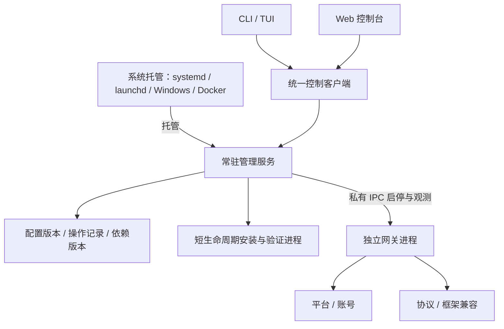

# OneBots 服务架构重构方案

状态：实施中，工作分支 `codex/service-architecture`。2026-09-08。

## 1. 目标与明确决策

OneBots 是完整的自托管产品。安装、配置、平台接入、协议输出、框架兼容、启停、升级和修复应在同一套产品模型中完成。

采用 **常驻管理服务 + 独立网关进程 + 系统托管 + CLI/TUI/Web 客户端**。停止或损坏网关，不得导致管理端不可用。允许替换现有内部架构；不长期保留两套安装器、配置写入者或进程控制器。

用户侧仍只有一个 `onebots` 命令、一套 Web 控制台、一个 Docker 容器。内部模块划分不要求用户分别安装多个产品。继续开源完整自托管能力，不引入云端控制台、计费或多租户作为前提。

确定以下产品行为：

1. Docker 空数据卷直接启动，Web 可访问；网关可空载运行，平台、账号、协议、框架选择均为空。
2. 用户无需先运行宿主脚本。CLI、TUI、Web 都能完成扩展安装、配置、应用与故障恢复。
3. 平台凭据和协议连接由用户填写；Schema 提供字段、校验和有意义的选项，不生成虚构账号或强制启用某协议。
4. 网关停止后，Web 仍能编辑配置、安装依赖并再次启动网关。
5. 系统托管维护管理服务，管理服务独占网关的生命周期；两者不同时争抢网关进程。
6. 安装、启用、配置、启动是不同操作。安装包不会擅自打开平台连接或协议出口。
7. 必需 peer 与宿主运行时一起解析和验证，不能把“npm 返回成功”当成可启动。
8. 所有发版仍使用 **patch**。内部破坏性重构不借机改成 minor/major，也不新增自动版本等级校验。

## 2. 当前代码与实测问题

以下是本次本地源码检查和容器验证结果，不是新架构已实现的能力。

| 当前入口 | 现状 | 重构结论 |
| --- | --- | --- |
| `packages/onebots/src/app.ts` | `App.start()` 同时注册鉴权、配置、扩展、账号、终端等管理路由并启动网关 | 拆出独立管理宿主，网关不承载控制台 |
| `runtime.ts`、`runtime-shutdown.ts` | 直接启动应用并处理进程信号 | 保留网关启动/停机能力，纳入管理服务的子进程契约 |
| `service-manager.ts`、`service-definition.ts` | 系统服务定义直接携带网关插件选择和配置 | 系统服务只指向管理服务和工作区，不固化平台/协议选择 |
| `cli/command-application.ts` | 同时处理系统服务、运行时预检、管理请求和本地状态 | 保留命令交互，业务控制收敛到统一客户端 |
| `routes/extensions.ts`、`extension-manager.ts` | 在线包变更直接作用于运行目录 | 替换成候选版本安装和激活事务 |
| `installation-local.ts`、`scripts/docker-extension-*.mjs` | 本机与容器有不同下载、验证、切换路径 | 统一安装模型，宿主差异放在执行实现中 |
| `routes/config.ts`、`process-restart.ts` | Web 重启依靠当前网关退出，再由外部机制拉起 | 管理服务接收重启操作，网关不决定自己的重生 |
| `packages/web/src/views/extension-*` | 依赖网关管理接口和实例快照 | 接到独立管理服务，网关离线时仍可编辑与管理 |

本轮实验已确认：

- 空白 Web、管理鉴权、零扩展状态可以工作。
- 在试验容器中通过 Web 安装 Matrix 时，包管理器产生了第二份 `onebots`：网关使用 `/app/packages/onebots`，插件解析到 `/data/extensions/node_modules/.pnpm/onebots@1.2.12/...`。注册表身份检查拒绝加载，后续恢复也未完整成功。
- 因此，“放开 Docker 在线安装限制 + 增加进程重启循环”不足以形成正确产品架构，不能作为完成证明。
- 已推送的 `0f5819c6` 包含首次缺配置等待行为，与用户最新预期不符，必须在整体切换中替换。后续未提交的局部实验不作为正式交付。

## 3. 进程与模块职责



### 管理服务

承载 Web、鉴权、控制接口、配置草稿、扩展目录、安装操作、日志、状态、网关生命周期和恢复。管理服务自身不导入平台 SDK、协议插件或框架扩展，不依赖插件注册表才能启动。

只有管理服务可以提交配置版本、激活依赖版本和改变网关期望状态。配置损坏时进入可诊断的恢复界面，不能跟着网关一起启动失败。

### 网关进程

保留 Adapter → Account/ID → Protocol/Application 的业务模型，以及原始 ID 类型契约、平台事件和开放协议报文契约。只消费管理服务交付的明确运行版本和配置快照，负责接入、转发、账号生命周期与协议连接。

网关不执行包管理器，不修改系统服务定义，不保存管理凭据，不写管理服务的状态库，也不递归拉起自己。网关报告启动握手、配置版本、依赖版本、进程实例、账号状态和退出原因。

### 系统托管

systemd、launchd、Windows 托管或 Docker 只负责管理服务的存活和开机启动。管理服务内部的同一生命周期实现负责网关，Docker 不再单独实现一套网关退出码循环。

本机默认用户级服务；`--system` 明确安装系统级服务。提权仅用于安装/卸载系统定义，不让 Web 或网关以管理员身份运行。Docker 使用前台管理服务作为容器主程序，转发终止信号、回收子进程，不安装 systemd，也不挂载 Docker socket。

### CLI、TUI、Web

它们是同一控制接口的不同客户端。终端向导只是交互形式，不拥有自己的安装事务或配置保存机制。所有入口使用同一目录、Schema、安装计划、错误码、操作状态和修复建议。

系统服务的首次安装/卸载属于 CLI 引导职责；管理服务未启动时，CLI 可通过系统托管接口启动它，再连接控制接口，不能退回另一套直接修改网关的路径。

## 4. 用户命令与控制契约

命令名称是目标设计，不代表当前 CLI 已具备下列全部语义。

| 命令/操作 | 唯一含义 |
| --- | --- |
| `onebots install` | 引导安装完整产品和系统托管；允许空白安装，选择扩展时复用统一安装计划 |
| `onebots uninstall` | 停止进程、移除系统托管，默认保留账号数据和配置；清除数据必须显式选择 |
| `onebots start / stop / restart` | 改变网关状态；`stop` 不关闭管理服务和 Web |
| `onebots status` | 分别显示管理服务、网关期望/实际状态、账号状态和进行中操作 |
| `onebots ui` | 连接管理服务的 TUI 工作台 |
| `onebots extensions install / remove` | 安装或移除依赖版本，不隐式连接账号；被引用依赖不可直接删除 |
| `onebots config validate / apply` | 校验草稿、提交并应用配置，明确是否需要切换网关 |
| `onebots logs` | 选择管理日志、网关日志或某次操作日志 |
| `onebots service start / stop / status` | 显式控制管理服务本身，限本地系统权限；区别于网关启停 |
| `onebots serve` | 前台运行管理服务，供 Docker、系统托管和开发使用 |

控制接口分为状态查询、计划预检、提交操作、查询/订阅操作结果。写操作返回 `operationId`，不能把受理成功写成安装成功或重启成功。请求包含幂等键和期望配置版本；幂等键重复但内容不同必须拒绝。

本地 CLI 使用私有 Unix socket / Windows named pipe，并校验操作系统访问权限。Web 使用鉴权后的 HTTP 与事件流。远程 CLI 显式配置地址与认证。外部 HTTP 与本地 IPC 是同一管理模块的传输实现，不维护两套业务语义。

管理服务与网关使用父子进程私有 IPC，带协议版本、管理实例和网关实例标识；不开放无鉴权 TCP 控制端口。系统服务安装/卸载不暴露为远程 Web 提权功能。

## 5. 端口、入口和健康状态

默认继续使用一个对外端口 `6727`，避免要求用户重配多套端口。

- 管理服务持有公共入口：Web、管理接口、健康检查和公共静态校验文件。
- 网关的 HTTP/WS 入口只监听私有本地地址。管理入口向当前网关转发平台回调和协议流量，保留现有外部路径。
- 代理目标由当前网关握手确定，不能由外部请求指定。管理路径保留，不允许插件覆盖。
- 原始请求体、签名所需头、查询参数、上传、SSE、WebSocket、背压与断连必须完整验证。不能解析后重新序列化平台签名报文。
- 反向 WS、Webhook 等出站连接仍归网关。网关退出时关闭旧连接；下一实例不能与旧实例同时登录同一账号。
- 网关不可用时，协议入口给出明确的暂不可用响应，不能返回 Web HTML 或假的协议成功。

健康状态分开：管理服务可用、网关可用、平台账号在线。空白安装和用户主动停止网关时，容器管理健康检查仍通过；网关崩溃必须在状态界面和告警中显式呈现。不能为重启某个账号而使整个控制台消失。

首次管理认证采用本地受权限保护的初始化入口：本机安装向导可交互设定管理认证；Docker 用户可通过 `docker exec <容器> onebots auth bootstrap` 获取短时、单次的配对码，再在 Web 完成初始化。此命令属于目标接口，需验证调用身份。配对码不写容器日志、不进入 URL，必须原子消费、限流并过期失效；初始化完成后不能再次无条件重置认证。初始管理接口不得因“尚未配置”而免鉴权开放。

管理认证保存在独立的私有控制目录，不随网关配置传递。旧配置中混合存储的管理认证在迁移时拆出；配置导出默认脱敏。远程用户不应为了首次登录先编写一份平台配置。

## 6. 生命周期与持久化状态

网关期望状态只包含 `running` / `stopped`；实际状态包含 `starting`、`running`、`stopping`、`stopped`、`failed`。两者分别存储和显示。

- 显式停止先持久化 `stopped` 再停机，管理服务或容器重启后不应偷偷启动账号。
- 显式启动先校验已选运行版本，取得工作区独占权，再创建子进程；同一工作区不得重复启动。
- 重启是一次有记录的停止与启动事务，收到新实例握手并验证配置/依赖版本后才宣告成功。
- 正常停止等待资源释放；超时按受管进程组终止，不能按一个可能复用的旧 PID 杀进程。
- 异常退出按有界退避恢复；超过阈值进入 `failed`，控制台继续运行，避免无限崩溃循环。
- 管理服务重启后从持久化记录恢复期望状态、对账未完成操作。结果不明时先核实，不能直接重放安装或重复启动。
- 管理服务终止时停止并回收网关与安装子进程。各操作系统分别验证父进程退出、强杀与重启后的孤儿进程处理。

持久化放在一个工作区：配置版本、运行数据、不可变依赖版本、操作日志和本地认证材料。操作日志先落盘再产生外部效果；小规模单实例先采用受锁保护的原子文件记录，避免为控制面引入数据库服务。需要多记录原子性时通过提交指针和恢复流程保证，不把多次写文件当成事务。

配置只允许管理服务提交。手工编辑文件视为待导入的外部变更，经过同一预检，不自动覆盖运行快照。启动采用固定快照；保留“已保存”和“已应用”的区别。

## 7. 统一安装和运行版本

安装流程统一为：

```text
选择平台/协议/框架 → 展示依赖与必需 peer → 填写必要授权 → 确认计划
→ 下载到候选目录 → 清除下载凭据 → 校验与加载预检 → 标记可用版本
→ 展示该版本 Schema → 用户填写账号与协议 → 明确应用 → 切换网关
```

依赖状态至少区分 `available`、`installing`、`installed`、`selected`、`active`、`failed`。选中包、安装完成、配置已保存、实例已生效不能混为一个“已启用”。未配置 Bot 也必须能查看适配器能力清单。

每个依赖版本包含匹配的网关宿主、唯一 `onebots`/`@onebots/core` 身份、扩展、必需 peer、锁文件和验证记录。网关从该版本自己的入口启动，不能用镜像 A 的宿主去加载安装目录 B 的另一份宿主。

验证至少覆盖：准确版本、包身份、peer 满足、宿主单例、ESM 加载、注册成功、Schema 与配置一致。包管理器退出成功只代表下载步骤结束。控制面永远不加载候选插件来生成表单；使用版本化声明式元数据，必要的动态探测交给短生命周期验证进程。

禁止修改活动依赖目录。下载失败直接废弃候选版本；激活失败恢复先前运行版本与配置指针。真实数据库、聊天记录和平台会话不随依赖回滚删除，也不能承诺撤销已经发送的平台消息。

第一次安装没有旧版本：失败后管理端继续运行、保留错误和用户草稿，不能虚构“回滚成功”。下载中断可重试下载，激活结果未知必须先对账。删除依赖使用同样的候选版本机制，不原地卸载运行中的包。

更新管理程序本身与更新网关依赖分开：Docker 由用户更新镜像；本机由 CLI 和系统托管配合替换管理程序。Web 不让运行中的管理进程对自身执行 `npm update`。

## 8. 私有依赖与凭据

私有包也由 CLI/TUI/Web 提交同一种安装操作；宿主脚本不再是唯一必经入口。Web 使用 HTTPS 或可信的本地隧道提交下载授权，不通过 URL、命令行参数或日志传递 Token。

信任角色明确：管理服务是用户授权的控制面，可以短暂接收下载凭据；网关和平台插件不应收到下载凭据。安装器只接收本次下载需要的授权，使用范围受限的临时凭据通道。下载阶段禁用生命周期脚本，完成后终止下载进程、清除临时认证材料，再启动不携带凭据的验证进程。失败、取消和控制服务恢复都要清理临时文件。

不把 Token 放进镜像层、依赖版本清单、配置导出、操作记录或运行时环境。需要跨重启重试时重新输入授权，默认不长期保存私有仓库凭据。原生模块需要构建时，在无下载凭据的独立构建阶段执行；缺少构建依赖应明确失败，不能标记已完成。

**安全承诺的限制**：普通子进程和清空环境变量不是安全沙箱。同一用户身份下的恶意已安装代码可能读取同用户文件或进程信息。默认产品面向用户信任的扩展，保证凭据生命周期与不意外传播；不能宣称抵御恶意同权限插件。强隔离需要不同系统身份、ACL/容器隔离及网络限制的实际实现，并通过对应环境验证，不能用 `--network` 字样或环境变量代替。

控制面不暴露任意 shell、任意下载地址或任意 npm 包执行接口。可信扩展目录、安装版本、依赖计划与已有鉴权/并发保护继续保留。

## 9. 源码组织与删除清单

先在现有发布包内按模块组织，避免为了架构外形立即拆出一批 npm 包：

```text
packages/onebots/src/
  control/       # 常驻宿主、工作区状态、配置提交、操作调度
  gateway/       # 网关子进程入口、IPC、生命周期
  installation/  # 计划、候选依赖版本、下载、验证、激活与恢复
  hosting/       # 系统服务安装/卸载与前台托管
  client/        # CLI/TUI/Web 共用的控制契约和客户端
  cli/           # 命令解析和输出
  tui/           # 终端交互
packages/web/    # 控制客户端的 Web 呈现
packages/core/   # 保留平台/协议/账号/ID 内核
```

共享契约不得依赖 `App`、平台 SDK 或 CLI 渲染框架。Web 可通过构建共享契约入口消费，无须引入服务器实现。只有出现真实独立发布/复用需求时才拆包。

替换或删除：

- `App.start()` 中的管理路由、Web 宿主及管理鉴权状态，迁移到管理模块。
- Web 通过网关 `process.exit(75)` 实现自重启的路径，改为统一生命周期操作。
- TUI、Web、Docker 分别直接执行安装、保存配置、切换进程的逻辑。
- Docker 入口中的固定插件参数、示例配置复制、等待用户脚本才启动的分支。
- 服务定义中重复存储插件选择，与配置不一致时的多套修补逻辑。
- 活动目录在线 `npm/pnpm install`、卸载后还原锁文件的补救流程。
- 本轮未提交的独立 Docker supervisor 实验，不作为另一个永久进程管理实现。

保留并迁移已有价值：扩展可信目录、能力清单、Schema、原始 ID 契约、包身份检查、实例/配置版本前置条件、凭据脱敏、账号预检、跨平台系统服务安装权限检查。

## 10. 迁移与兼容策略

允许替换内部模块和管理接口，但必须公开迁移行为，不以 patch 版本掩盖风险。

- 保持 OneBot/Satori/Milky/MCP 等对外协议报文与连接路径；框架 `-t` 选择保留概念，不强制开启其依赖协议，缺失时给出明确配置引导。
- CLI/Web 同批切换到新控制契约。版本不匹配应拒绝写操作并提示更新，不维护第二套旧控制器。
- 配置引入结构版本。识别旧 YAML，备份后单向导入；旧插件参数与 YAML 冲突时展示差异，不猜测丢弃。
- 迁移系统服务时先确认旧网关停止，再切换服务定义并验证新管理端；失败恢复原服务定义。账号不能双开。
- 原账号数据库、ID 映射、媒体、密钥和登录态保留；不为了布局整齐重建 ID 或清空数据目录。
- 升级失败需要能恢复旧程序、配置和服务定义。回退到旧版本前检查数据格式兼容性，不承诺无条件降级。
- Docker/HF/1Panel/本机安装文档及生成的服务定义同时更新，旧安装脚本要么退役，要么仅调用新入口，不能继续拥有独立业务实现。

## 11. 实施顺序与交付门槛

每一步交付可验证的完整流程；可在隔离分支中分阶段提交，但不能把未完成的双轨架构直接发布到 master。完整切换前不再扩充外围框架或修饰 UI。

| 阶段 | 交付 | 验收门槛 | 粗估工作量 |
| --- | --- | --- | --- |
| 1. 控制契约与空白启动 | 管理宿主、网关 IPC、统一状态、公共入口、最小 CLI/Web | 空卷直接打开 Web；停网关后 Web 保持可用；能再启动，容器无宿主脚本依赖 | 12–16 小时 |
| 2. 依赖版本与凭据流程 | 单一安装模块、必需 peer、私有下载、验证、激活恢复 | CLI/Web 同一计划；公开包真实下载；私有包授权成功/拒绝均正确；不存在重复宿主；中断不损坏旧版本 | 12–20 小时 |
| 3. 配置与各客户端统一 | 动态 Schema、草稿/保存/应用、账号协议/框架配置、日志与操作进度 | 未建 Bot 可看能力；网关离线可编辑；三个入口共享冲突、失败、重试语义 | 10–16 小时 |
| 4. 系统托管与迁移 | 各系统服务、Docker/HF、安装卸载、旧配置/服务迁移 | 启停语义一致；机器重启保持期望状态；卸载保留数据；旧服务迁移不双开且可恢复 | 12–20 小时 |
| 5. 产品验收与清理 | 故障注入、完整文档、删旧路径、构建产物与 CI | 下列验收全部满足，遗留实现已移除，发布仅 patch | 8–12 小时 |

粗估合计 54–84 小时，按 8 小时/工作日约 7–11 天；这是范围评估，不是承诺完成时间。环境权限、私有包访问和 Windows 实机验证可能影响日历时间，不能用模拟测试替代实机证据。

最终验收必须覆盖：

- 全新 Docker：不运行脚本、不挂 Docker socket，Web 登录 → 安装 → 配置 → 应用 → 实际协议调用成功。
- 同一流程通过 CLI、TUI 完成，状态和操作记录与 Web 一致。
- 主动 stop 后 Web 保持在线；管理服务重启后网关仍停止；start 后恢复。
- 插件加载失败、配置错误、peer 冲突、下载断网、错误私有授权，均不破坏管理端和旧可用版本。
- 安装、验证、切换各阶段强制中断，重启后能正确对账；第一次安装失败与已有版本回退区别处理。
- 连续 restart、CLI/Web 同时 apply、过期页面、请求超时重试，不重复启动、不覆盖新配置、不重复激活。
- 保留账号/ID/会话数据，切换时没有两个实例同时接入同一账号。
- HTTP 签名回调、上传、WS、反向 WS、SSE、鉴权和所有现有协议/框架连接回归通过。
- Linux、macOS、Windows、Docker 各自提供实际托管证据；无法访问的环境明确标记未验证，不宣告全平台完成。
- 构建、相关测试、npm tarball、镜像、文档和对应提交的 CI 分别验收；CI 通过不等于已发布。

## 12. 可用于目标模式的完整目标

将 OneBots 整体重构为常驻管理服务、独立网关进程、系统托管和统一 CLI/TUI/Web 客户端组成的完整自托管产品。空白安装直接提供管理端，不预填平台账号或协议；所有客户端共用安装、配置、启停、升级和恢复能力，支持公开与私有依赖及必需 peer。网关停止或失败不影响管理端，通过不可变运行版本、持久化操作和单一生命周期控制保证可验证切换与恢复。完成旧配置/服务迁移、删除被替代实现、跨入口和实际部署验收、文档及对应 CI 后收口。允许必要的内部破坏性重构，保留账号数据、ID 和外部协议契约，全部版本变更只使用 patch。


## 13. 实施记录

### 第一阶段：已验证最小管理与网关闭环

- 新增独立 GatewayApp 与私有 IPC 网关入口；真实 Mock + OneBot 调用通过。
- 管理服务独立持有 Web、认证、HTTP/WS 入口和工作区控制权；CLI/Web 共用纯控制客户端。
- 期望状态与实际状态分离，操作先持久化再执行；停止失败保留控制锁，恢复期间不代理历史端口。
- 控制工作区采用 Node 内置 SQLite 的专用长期写事务锁；进程强杀后由 OS 释放，不基于旧 PID 删除他人的锁。它不作为业务状态数据库，仅适用于可靠本地文件锁卷。
- 私有本地 IPC 生成单次配对码；公开 HTTP 不能获取配对码。认证损坏失败关闭，不把网关配置凭据放进错误消息。
- 阶段回归：130 文件 / 997 测试通过。真实 Docker 空卷无需宿主脚本，Web 配对、启停/重启网关、管理端持续在线通过；容器重启保留用户的停止意图。
- 隔离分支提交 `251534d5` 的 [CI 验证通过](https://github.com/lc-cn/onebots/actions/runs/34184063251)：全量构建、测试、打包检查、Docker 构建及空卷/重启验证；没有合入 master 或发布。

第一阶段仍处于隔离分支验收，不代表完整产品已交付：CLI 目前以 `control start/stop/restart/status` 验证统一客户端；旧命令、完整 Web 配置页、TUI、安装、迁移和系统托管尚待后续统一切换。Windows 本地控制传输明确拒绝，待 ACL 实现和实机验收，不能视为已支持。异常退出自动退避与完整中断恢复仍需后续故障注入验收。

### 第二阶段：运行版本安装与切换验收中

- 纯计划绑定精确宿主/core 工件、选择集合、必需 peer 原始约束、平台/架构/Node ABI 和摘要；框架只注册兼容能力，不补开协议。
- 公开扩展来自可信目录的固定版本。已有 Mock 适配器纳入可选目录，标注本地测试用途，不作为默认账号或默认选择。
- 管理服务内置精确 pnpm 9.15.9，用 Node 执行其受信入口并核验实际版本，不再依赖 Corepack 临时下载的版本。
- 下载只生成候选文件，禁用生命周期脚本。pnpm 的 file override 会改写 peer 范围，因此下载阶段不依赖其 strict-peer 检查判定兼容性；隔离验证进程必须重新核验实际包的原始必需 peer、完整解析图、唯一宿主身份、插件注册与 Schema。下载结束不能生成成功收据或触发激活。
- 本地工件复制后核验实际字节，按摘要存入私有只读快照；源文件后续改变不影响已确认计划。运行目录不原地安装或卸载。
- 临时授权由短命下载 worker 持有。父进程断连时回收下载进程组并清理授权；worker 异常死亡时按持久化所有权恢复，存活或归属未知的记录阻止继续安装，不误删或盲目杀进程。
- 激活与启停共用单一串行入口；原期望停止时仍保持停止，新实例失败仅在确认子进程已回收后恢复旧版本。持久化失败或中断结果未知时保留诊断，不虚报成功。
- CLI/Web 共用计划、安装状态、取消与显式应用接口；私有 Token 不放入命令行参数、URL、浏览器持久存储或操作记录。

已验证真实候选下载、候选自身宿主/core 单例、Mock + OneBot v11 注册与 Schema 验证；完整仓库回归为 678 个文件 / 4,713 项测试通过，全量构建与 41 个发布包边界检查通过。真实父进程与下载 worker 的 SIGKILL 清理测试通过。真实控制 API 完成公开 MCP 下载、冲突拒绝、激活幂等、Mock 协议调用和管理服务重启恢复；浏览器验证仅选择 Zhin 不会自动勾选协议，停止网关后安装面板仍可使用。最终 Alpine 镜像构建通过，空卷 Web 配对、启停、容器重启保留停止意图均通过；在镜像内使用自带宿主工件真实下载 Mock、OneBot v11、MCP，完成验证、激活及实际协议调用，停网关后管理服务继续在线。本阶段提交 CI 待验证，不以局部通过代替完整目标完成。

原生终端 PTY 改为按需加载的可选依赖；镜像安装及生产裁剪禁用依赖生命周期脚本，避免旧终端的外部原生包下载阻止管理服务启动。干净安装后的 Vue/Vite/Tailwind 与 esbuild 构建以及 Alpine 容器整体运行验收均通过。

尚未使用真实私有包授权或真实平台账号作在线验收；Windows 进程树与 ACL 未实机验证。第三至第五阶段的配置/TUI统一、系统托管迁移、旧实现删除及完整产品文档仍未完成。不将这些阶段性改动推送到 master 或发布为完成产品。
