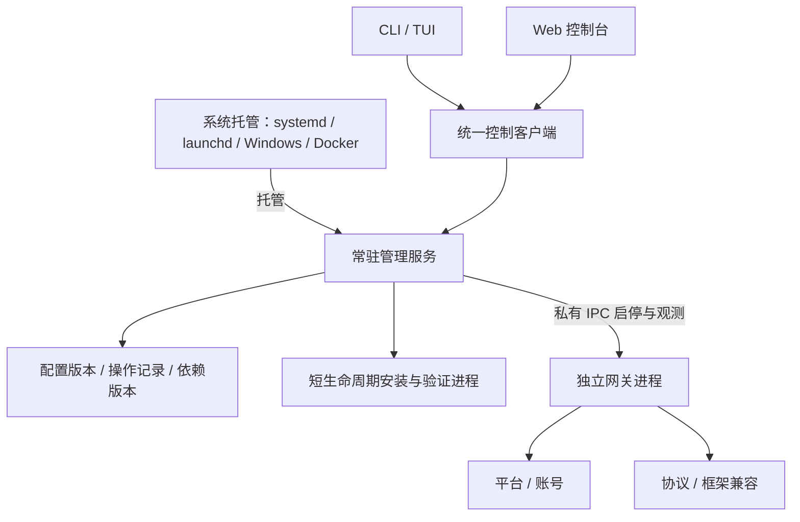

# OneBots 服务架构重构方案

状态：实施中，工作分支 `codex/service-architecture`。2026-09-08。

## 1. 目标与明确决策

OneBots 是完整的自托管产品。安装、配置、平台接入、协议输出、框架兼容、启停、升级和修复应在同一套产品模型中完成。

采用 **常驻管理服务 + 独立网关进程 + 系统托管 + CLI/TUI/Web 客户端**。停止或损坏网关，不得导致管理端不可用。允许替换现有内部架构；不长期保留两套安装器、配置写入者或进程控制器。

用户侧仍只有一个 `onebots` 命令、一套 Web 控制台、一个 Docker 容器。内部模块划分不要求用户分别安装多个产品。继续开源完整自托管能力，不引入云端控制台、计费或多租户作为前提。

确定以下产品行为：

1. Docker 空数据卷直接启动，Web 可访问；网关可空载运行，平台、账号、协议、框架选择均为空。
2. 用户无需先运行宿主脚本。CLI、TUI、Web 都能完成扩展安装、配置、应用与故障恢复。
3. 平台凭据和协议连接由用户填写；Schema 提供字段、校验和有意义的选项，不生成虚构账号或强制启用某协议。
4. 网关停止后，Web 仍能编辑配置、安装依赖并再次启动网关。
5. 系统托管维护管理服务，管理服务独占网关的生命周期；两者不同时争抢网关进程。
6. 安装、启用、配置、启动是不同操作。安装包不会擅自打开平台连接或协议出口。
7. 必需 peer 与宿主运行时一起解析和验证，不能把“npm 返回成功”当成可启动。
8. 所有发版仍使用 **patch**。内部破坏性重构不借机改成 minor/major，也不新增自动版本等级校验。

## 2. 当前代码与实测问题

以下是本次本地源码检查和容器验证结果，不是新架构已实现的能力。

| 当前入口 | 现状 | 重构结论 |
| --- | --- | --- |
| `packages/onebots/src/app.ts` | `App.start()` 同时注册鉴权、配置、扩展、账号、终端等管理路由并启动网关 | 拆出独立管理宿主，网关不承载控制台 |
| `runtime.ts`、`runtime-shutdown.ts` | 直接启动应用并处理进程信号 | 保留网关启动/停机能力，纳入管理服务的子进程契约 |
| `service-manager.ts`、`service-definition.ts` | 系统服务定义直接携带网关插件选择和配置 | 系统服务只指向管理服务和工作区，不固化平台/协议选择 |
| `cli/command-application.ts` | 同时处理系统服务、运行时预检、管理请求和本地状态 | 保留命令交互，业务控制收敛到统一客户端 |
| `routes/extensions.ts`、`extension-manager.ts` | 在线包变更直接作用于运行目录 | 替换成候选版本安装和激活事务 |
| `installation-local.ts`、`scripts/docker-extension-*.mjs` | 本机与容器有不同下载、验证、切换路径 | 统一安装模型，宿主差异放在执行实现中 |
| `routes/config.ts`、`process-restart.ts` | Web 重启依靠当前网关退出，再由外部机制拉起 | 管理服务接收重启操作，网关不决定自己的重生 |
| `packages/web/src/views/extension-*` | 依赖网关管理接口和实例快照 | 接到独立管理服务，网关离线时仍可编辑与管理 |

本轮实验已确认：

- 空白 Web、管理鉴权、零扩展状态可以工作。
- 在试验容器中通过 Web 安装 Matrix 时，包管理器产生了第二份 `onebots`：网关使用 `/app/packages/onebots`，插件解析到 `/data/extensions/node_modules/.pnpm/onebots@1.2.12/...`。注册表身份检查拒绝加载，后续恢复也未完整成功。
- 因此，“放开 Docker 在线安装限制 + 增加进程重启循环”不足以形成正确产品架构，不能作为完成证明。
- 已推送的 `0f5819c6` 包含首次缺配置等待行为，与用户最新预期不符，必须在整体切换中替换。后续未提交的局部实验不作为正式交付。

## 3. 进程与模块职责



### 管理服务

承载 Web、鉴权、控制接口、配置草稿、扩展目录、安装操作、日志、状态、网关生命周期和恢复。管理服务自身不导入平台 SDK、协议插件或框架扩展，不依赖插件注册表才能启动。

只有管理服务可以提交配置版本、激活依赖版本和改变网关期望状态。配置损坏时进入可诊断的恢复界面，不能跟着网关一起启动失败。

### 网关进程

保留 Adapter → Account/ID → Protocol/Application 的业务模型，以及原始 ID 类型契约、平台事件和开放协议报文契约。只消费管理服务交付的明确运行版本和配置快照，负责接入、转发、账号生命周期与协议连接。

网关不执行包管理器，不修改系统服务定义，不保存管理凭据，不写管理服务的状态库，也不递归拉起自己。网关报告启动握手、配置版本、依赖版本、进程实例、账号状态和退出原因。

### 系统托管

systemd、launchd、Windows 托管或 Docker 只负责管理服务的存活和开机启动。管理服务内部的同一生命周期实现负责网关，Docker 不再单独实现一套网关退出码循环。

本机默认用户级服务；`--system` 明确安装系统级服务。提权仅用于安装/卸载系统定义，不让 Web 或网关以管理员身份运行。Docker 使用前台管理服务作为容器主程序，转发终止信号、回收子进程，不安装 systemd，也不挂载 Docker socket。

### CLI、TUI、Web

它们是同一控制接口的不同客户端。终端向导只是交互形式，不拥有自己的安装事务或配置保存机制。所有入口使用同一目录、Schema、安装计划、错误码、操作状态和修复建议。

系统服务的首次安装/卸载属于 CLI 引导职责；管理服务未启动时，CLI 可通过系统托管接口启动它，再连接控制接口，不能退回另一套直接修改网关的路径。

## 4. 用户命令与控制契约

命令名称是目标设计，不代表当前 CLI 已具备下列全部语义。

| 命令/操作 | 唯一含义 |
| --- | --- |
| `onebots install` | 引导安装完整产品和系统托管；允许空白安装，选择扩展时复用统一安装计划 |
| `onebots uninstall` | 停止进程、移除系统托管，默认保留账号数据和配置；清除数据必须显式选择 |
| `onebots start / stop / restart` | 改变网关状态；`stop` 不关闭管理服务和 Web |
| `onebots status` | 分别显示管理服务、网关期望/实际状态、账号状态和进行中操作 |
| `onebots ui` | 连接管理服务的 TUI 工作台 |
| `onebots extensions install / remove` | 安装或移除依赖版本，不隐式连接账号；被引用依赖不可直接删除 |
| `onebots config validate / apply` | 校验草稿、提交并应用配置，明确是否需要切换网关 |
| `onebots logs` | 选择管理日志、网关日志或某次操作日志 |
| `onebots service start / stop / status` | 显式控制管理服务本身，限本地系统权限；区别于网关启停 |
| `onebots serve / run` | 前台运行同一管理服务，供 Docker、系统托管和开发使用；非交互无命令启动使用相同入口 |

公开前台入口只接受工作区与管理监听参数，不再用 `-c/-r/-p/-t` 直接启动旧网关。扩展选择与账号配置由管理端保存；旧系统服务先执行 `migrate`。HF 同样启动管理服务，不再运行旧扩展恢复安装器。迁移过渡期间，内部 `--service-runtime` 仍用于旧托管定义及回退；这一入口与公开 App API 尚存时，不宣称旧 App 管理鉴权已经删除。

开发入口 `pnpm dev` 已统一为当前开发工作区的管理服务。网关共享的默认值合并、协议默认值注册与扩展加载独立于旧 App；五个协议使用 `registerProtocolDefaults`。旧 `App.registerGeneral` 暂以相同注册表承接旧消费者，不另建默认值副本。`mcp` 已改为经私有控制连接访问现有网关，并删除独立账号启动实现；`send` 已改为管理发送操作和结果查询，不再读取旧管理凭据；仍需迁移 `update` 的旧服务重启，随后才能连同公开 App 构造入口移除整条旧管理链。

控制接口分为状态查询、计划预检、提交操作、查询/订阅操作结果。写操作返回 `operationId`，不能把受理成功写成安装成功或重启成功。请求包含幂等键和期望配置版本；幂等键重复但内容不同必须拒绝。

本地 CLI 使用私有 Unix socket / Windows named pipe，并校验操作系统访问权限。Web 使用鉴权后的 HTTP 与事件流。远程 CLI 显式配置地址与认证。外部 HTTP 与本地 IPC 是同一管理模块的传输实现，不维护两套业务语义。

管理服务与网关使用父子进程私有 IPC，带协议版本、管理实例和网关实例标识；不开放无鉴权 TCP 控制端口。系统服务安装/卸载不暴露为远程 Web 提权功能。

## 5. 端口、入口和健康状态

默认继续使用一个对外端口 `6727`，避免要求用户重配多套端口。

- 管理服务持有公共入口：Web、管理接口、健康检查和公共静态校验文件。
- 网关的 HTTP/WS 入口只监听私有本地地址。管理入口向当前网关转发平台回调和协议流量，保留现有外部路径。
- 代理目标由当前网关握手确定，不能由外部请求指定。管理路径保留，不允许插件覆盖。
- 原始请求体、签名所需头、查询参数、上传、SSE、WebSocket、背压与断连必须完整验证。不能解析后重新序列化平台签名报文。
- 反向 WS、Webhook 等出站连接仍归网关。网关退出时关闭旧连接；下一实例不能与旧实例同时登录同一账号。
- 网关不可用时，协议入口给出明确的暂不可用响应，不能返回 Web HTML 或假的协议成功。

健康状态分开：管理服务可用、网关可用、平台账号在线。空白安装和用户主动停止网关时，容器管理健康检查仍通过；网关崩溃必须在状态界面和告警中显式呈现。不能为重启某个账号而使整个控制台消失。

系统操作的恢复门禁也单独报告：即使管理服务及网关仍在线，未完成或损坏的系统操作记录仍须明确提示待对账。状态查询只读，不通过创建日志实例触发冷恢复，不读取迁移备份中的私有正文。

首次管理认证采用本地受权限保护的初始化入口：本机 CLI/TUI 可申请配对码授权浏览器；Docker 用户可通过 `docker exec <容器> onebots auth bootstrap` 获取短时、单次的配对码，再在 Web 完成初始化。本地入口必须验证调用身份。配对码不写容器日志、不进入 URL，必须原子消费、限流并过期失效；初始化完成后不能再次无条件重置认证。初始管理接口不得因“尚未配置”而免鉴权开放。

管理认证保存在独立的私有控制目录，不随网关配置传递。Web 只保留设备码配对与浏览器会话，不再提供旧用户名/密码或根级管理 `access_token` 登录。设备码只用于短时授权，不能作为长期凭据；会话需支持退出、撤销及本机恢复授权。迁移只移除合法旧配置根级的 `username`、`password`、`access_token`，不沿用这些旧凭据创建新会话，不递归删除平台密钥或协议鉴权字段。损坏 YAML 保留原始字节，由显式修复流程处理；配置导出默认脱敏。远程用户不应为了首次登录先编写一份平台配置。 控制台退出登录必须请求管理服务持久撤销当前会话，确认成功后才清除本地凭据；通信失败不能显示撤销成功。另设明确的“清除本地凭据”，只处理浏览器存储，不能冒充服务端退出。退出后仍通过本机恢复码重新授权，不重新开放首次初始化。

## 6. 生命周期与持久化状态

网关期望状态只包含 `running` / `stopped`；实际状态包含 `starting`、`running`、`stopping`、`stopped`、`failed`。两者分别存储和显示。

- 显式停止先持久化 `stopped` 再停机，管理服务或容器重启后不应偷偷启动账号。
- 显式启动先校验已选运行版本，取得工作区独占权，再创建子进程；同一工作区不得重复启动。
- 重启是一次有记录的停止与启动事务，收到新实例握手并验证配置/依赖版本后才宣告成功。
- 正常停止等待资源释放；超时按受管进程组终止，不能按一个可能复用的旧 PID 杀进程。
- 异常退出按有界退避恢复；超过阈值进入 `failed`，控制台继续运行，避免无限崩溃循环。
- 管理服务重启后从持久化记录恢复期望状态、对账未完成操作。结果不明时先核实，不能直接重放安装或重复启动。
- 管理服务终止时停止并回收网关与安装子进程。各操作系统分别验证父进程退出、强杀与重启后的孤儿进程处理。

持久化放在一个工作区：配置版本、运行数据、不可变依赖版本、操作日志和本地认证材料。操作日志先落盘再产生外部效果；小规模单实例先采用受锁保护的原子文件记录，避免为控制面引入数据库服务。需要多记录原子性时通过提交指针和恢复流程保证，不把多次写文件当成事务。

配置只允许管理服务提交。手工编辑文件视为待导入的外部变更，经过同一预检，不自动覆盖运行快照。启动采用固定快照；保留“已保存”和“已应用”的区别。

## 7. 统一安装和运行版本

安装流程统一为：

```text
选择平台/协议/框架 → 展示依赖与必需 peer → 填写必要授权 → 确认计划
→ 下载到候选目录 → 清除下载凭据 → 校验与加载预检 → 标记可用版本
→ 展示该版本 Schema → 用户填写账号与协议 → 明确应用 → 切换网关
```

依赖状态至少区分 `available`、`installing`、`installed`、`selected`、`active`、`failed`。选中包、安装完成、配置已保存、实例已生效不能混为一个“已启用”。未配置 Bot 也必须能查看适配器能力清单。

每个依赖版本包含匹配的网关宿主、唯一 `onebots`/`@onebots/core` 身份、扩展、必需 peer、锁文件和验证记录。网关从该版本自己的入口启动，不能用镜像 A 的宿主去加载安装目录 B 的另一份宿主。

验证至少覆盖：准确版本、包身份、peer 满足、宿主单例、ESM 加载、注册成功、Schema 与配置一致。包管理器退出成功只代表下载步骤结束。控制面永远不加载候选插件来生成表单；使用版本化声明式元数据，必要的动态探测交给短生命周期验证进程。

候选版本激活必须在唯一生命周期队列内，用候选宿主验证当前配置，即使网关已停止也不可跳过。安装收据只证明依赖可加载，不能替代配置兼容性验证。停止前与指针切换前复核配置摘要及候选收据；验证失败不得改变活动版本，停止后的变更则保守进入对账门禁。

禁止修改活动依赖目录。下载失败直接废弃候选版本；激活失败恢复先前运行版本与配置指针。真实数据库、聊天记录和平台会话不随依赖回滚删除，也不能承诺撤销已经发送的平台消息。

第一次安装没有旧版本：失败后管理端继续运行、保留错误和用户草稿，不能虚构“回滚成功”。下载中断可重试下载，激活结果未知必须先对账。删除依赖使用同样的候选版本机制，不原地卸载运行中的包。

更新管理程序本身与更新网关依赖分开：Docker 由用户更新镜像；本机由 CLI 和系统托管配合替换管理程序。Web 不让运行中的管理进程对自身执行 `npm update`。

## 8. 私有依赖与凭据

私有包也由 CLI/TUI/Web 提交同一种安装操作；宿主脚本不再是唯一必经入口。Web 使用 HTTPS 或可信的本地隧道提交下载授权，不通过 URL、命令行参数或日志传递 Token。

信任角色明确：管理服务是用户授权的控制面，可以短暂接收下载凭据；网关和平台插件不应收到下载凭据。安装器只接收本次下载需要的授权，使用范围受限的临时凭据通道。下载阶段禁用生命周期脚本，完成后终止下载进程、清除临时认证材料，再启动不携带凭据的验证进程。失败、取消和控制服务恢复都要清理临时文件。

不把 Token 放进镜像层、依赖版本清单、配置导出、操作记录或运行时环境。需要跨重启重试时重新输入授权，默认不长期保存私有仓库凭据。原生模块需要构建时，在无下载凭据的独立构建阶段执行；缺少构建依赖应明确失败，不能标记已完成。

**安全承诺的限制**：普通子进程和清空环境变量不是安全沙箱。同一用户身份下的恶意已安装代码可能读取同用户文件或进程信息。默认产品面向用户信任的扩展，保证凭据生命周期与不意外传播；不能宣称抵御恶意同权限插件。强隔离需要不同系统身份、ACL/容器隔离及网络限制的实际实现，并通过对应环境验证，不能用 `--network` 字样或环境变量代替。

控制面不暴露任意 shell、任意下载地址或任意 npm 包执行接口。可信扩展目录、安装版本、依赖计划与已有鉴权/并发保护继续保留。

## 9. 源码组织与删除清单

先在现有发布包内按模块组织，避免为了架构外形立即拆出一批 npm 包：

```text
packages/onebots/src/
  control/       # 常驻宿主、工作区状态、配置提交、操作调度
  gateway/       # 网关子进程入口、IPC、生命周期
  installation/  # 计划、候选依赖版本、下载、验证、激活与恢复
  hosting/       # 系统服务安装/卸载与前台托管
  client/        # CLI/TUI/Web 共用的控制契约和客户端
  cli/           # 命令解析和输出
  tui/           # 终端交互
packages/web/    # 控制客户端的 Web 呈现
packages/core/   # 保留平台/协议/账号/ID 内核
```

共享契约不得依赖 `App`、平台 SDK 或 CLI 渲染框架。Web 可通过构建共享契约入口消费，无须引入服务器实现。只有出现真实独立发布/复用需求时才拆包。

替换或删除：

- `App.start()` 中的管理路由、Web 宿主及管理鉴权状态，迁移到管理模块。
- Web 通过网关 `process.exit(75)` 实现自重启的路径，改为统一生命周期操作。
- TUI、Web、Docker 分别直接执行安装、保存配置、切换进程的逻辑。
- Docker 入口中的固定插件参数、示例配置复制、等待用户脚本才启动的分支。
- 服务定义中重复存储插件选择，与配置不一致时的多套修补逻辑。
- 活动目录在线 `npm/pnpm install`、卸载后还原锁文件的补救流程。
- 本轮未提交的独立 Docker supervisor 实验，不作为另一个永久进程管理实现。

保留并迁移已有价值：扩展可信目录、能力清单、Schema、原始 ID 契约、包身份检查、实例/配置版本前置条件、凭据脱敏、账号预检、跨平台系统服务安装权限检查。

## 10. 迁移与兼容策略

允许替换内部模块和管理接口，但必须公开迁移行为，不以 patch 版本掩盖风险。

- 保持 OneBot/Satori/Milky/MCP 等对外协议报文与连接路径；框架 `-t` 选择保留概念，不强制开启其依赖协议，缺失时给出明确配置引导。
- CLI/Web 同批切换到新控制契约。版本不匹配应拒绝写操作并提示更新，不维护第二套旧控制器。
- 配置引入结构版本。识别旧 YAML，备份后单向导入；旧插件参数与 YAML 冲突时展示差异，不猜测丢弃。
- 迁移系统服务时先确认旧网关停止，再切换服务定义并验证新管理端；失败恢复原服务定义。账号不能双开。
- 原账号数据库、ID 映射、媒体、密钥和登录态保留；不为了布局整齐重建 ID 或清空数据目录。
- 升级失败需要能恢复旧程序、配置和服务定义。回退到旧版本前检查数据格式兼容性，不承诺无条件降级。
- Docker/HF/1Panel/本机安装文档及生成的服务定义同时更新，旧安装脚本要么退役，要么仅调用新入口，不能继续拥有独立业务实现。

## 11. 实施顺序与交付门槛

每一步交付可验证的完整流程；可在隔离分支中分阶段提交，但不能把未完成的双轨架构直接发布到 master。完整切换前不再扩充外围框架或修饰 UI。

| 阶段 | 交付 | 验收门槛 | 粗估工作量 |
| --- | --- | --- | --- |
| 1. 控制契约与空白启动 | 管理宿主、网关 IPC、统一状态、公共入口、最小 CLI/Web | 空卷直接打开 Web；停网关后 Web 保持可用；能再启动，容器无宿主脚本依赖 | 12–16 小时 |
| 2. 依赖版本与凭据流程 | 单一安装模块、必需 peer、私有下载、验证、激活恢复 | CLI/Web 同一计划；公开包真实下载；私有包授权成功/拒绝均正确；不存在重复宿主；中断不损坏旧版本 | 12–20 小时 |
| 3. 配置与各客户端统一 | 动态 Schema、草稿/保存/应用、账号协议/框架配置、日志与操作进度 | 未建 Bot 可看能力；网关离线可编辑；三个入口共享冲突、失败、重试语义 | 10–16 小时 |
| 4. 系统托管与迁移 | 各系统服务、Docker/HF、安装卸载、旧配置/服务迁移 | 启停语义一致；机器重启保持期望状态；卸载保留数据；旧服务迁移不双开且可恢复 | 12–20 小时 |
| 5. 产品验收与清理 | 故障注入、完整文档、删旧路径、构建产物与 CI | 下列验收全部满足，遗留实现已移除，发布仅 patch | 8–12 小时 |

粗估合计 54–84 小时，按 8 小时/工作日约 7–11 天；这是范围评估，不是承诺完成时间。环境权限、私有包访问和 Windows 实机验证可能影响日历时间，不能用模拟测试替代实机证据。

最终验收必须覆盖：

- 全新 Docker：不运行脚本、不挂 Docker socket，Web 登录 → 安装 → 配置 → 应用 → 实际协议调用成功。
- 同一流程通过 CLI、TUI 完成，状态和操作记录与 Web 一致。
- 主动 stop 后 Web 保持在线；管理服务重启后网关仍停止；start 后恢复。
- 插件加载失败、配置错误、peer 冲突、下载断网、错误私有授权，均不破坏管理端和旧可用版本。
- 安装、验证、切换各阶段强制中断，重启后能正确对账；第一次安装失败与已有版本回退区别处理。
- 连续 restart、CLI/Web 同时 apply、过期页面、请求超时重试，不重复启动、不覆盖新配置、不重复激活。
- 保留账号/ID/会话数据，切换时没有两个实例同时接入同一账号。
- HTTP 签名回调、上传、WS、反向 WS、SSE、鉴权和所有现有协议/框架连接回归通过。
- Linux、macOS、Windows、Docker 各自提供实际托管证据；无法访问的环境明确标记未验证，不宣告全平台完成。
- 构建、相关测试、npm tarball、镜像、文档和对应提交的 CI 分别验收；CI 通过不等于已发布。

## 12. 可用于目标模式的完整目标

将 OneBots 整体重构为常驻管理服务、独立网关进程、系统托管和统一 CLI/TUI/Web 客户端组成的完整自托管产品。空白安装直接提供管理端，不预填平台账号或协议；所有客户端共用安装、配置、启停、升级和恢复能力，支持公开与私有依赖及必需 peer。网关停止或失败不影响管理端，通过不可变运行版本、持久化操作和单一生命周期控制保证可验证切换与恢复。完成旧配置/服务迁移、删除被替代实现、跨入口和实际部署验收、文档及对应 CI 后收口。允许必要的内部破坏性重构，保留账号数据、ID 和外部协议契约，全部版本变更只使用 patch。


## 13. 实施记录

### 第一阶段：已验证最小管理与网关闭环

- 新增独立 GatewayApp 与私有 IPC 网关入口；真实 Mock + OneBot 调用通过。
- 管理服务独立持有 Web、认证、HTTP/WS 入口和工作区控制权；CLI/Web 共用纯控制客户端。
- 期望状态与实际状态分离，操作先持久化再执行；停止失败保留控制锁，恢复期间不代理历史端口。
- 控制工作区采用 Node 内置 SQLite 的专用长期写事务锁；进程强杀后由 OS 释放，不基于旧 PID 删除他人的锁。它不作为业务状态数据库，仅适用于可靠本地文件锁卷。
- 私有本地 IPC 生成单次配对码；公开 HTTP 不能获取配对码。认证损坏失败关闭，不把网关配置凭据放进错误消息。
- 阶段回归：130 文件 / 997 测试通过。真实 Docker 空卷无需宿主脚本，Web 配对、启停/重启网关、管理端持续在线通过；容器重启保留用户的停止意图。
- 隔离分支提交 `251534d5` 的 [CI 验证通过](https://github.com/lc-cn/onebots/actions/runs/34184063251)：全量构建、测试、打包检查、Docker 构建及空卷/重启验证；没有合入 master 或发布。

第一阶段仍处于隔离分支验收，不代表完整产品已交付：CLI 目前以 `control start/stop/restart/status` 验证统一客户端；旧命令、完整 Web 配置页、TUI、安装、迁移和系统托管尚待后续统一切换。Windows 本地控制传输明确拒绝，待 ACL 实现和实机验收，不能视为已支持。异常退出自动退避与完整中断恢复仍需后续故障注入验收。

### 第二阶段：运行版本安装与切换验收中

- 纯计划绑定精确宿主/core 工件、选择集合、必需 peer 原始约束、平台/架构/Node ABI 和摘要；框架只注册兼容能力，不补开协议。
- 公开扩展来自可信目录的固定版本。已有 Mock 适配器纳入可选目录，标注本地测试用途，不作为默认账号或默认选择。
- 管理服务内置精确 pnpm 9.15.9，用 Node 执行其受信入口并核验实际版本，不再依赖 Corepack 临时下载的版本。
- 下载只生成候选文件，禁用生命周期脚本。pnpm 的 file override 会改写 peer 范围，因此下载阶段不依赖其 strict-peer 检查判定兼容性；隔离验证进程必须重新核验实际包的原始必需 peer、完整解析图、唯一宿主身份、插件注册与 Schema。下载结束不能生成成功收据或触发激活。
- 本地工件复制后核验实际字节，按摘要存入私有只读快照；源文件后续改变不影响已确认计划。运行目录不原地安装或卸载。
- 临时授权由短命下载 worker 持有。父进程断连时回收下载进程组并清理授权；worker 异常死亡时按持久化所有权恢复，存活或归属未知的记录阻止继续安装，不误删或盲目杀进程。
- 激活与启停共用单一串行入口；原期望停止时仍保持停止，新实例失败仅在确认子进程已回收后恢复旧版本。持久化失败或中断结果未知时保留诊断，不虚报成功。
- CLI/Web 共用计划、安装状态、取消与显式应用接口；私有 Token 不放入命令行参数、URL、浏览器持久存储或操作记录。

已验证真实候选下载、候选自身宿主/core 单例、Mock + OneBot v11 注册与 Schema 验证；完整仓库回归为 678 个文件 / 4,713 项测试通过，全量构建与 41 个发布包边界检查通过。真实父进程与下载 worker 的 SIGKILL 清理测试通过。真实控制 API 完成公开 MCP 下载、冲突拒绝、激活幂等、Mock 协议调用和管理服务重启恢复；浏览器验证仅选择 Zhin 不会自动勾选协议，停止网关后安装面板仍可使用。最终 Alpine 镜像构建通过，空卷 Web 配对、启停、容器重启保留停止意图均通过；在镜像内使用自带宿主工件真实下载 Mock、OneBot v11、MCP，完成验证、激活及实际协议调用，停网关后管理服务继续在线。隔离分支提交 `4aeb871c` 的 [CI 全部通过](https://github.com/lc-cn/onebots/actions/runs/34187976767)，包括全量构建、回归、tarball 边界和真实 Docker 安装/协议验收；不以第二阶段通过代替完整目标完成。

原生终端 PTY 改为按需加载的可选依赖；镜像安装及生产裁剪禁用依赖生命周期脚本，避免旧终端的外部原生包下载阻止管理服务启动。干净安装后的 Vue/Vite/Tailwind 与 esbuild 构建以及 Alpine 容器整体运行验收均通过。

尚未使用真实私有包授权或真实平台账号作在线验收；Windows 进程树与 ACL 未实机验证。第三至第五阶段的配置/TUI统一、系统托管迁移、旧实现删除及完整产品文档仍未完成。不将这些阶段性改动推送到 master 或发布为完成产品。


### 第三阶段：配置管理统一实施中

阶段三待办设计：[损坏配置恢复契约](./damaged-configuration-recovery.md)。该恢复能力尚未实现或验收；管理 Web 保持在线不代表坏 YAML 已可通过配置界面修复。后续须补齐原始字节私有备份、修复模式收据、原始摘要 CAS 和中断对账，不能把正常配置应用的已验证成果视为损坏配置恢复已完成。

先建立管理域内的配置文档、私有草稿及隔离校验边界，再接入应用事务与客户端，不复用旧路由直接写运行配置。草稿绑定运行版本和配置版本，独立持久化并检查编辑冲突；账号键使用显式路径段，保留字符串 ID。配置文档统一使用严格 JSON 校验，敏感值通过单独的保留/替换/清除操作处理，公开投影只返回是否已配置。

配置校验使用目标宿主自己的插件加载器与运行时规则，在独立进程内执行，不创建账号。当前已验证正常校验、超时、取消与已建立监听后的父进程强杀；worker 启动前先持久化所有权；未 fork 且父进程已死的目录可回收，启动中但缺少权威 PID 的窗口保守阻断。存活 worker、PID 重用、记录损坏、跨主机或符号链接均不自动删除，也不杀历史 PID。恢复检查已接入配置校验入口；服务关闭会取消校验并等待已接受操作完成。系统服务重启、跨系统迁移仍待后续验收，不能把模块测试视为所有系统环境已经完成验收。

安装验证现已从实际协议注册表导出映射元数据，配置读取同时核验 Schema 收据摘要；不从名称拆分猜测，也不为旧产物补造映射。草稿应用服务已将实际私有存储、Schema、敏感字段投影和运行版本冲突检查接通，支持显式建立无默认凭据/协议的空账号。

管理服务已提供配置快照、草稿编辑、账号创建、校验及应用 API，统一控制客户端已提供对应方法。下一步为 CLI/TUI/Web 操作界面、坏配置恢复及旧配置写入路径删除；不代表第三阶段已完成。


配置文件唯一写入器与配置应用事务已实现：以文件摘要检查版本，私有旧/新文档及意图先落盘，再停止、写入和按原期望状态启动；仅在确认子进程退出且文件仍属本次操作时回退。重复请求绑定校验标识、基础版本及文档摘要，未知结果进入恢复门禁。该门禁已接入真实管理宿主，损坏配置操作记录不会关闭 Web，也不会禁止停止；配置 API 只接受校验回执标识，再核对草稿、基础版本和运行指纹，不接受客户端直接提交正文绕过校验。

平台账号不再被强制要求至少配置一个协议出口；账号必填项和已启用协议字段继续由实际插件规则校验。此调整只解除强制输出约束，不自动启用平台、协议或框架。


已通过真实 HTTP 空白工作区流程：配对、读取宿主 Schema、创建草稿、编辑普通字段、独立校验、应用、幂等重放、保持停止意图及再启动。空白目录没有 onebots 依赖时，管理服务显式提供自己的可信宿主入口；候选版本仍定位候选内宿主。宿主路径不属于 HTTP 请求字段。


用户入口接入进展：`onebots control config` 已提供快照、草稿、字段编辑、账号与协议容器、校验、应用和操作查询；敏感输入只从受限 stdin 读取。Web 已接统一配置面板和 Schema 字段组件，秘密仅存在于内存，明确冲突与未知结果分开处理；浏览器实际验收因当前 Mac 锁屏未能执行，不记为通过。`onebots control tui` 已提供统一状态、启停和安装流程，配置交互回调与旧 TUI 替换尚未完成。

通过真实 HTTP 验证了未创建 Bot 时读取平台 Schema，再添加带点字符串账号 ID、设置 OneBot v11、应用并实际调用协议。新增父容器准备只为用户明确编辑的声明字段建立缺失对象，不填默认值，也不能绕过账号或协议容器创建流程。


本阶段用户入口检查点：全量构建通过，694 个测试文件 / 4,816 项回归通过，41 个发布包 tarball 检查通过。构建后的真实 TUI 可查看状态、停止网关并退出；停止后 CLI 仍能读取平台 Schema 和配置快照。临时管理服务均已关闭。Docker 验收脚本已改为通过统一配置 API 建草稿、添加账号与协议、校验并应用，不再直接写配置文件；该流程已在全新 Alpine 数据卷中真实验收通过，包含公开依赖下载、配置回执与重复应用、实际 OneBot 调用、停止后管理端在线和容器重启保持停止意图。


第三阶段交互与恢复补充：顶层 `onebots ui`、`tui`、`setup` 和交互式无参数入口已统一连接管理服务，旧交互入口不再直接写配置。安装与配置向导共用 `ControlClient`；管理服务未运行时明确提示先启动 `serve`，不会回落到旧网关。系统托管的 `install/start/stop` 和非交互运行迁移仍属第四阶段，尚未完成。

配置表单支持嵌套对象和声明式对象列表；列表追加仅创建空行，删除按草稿版本与索引执行，服务端保留秘密并重新生成索引投影。未知字段及敏感祖先禁止结构改写；目标文档在持久化前必须能安全投影。TUI 提供同一列表能力和显式验证应用，未知结果只查询原操作 ID。

认证凭证丢失可在本地运行 `onebots auth recover --data-dir <工作区>`，得到五分钟内一次性有效的恢复码；HTTP 无权签发，发码和错误输入均不撤销旧会话，成功兑换才替换凭证。Web 提供重新配对入口；恢复码与会话内容不写入操作日志。

浏览器限制已在本次验收时解除：临时工作区中通过实际 Web 完成配对、创建含点号账号、添加并编辑 Mock 好友列表、明确配置 OneBot HTTP、校验及应用；实际协议返回表单填写的测试好友。Web 停止网关后管理页继续在线，测试会话和临时服务已关闭。这不代表所有秘密列表、并发冲突及损坏配置恢复已经完成浏览器验收。

CI 检查点 `1979bdf2`（运行 `34192522112`）全流程成功，包含全仓库测试与实际 Docker 安装配置验收。它验证配置草稿检查点及测试依赖隔离修复；其后的交互、认证恢复与列表改动需由后续提交独立验证，不沿用旧 CI 结果。

本轮整合验收：全量 `pnpm build` 通过，699 个测试文件 / 4,851 项测试通过，41 个发布包 / 2,357 个文件 tarball 边界检查通过。构建后顶层 `tui` 在真实终端连接重启后的临时管理服务，确认此前 Web 停止网关的意图仍为 stopped；退出不关闭管理服务。标准 Docker 健康检查已只读取管理 `PORT` 并访问根 `/ready`，不再让业务 YAML 错误或业务路径影响管理健康。

认证收敛约束：Web 管理登录统一配对码与本地恢复码，后续删除旧管理 `username/password` 与配置中的管理 `access_token` 入口，并提供迁移提示。浏览器内部会话凭证、协议出口 `access_token` 和平台账号凭据继续保留，不得因字段同名而一并移除。旧 Web 登录页、未挂载路由、URL Token 登录和旧布局已经删除；保留尚待迁移的业务页面及其共享请求安全检查。旧 App 管理入口的删除仍须与运行入口迁移一起完成，不能提前宣称已完全移除。

管理端不保留用户名密码、永久管理 Token 与配对码三套并行登录方式。首次配对与本机恢复签发短时一次性码，日常访问使用可撤销的浏览器会话；恢复权限属于本机控制入口，不能从远程 Web 签发恢复码。此约束只针对管理认证，不改变平台接入和协议客户端的认证契约。 设备码只用于建立授权，不能作为长期请求凭据；浏览器会话须具有明确的到期与撤销规则。当前退出、恢复撤销及 30 天绝对会话有效期已实现：访问和服务重启不续期，到期须通过本机恢复码重新授权；无签发时间的旧会话同样须恢复，不重新开放初始化。设备会话管理已接入统一客户端：本机 `auth device` / TUI 签发追加授权码，Web 列出安全会话编号和授权/到期时间并支持逐设备撤销，最多 16 个有效会话；恢复兑换撤销所有旧设备。认证存储升级为 v2，有效 v1 会话迁移保留期限，不允许直接回退到只读 v1 的管理程序；OS 升级事务仍须核验数据格式兼容性，不能以旧用户名密码或管理 Token 作为备用入口。

无终端部署的首次授权通过 `ONEBOTS_BOOTSTRAP_CODE` 注入 32 字节随机码：在任何网关/worker 启动前消费环境，只存摘要，五分钟有效。同码重启不续期；未配对可换新码，最多保留 16 次消费历史以拒绝历史重放。首次部署码不能替换本地配对码或已有会话，不能用于恢复。无终端恢复使用另一个显式 Secret `ONEBOTS_RECOVERY_CODE`：仅已配对工作区接受，五分钟一次性，先消费历史再发布挑战，成功兑换才撤销旧会话；不覆盖本地恢复码，不续期或重放历史码，最多记录 16 次。两种 Secret 不可同时设置，均须在启动子进程前从环境清除。该入口属于部署管理员，不开放远程发码 API；不能用静态 Token 回退。管理端统一备份和私有上传目标核验仍待完成，真实 HF 云端恢复仍需验收。

HF 自动恢复仅限完全空卷，导入配置、账号数据和静态文件，永久排除 `.control`、依赖及临时授权。挂载点无法整体原子替换，恢复使用隔离验证和持久失败标记；部分发布、中断下载或残留暂存目录都阻止继续启动，不自动覆盖重试。业务配置原字节及账号 ID 保留；扩展须重新安装验证，不导入旧激活收据。旧“保存配置即上传 Space”链路不作为新管理端已交付能力。

损坏配置恢复已接入统一草稿、验证及应用事务，详见[恢复契约](./damaged-configuration-recovery.md)。真实浏览器完成备份确认、编辑、校验、应用和停止网关；私有备份逐字节保持中文及 CRLF。修复对账重新核验候选正文与原始摘要，不将日志中孤立的摘要视为覆盖授权。全量构建及主包补充构建通过，本批回归为 705 个文件 / 4,913 项测试通过；Docker 修复验收已加入隔离分支 CI，尚需观察远端执行结果。

本批回归也复现并修复了 SQLite 工作区锁的初始化竞争：移除抢锁前无用途的独立建表事务，八个独立进程竞争一百个新工作区的对照中，修复前二十轮无赢家，修复后零轮失败；永久回归覆盖四十轮竞争。后续系统服务迁移必须沿用同一工作区排他锁，不能另开第二套网关。

`serve --help` 已改为只显示帮助，构建后 CLI 在全新临时目录中验证退出成功且没有创建任何文件；未知、重复及旧网关参数会在启动前拒绝。过长的本地控制套接字路径仍需明确预检诊断。损坏配置时安装目录当前不可读，需在可信插件元数据与配置来源之间明确分离，只读目录不应依赖坏 YAML 解析成功。后两项尚未完成，不以配置修复流程通过代替完整产品验收。

第四阶段开始建立 `ManagerServiceSpec`：固定记录版本、运行种类、托管范围、工作区、Node/CLI 路径、工作目录和管理监听地址，不承载账号、协议或框架选择。严格读取和参数生成已实现并测试，尚未接入旧系统服务调用链；只有持久化迁移与回退事务完成后才切换，不能仅替换旧定义的启动参数。

提交 `0e370654` 的 [CI 全流程通过](https://github.com/lc-cn/onebots/actions/runs/34196309176)，包括新增 Docker 配置修复验收；该结果不涵盖后续第四阶段未提交改动。

迁移配置准备已实现：复现旧 `--service-runtime` 的配置优先规则；只移除根级旧管理认证字段，保留深层协议与平台同名凭据。仅支持真实同配置目录、同托管范围、同工作目录迁移，拒绝覆盖已有 `.control`、新配置或悬空目标链接。自定义旧 YAML 文件名明确映射到固定 `config.yaml`，不搬动 `data`；损坏来源保留原始字节，不推断空配置。这些函数只读取并准备私有候选，尚未写入、停机或授权切换。24 项定向测试及主包类型检查通过，下一步须将准备结果绑定原始摘要和定义备份，接入持久化迁移事务后才开放执行入口。

迁移事务基础已实现：`FileServiceMigrationJournal` 先将旧定义、元数据、配置及可选 runner 的原字节保存为 `0400` 私有备份，规范化摘要核验后再创建 `0600` 操作日志；目录为 `0700`。损坏记录、悬空入口及已有中断均拒绝新迁移；冷启动只将未结束记录标为中断，不重放动作。`ServiceMigrationTransaction` 在每个外部效果前记录阶段，保留原运行/停止意图；回退前须确认新实例退出、当前文件仍属于本次操作，恢复后只在原来运行时重启旧服务。日志写入结果未知时不继续补偿；终态也只允许单向转为恢复门禁，不能复活为运行中的操作。

目前日志与事务的联测使用真实私有文件存储和受控平台端口，验证顺序及失败分支，尚未实际修改 systemd/launchd。平台驱动的事务接线、冷中断对账和 CLI 接线仍待实施；只有这些完成并通过实际部署验收，才能宣称系统服务迁移已完成。

服务级跨进程互斥已实现：共享单一 SQLite 排他锁实现，迁移使用服务状态目录中的独立锁文件，工作区仍使用原来的 manager 锁。真实多进程竞争、强杀释放、权限边界和双锁同时持有测试通过。`migrateSystemService` 将锁范围覆盖只读快照、备份、外部动作及最终确认；操作查询也受同一锁保护，不能在另一个进程迁移时将其误标为冷中断。

管理服务定义已提供 Linux systemd 和 macOS launchd 渲染，保持原服务名称，固定 `serve` 参数，不写账号或插件选择。systemd 禁止参数环境展开并正确处理百分号，管理服务先接收 SIGTERM，超时后清理剩余进程；launchd 保留失败重启与停止期限。macOS `plutil` 已实际解析并验证参数/路径内容；本机缺少 `systemd-analyze`，对应原生验收明确跳过。定义生成尚未接入真实系统服务安装，不代表启动、停机及升级迁移已在两个系统完成实测。

第四阶段基础检查点：主包构建通过，全仓库 714 个测试文件通过，4,964 项测试通过、1 项 systemd 原生检查因工具缺失跳过；41 个发布包 / 2,385 个文件的 tarball 边界检查通过。这是迁移基础实现的验证，不是实际系统服务迁移已交付的证明。

第四阶段后续迁移约束：捕获旧服务时，定义、元数据、配置必须在首次异步系统观测前绑定，在观测后重新比较，不能将运行状态与观测期间的新配置混用。新工作区排他创建并持久化原网关启停意图；已有 `.control` 或中断痕迹不得自动接管。

迁移期间管理端保持可读、可配对，但阻止配置、依赖和网关控制写操作。只有本机控制通道可以按精确迁移操作 ID 释放维护标记。事务先持久化 `releasing-target` 提交决定，再开放管理操作；此后响应或日志结果未知时只能对账，不能回退旧配置覆盖用户后续操作。

systemd 与 launchd 驱动已经实现，但当前仍需完成实际迁移端口、CLI 接线及部署验收。尤其 launchd 主进程组清空不能证明 detached 网关和 worker 已退出，必须结合持久进程归属记录；旧已停止服务缺少历史进程组证据时，不能以 PID 文件缺失或端口关闭代替停止证明。

维护门禁已通过真实 HTTP/Unix 通道验证：迁移中可配对和读取状态，鉴权后的写操作返回 423；即使持有有效会话，TCP 也不能释放标记。本机按精确操作 ID 确认后恢复写操作，管理服务重启仍保持原停止意图及浏览器会话；损坏标记保留管理端诊断能力，但禁止写入且不返回标记内容。这些测试不安装或修改真实系统服务。

实际迁移入口已组合捕获、平台驱动、文件事务、管理工作区、持久日志和本地管理验收。目标 Node 与程序文件先检查，管理 IPC 的 PID 必须与系统服务实际进程一致；一旦记录目标实例，重启或替代实例不能被当作原实例停止。回退旧服务前先持久封锁新工作区，避免之后误运行 `serve` 又启动第二套网关。运行状态和是否自动启动分别保留，launchd 禁用自启的服务需临时启用才能加载，再核验恢复禁用状态。

管理服务以版本化的进程归属凭据声明完整的 worker 登记契约。依赖验证与配置 Schema 检查均在 fork 前记录意图、持久记录 PID 后才发送启动消息；静止验证只读检查网关及全部已登记 worker。旧管理目录没有此证明时不能凭空补写证明或允许操作，必须保留管理诊断能力并禁止产生新子进程。系统服务迁移的真实 OS 验收与冷中断对账仍待完成。

架构分支已接入 `onebots migrate`（可选 `--system`、`--host`、`--port`），从旧服务元数据取得原工作区和工作目录，使用当前 CLI 的 Node 与程序入口。默认管理端绑定 `127.0.0.1:6727`，不接受移动工作区或额外注册平台/协议。返回操作标识与阶段，未知结果明确禁止盲重试。命令层、实际迁移入口和真实 `migrate --help` 的无副作用验证已通过；尚未在真实系统服务上执行迁移。旧 `install/start/status` 等命令仍需统一切换，不能把提供迁移命令视为完整 CLI 已交付。

迁移入口检查点：全量构建（含文档）通过，726 个测试文件、5,073 项测试通过，1 项 systemd 原生检查因本机工具缺失跳过；41 个发布包、2,413 个文件的 tarball 边界检查通过。全仓并发曾暴露旧安装互斥测试的 1 秒轮询竞态，已改为显式同步并收回异步操作，重新全仓验证通过。这些结果不替代真实系统服务迁移或远程 CI 验收。

第四阶段普通命令正在切换：首次 `install` 只接受工作区、管理监听地址和托管范围，不读取业务 YAML，也不预填平台或协议。它确认 OS 服务身份不存在后写入管理服务定义并启用托管，但不启动进程；`start/stop/restart` 共用持久化操作记录、服务锁和进程退出证明，保留网关期望状态及原自动启动设置。安装、迁移和控制核验共用同一份定义生成逻辑。当前定向回归 110 项通过，主包构建通过，构建后的五个服务命令帮助在空目录中退出成功且不创建文件。这些是本地代码与隔离测试证据，不代表实际 systemd/launchd 安装验收完成；卸载、升级、诊断及中断对账仍需继续统一。

第四阶段卸载与日志补充：顶层 `uninstall` 已切换到管理服务事务，先禁用系统自动启动、确认完整进程退出，再持工作区锁移除托管定义和元数据；每个外部效果前持久化阶段，保留全部工作区数据。文件描述符固定本次捕获的文件身份，替换或未知结果进入恢复门禁。该实现依赖私有目录与服务协作锁，不宣称文件预检和路径删除对绕过锁的同用户写入具有原子性。冷启动续办、原操作幂等恢复仍未完成，不能将门禁本身视为恢复能力已经交付。

顶层 `logs` 已从旧服务控制器切换为只读管理服务入口：Linux 读取固定服务的 journal，macOS 读取定义指定的两份固定日志；旧元数据提示迁移，非法元数据与定义不一致时拒绝读取，不加载业务配置或创建工作区。macOS 日志预检不保证抵御同用户并发替换。真实 systemd/launchd 安装、卸载及机器重启验收仍待执行。

本机显式对账入口为 `onebots recover --operation <原操作 ID> [--system]`。首批支持已达到目标的停止与卸载：停止要求定义、元数据、原启用设置及前后 OS 状态一致，并持工作区锁核验所有进程退出；卸载要求原快照的系统与路径匹配，OS 身份及两份托管文件均已不存在，且完整进程退出。通过后仅将原记录确认为成功，不创建新操作、不重放系统动作；重复同 ID 仍核验现场。其他未完成操作、迁移痕迹、损坏记录、外来文件或未知进程均保持阻断。此入口尚不支持中途续办、启动/重启/安装对账，不能替代完整恢复验收。

终端中断丢失操作 ID 时，可通过 `onebots status [--system]` 或 `--json` 查看待核实记录。列表仅包含来源、ID、动作、阶段和状态，不返回工作区、宿主路径或备份；服务元数据缺失时仍读取独立操作记录。记录损坏时不展示局部列表，超过 100 条会明确截断，多个操作存在时不推荐单项解除阻断。该查询不将运行记录改为中断，也不执行恢复。

`doctor` 已切换为新管理服务的只读诊断：无显式工作区时检查系统托管契约，前台或 Docker 使用 `--data-dir`，不要求安装系统服务。受鉴权的 `/api/control/diagnostics` 只投影既有状态及配置来源，不刷新 Schema、不启动 worker、不加载插件或写盘。CLI 通过私有本地 socket 确认管理身份，再对实际本机监听地址检查健康、就绪、Web 与匿名访问限制；坏 YAML 不会跳过管理端探针。`--fix` 明确拒绝旧自动重装和权限改写，`--strict` 将未验证项视为失败。诊断已补充数据目录、数据库访问、用户静态目录，以及运行收据与启动扩展选择的一致性；不会把文件可访问或既有收据视为本次完整性/插件执行验收。

空安装的数据目录和数据库允许处于可创建状态，不提前写入；已有敏感数据路径须符合私有权限边界。已有数据库不在诊断请求中打开 SQLite，因此内容完整性继续标为未检查。扩展收据核验复用既有仓库实例，检查 ABI、平台、计划、锁文件、Schema 与宿主清单摘要，再核对当前选择属于已验证集合；已安装但未启用的扩展不构成错误。注册通过仅指已有验证证据仍匹配，不重新运行插件；无证据的内置非空扩展选择明确未验证，账号字段与自定义协议连接配置仍需配置验证流程。

本批安装与普通控制检查点：完整构建、736 个测试文件（5,198 项通过、1 项原生 systemd 工具缺失跳过）、41 个发布包（2,435 个生产文件）边界检查通过。只读 `status --json` 已通过构建产物空目录验证，不创建状态文件。移除无生产入口的旧 `runUi → OneBotsTui → runTuiSession` 链路；现有控制 TUI 保留。POSIX 网关与四类 worker 统一使用有界进程组退出确认，短暂 `EPERM` 不当作退出，只有 `ESRCH` 可以释放所有权。先前全仓曾出现一次组已消失但 helper PID 探测仍存在的断言失败；定向和本轮全仓未复现，已保留失败时的 PID/PGID/状态诊断，尚不能宣称所有原生进程边界已完成实机验收。

MCP 管理链路：`onebots mcp --data-dir 工作区 [--account 平台/账号]` 不加载插件、不启动账号、不自动启用协议。控制会话同时绑定调用设备与当前网关实例，只能选择已有 MCP 账号；多个候选要求显式选择。私有父子 IPC 严格关联请求和实例身份，限制报文、会话、通知队列及未决调用。正常 EOF 排空已接收调用并释放自身会话，停机、重启和未知结果不会重放工具调用。本地全量构建通过，760 个测试文件、5,452 项测试通过、1 项跳过，41 个发布包边界检查通过；真实管理服务、网关及 CLI stdio 的初始化、会话隔离和停启验收通过。MCP 检查点 `117e7383` 的 [CI 已通过](https://github.com/lc-cn/onebots/actions/runs/34221902396)，包括 Docker 安装后的 MCP 控制调用；不代表旧管理链已整体移除。

发送操作通过 `/api/control/messages/context` 读取实际运行快照，通过 `POST /api/control/messages/send` 提交带 UUID、期望实例与配置摘要的纯文本请求，通过 `/api/control/messages/operations/:id` 查询结果。管理服务先持久化完整请求摘要再单次派发，不把消息正文或目标落入日志；冷启动遗留与发送后异常保持 `unknown`，迟到结果不覆盖终态。同一 ID 只返回历史操作，内容变化拒绝。鉴权设备只能查询自身记录；本机私有控制连接可以只读恢复旧设备的回执，不转移所有权、不重发。CLI 默认保留字符串目标，数字需显式指定；返回结果须满足完整回执契约及实例约束，缺失平台回执不能推断成功。

发送域当前复用私有操作存储，最多 8 个在途协调操作、每次 30 秒；网关也限制 8 个真正未结束的发送调用，不把关闭 IPC 当成 SDK 取消。操作记录达到 10,000 条后拒绝新管理发送而保留查询，不自动删审计或丢幂等键；长期归档与保留策略仍待统一操作治理阶段完成，不能把此检查点视为完整产品收口。该发送域门禁不停止网关协议服务或其他管理功能。

发送检查点本地验收：全量构建通过，766 个测试文件、5,488 项测试通过，1 项跳过；41 个发布包、2,511 个生产文件通过 tarball 边界检查。真实无协议 Mock 网关、CLI 发送/查询、跨管理服务重启去重及凭据撤销后的只读恢复已验证。Docker 安装脚本已补入发送及停机后回执查询，对应提交 `a5470e31` 的 [CI 已通过](https://github.com/lc-cn/onebots/actions/runs/34224052612)；未验证真实平台在线发送，不据此宣称完整架构已完成。

认证恢复检查点：退出登录提交 `d5d52323` 的 [CI 已通过](https://github.com/lc-cn/onebots/actions/runs/34225273835)。无终端恢复本地 6 个测试文件、40 项测试通过；主程序及 Docker/HF 镜像构建、41 个发布包边界检查通过。实际本地 HF 容器已验证保留数据卷换 Secret 后恢复授权、兑换前保留旧会话、兑换后旧会话失效、重启不重放恢复码及保持网关停止意图；不代表真实 Hugging Face 云端环境已验收。

升级目标解析已增加独立只读边界：`latest` 仅用于选择版本，后续固定精确版本及公开 npm 归档 URL，校验 SHA-512 后读取宿主清单、扩展目录和网关入口。无 npmrc、下载 Token、包安装或目标代码执行；有界解压与标准 tar 首头检查后，仅由固定系统 tar 向 stdout 读取成员。真实本仓 npm 包在 macOS 与 Alpine 容器读取通过，29 项相关测试通过。安装计划可使用目标目录中的精确扩展版本，缺失项不回退当前目录；该解析器已接入下述持久升级计划，CLI/TUI/Web 已接入网关升级预览及既有安装流程，不代表完整升级事务已经交付，也未据此宣称线上目标包升级通过。

候选配置验证检查点 `1aa95d11` 的 [CI 已通过](https://github.com/lc-cn/onebots/actions/runs/34227227666)，包括实际 Docker 依赖安装、版本激活、协议调用和 HF 管理恢复验收。

升级计划通过统一客户端的 `planUpdate` 和 `POST /api/control/updates/plan` 提交当前运行版本与配置摘要，服务端从固定公开发布源解析目标，不接受客户端指定下载 URL 或版本。计划保留已安装但未启用的扩展，确认记录绑定配置摘要和发布归档摘要；安装前复核，激活时在生命周期队列内验证原配置快照。下载、验证及切换复用现有安装事务，重复操作只读已有记录，记录缺失不能重新派发。普通扩展安装与目录查询跟随活动宿主的发布目录，缺损时拒绝回退管理服务自带的旧版本。这仅覆盖网关运行版本，不升级常驻管理服务或 CLI 程序；系统托管升级、真实线上版本升级验收仍待完成。

客户端提供 `onebots control plan-update`、TUI“升级网关运行版本”及 Web 安装面板升级检查。预览只读取配置摘要；确认后继续使用同一安装任务、下载凭据和独立激活步骤，不引入第二个安装器。详见文档站“升级网关运行版本”。升级检查有界等待，配置变更、确认失效或响应丢失均不能触发自动重派。

顶层 update 已接到管理服务网关升级流程；旧原地包更新器及其独占回滚/目录解析实现退役。--check 保留0/2退出语义，旧 --yes/--packages-only/系统范围参数明确拒绝，不再重启OS服务或改写程序目录。管理程序升级仍是未完成项，不能由网关升级冒充。

旧认证退役须与旧管理宿主整体处理：新 GatewayApp 与 ControlAuth 均不加载旧 routes/auth，但 --service-runtime 和公开 App/createOnebots 仍可启动旧 App 及其业务路由。删除鉴权之前须迁移或明确退役账号验证与SSE、消息调试历史、终端与日志、静态文件管理、备份、账号单独启停等消费者，并将旧系统服务回滚改为使用保存的旧版本工件；不能留下未保护的旧 /api 接口。协议及账号 access_token、通用核心TokenManager、网关环境清理和旧凭据迁移逻辑不属于要删除的管理登录入口。

消息调试迁移先建立网关数据通路：GatewayApp 从真实适配器/协议分发事件记录最多 300 条独立 JSON 快照，单条上限 16 KiB，复杂数据降级，不持有 HTTP 客户端。历史与清空通过私有 IPC 请求，绑定管理实例、网关实例和请求标识；清空保留序号水位，失去确认时报告未知且不重放。已验证真实 Mock/OneBot 双向分发及构建网关 IPC。管理服务的设备会话鉴权、实时流撤销/背压、共享客户端和 Web 切换尚未接通，因此旧消息调试路由和旧鉴权仍未退役。

管理服务现提供 `/api/control/message-debug/history`、`clear` 和 `stream`，沿用设备会话鉴权；本地与 HTTP 共享客户端提供历史与清空方法。流每秒发送完整实例快照，最多 16 个连接，撤销、停止、关闭与写背压都会终止连接，轮询不重叠。清空必须携带期望网关实例；切换后迟到结果不作为当前成功，不自动重试。实际宿主已验设备撤销关闭流、本地与 HTTP 查询一致、网关停止保留管理及旧实例清空拒绝。Web 的共享流客户端接入与旧路由退役仍需完成，不能将新增接口视为旧鉴权已删除。

新控制台已通过共享客户端提供消息查看、方向/平台/账号/协议筛选和清空，默认不读取敏感消息；用户可开启每次完成后等待一秒的串行刷新。授权或网关实例变化清除旧视图，清空确认丢失停止自动刷新并标记未核验，不自动重试。该界面当前使用历史轮询，尚未消费 SSE；旧页面和旧 App 调试路由仍需完成退役核对。

一键安装脚本已移除旧 setup/update 原地流程：Linux/macOS 首次引导只向空目录安装管理程序，公开 npm 下载使用隔离环境和配置，验证新架构与 Web 工件后调用唯一服务 install/start/status。服务工作目录固定到持久 runtime；无默认协议、账号或长期登录凭据输出。成功重复执行不修改或重启；旧数据、失败候选及结果不明的操作不自动覆盖或重派。PowerShell 在原生托管未验收时于修改前明确拒绝并引导 Docker。公开 npm 尚未发布本分支的新架构包，真实系统安装、故障恢复及管理程序升级仍是发布前验收项。

首次安装产物增加真实 npm 验收：分别打包当前 core/Web/onebots，在独立空目录用与引导脚本一致的 ignore-scripts、隔离 npmrc 和固定公开源安装三个本地归档，再加载安装后的管理宿主。已实测 Web 页面及入口资源、匿名控制拒绝、零扩展目录、真实网关启停与管理服务重启后停止意图保留。该检查已加入分支CI；本地通过不替代对应远端CI结论，也不等同于真实系统托管安装、Node下载或npm已发布版本验收。

为后续管理程序候选验证复核隔离监督边界时，修复两项恢复缺口：配置worker只清理敏感request，不提前删除owner及私有目录；配置/依赖验证及能力探测父进程在终止后有界等待，无法确认退出则保留所有权证据并拒绝，不允许无限等待close或晚到事件恢复清理许可。真实worker成功、失败及IPC断开验证覆盖owner保留和请求清理，未知退出场景仍须通过冷恢复判断。管理程序候选验证和升级事务本身尚未据此完成。

管理程序候选验证已接入真实 npm 安装产物验收：在新的私有工作区准备维护状态，检查候选宿主/core 身份、管理启动、Web 资源、匿名控制拒绝和网关启动拒绝，关闭后才返回证明。损坏管理入口必须失败；共享监督器保留未知退出证据并限制终止等待。主包构建、配置/安装/监督器 32 个文件共 245 项回归与真实 npm 产物验收通过。这是候选启动检查，不是完整依赖图/归档完整性收据，不是系统服务升级事务，未执行真实系统托管切换。

管理程序候选准备已复用 GenerationInstaller 的持久下载、验证及收据流程，独立管理仓库中的候选还必须包含绑定候选身份的管理启动证明；重复请求和冷打开只读取已有操作，不重派，缺失/损坏管理证明不能降级接受网关收据。当前尚未开放原生管理升级命令，仓库锁和实际服务切换由后续统一托管事务接入。主包构建及控制/安装/验证 59 个文件共 442 项测试通过；真实 npm 产物已验证超长中文工作区中的相对 Unix socket 连接与清理。这不是原生升级成功证据。

原位管理升级的维护门禁必须与首次迁移区分：首次迁移保持原有业务网关启动验收；升级候选在已有工作区应禁止业务自动启动，同时保留 gateway.json 的原 desired，不重写认证或配置。待原管理进程及子进程退出并取得工作区锁后，独占写入升级维护标记；验收后经本地身份核验和唯一生命周期控制释放。沿用服务锁、平台驱动、定义快照与管理操作日志，释放结果未知不得回滚覆盖用户新操作。此门禁和 OS 切换事务仍待实现，不能将首次迁移 seed 用于覆盖已有工作区。

已有工作区的升级维护门禁现已接入管理宿主：准备函数在服务事务保持 OS 静止的前提下取得工作区锁，并复用全部历史进程退出核验；仅独占增加含操作ID和候选摘要的升级标记，不写配置、认证或网关状态。升级待确认时阻止业务自动启动，复用现有控制写入/MCP/发送封锁；旧迁移release不能解除升级标记。损坏标记保留管理状态读取并要求本机对账。真实独立旧管理进程退出后的维护重启已覆盖原running/stopped意图；这不代表OS升级切换和最终release事务已经实现，目前不开放用户升级执行入口。

升级门禁本地检查点：主包构建通过，控制/服务迁移/管理候选 59 个测试文件共423项通过，41个发布包边界检查通过；首次迁移原有启动验收未改变。实际systemd/launchd切换、升级释放与冷中断对账仍未验收。

升级确认已接入本地控制接口和生命周期队列：host从自身模块真实路径只读定位候选双收据，启动时固定身份并在确认前复核；摘要绑定仓库ID、候选ID及完整双收据，不能用相同planDigest代替相同候选。请求须同时匹配managerId、operationId和candidateDigest；远程请求不能确认。先CAS持久化releasing，再按原desired恢复网关，成功后记released；失败或响应/写盘结果未知保留releasing，冷启动封锁而不重派。普通源码/未验证宿主不能确认升级。此路径与收据检查不承诺检测同用户任意修改全部JS文件，工件目录仍须可信独占。

该检查点主包构建、75个测试文件共562项、41个发布包边界和真实npm产物启动回归通过。确认状态机和候选身份分别具备故障/边界测试；原生OS定义替换、旧工件回滚、中断releasing的显式对账仍待完成，不代表系统升级已验收。

升级确认补充关闭边界：进入生命周期队列后再次检查host仍开放、存储和进程所有权可用，拒绝延迟请求在shutdown之后重新启动网关。已完成的匹配确认只读返回，不因之后的网关恢复需求重新派发或改写历史结果。


真实候选到确认的正向链路现已接入CI的npm产物验收：使用本仓host/core归档及公开依赖，通过真实pnpm下载、依赖验证和管理启动验证取得双收据；结束独立旧管理进程后，在同一工作区启用升级维护并启动真实候选，确认前禁止网关启动，本地release恢复原运行意图。随后手动停止、重复release、重启候选及再次release均保持停止，认证文件字节不变。首次probe之前即保留整个临时运行目录，任何未确认退出均不清理所用工件；本地HTTP确认使用总时限。此验收未操作systemd/launchd服务定义，不代表原生OS升级、回滚及冷中断对账已完成。

系统托管入口现共用升级门禁：普通start/stop/restart、首次安装、卸载以及stop/uninstall对账均拒绝未完成或损坏的升级标记，不派发OS动作、不覆盖服务定义或账号数据。状态查询在管理进程离线时只读报告升级待确认，在线IPC也不能覆盖磁盘封锁证据；已released标记不阻止普通控制。此约束用于后续统一升级事务，不提供绕过门禁的强制启停或删除标记入口。


连续升级准备现先归档已released标记，再CAS替换为新操作；全过程持工作区锁并确认旧管理进程及子进程退出，历史操作ID不能重用。归档损坏/错属时拒绝覆盖；归档后CAS失败保留原完成记录，CAS已发生但响应未知则保留新门禁并拒绝重派。真实pnpm候选串联额外验证了同一已验证候选的连续维护确认：第二轮保留用户停止意图，第一轮确认不能释放第二轮；这是操作连续性验收，不是另一次版本发布或OS切换。


管理程序 OS 升级事务接入中：现有 `FileManagerServiceJournal` 增加升级记录，绑定前后候选摘要、原服务契约、目标契约和服务定义/元数据身份快照，保留原启用状态。协调器按持久阶段依次停止旧进程、建立维护门禁、写候选、恢复启用状态、按原运行意图启动、核验并释放；原停止状态不派发启动。未知结果一律保留原操作，不自动重试或回滚。当前覆盖的是真实日志持久化与故障注入端口测试，原生 OS 文件切换、原停止状态的离线释放、数据格式兼容核验和显式冷恢复端口尚未完成，因此尚未接入用户升级命令，也不代表实际 systemd/launchd 切换已验收。

升级文件端口已实现并用 Linux/systemd 与 macOS/launchd 格式的真实临时文件验证：原定义和元数据绑定内容摘要及 inode 等身份，依次 CAS 替换；第二步失败保留半完成状态，原快照重派被拒绝，工作区配置、认证及 ID 字节不变。此测试不调用操作系统服务命令；该端口仍需与退出证明、维护门禁和释放/恢复端口共同接入原生升级入口。

原停止服务的离线完成端口已实现：持工作区锁，重核稳定 OS 停止状态、历史进程退出、目标文件与候选身份后，仅将对应维护标记写成离线完成回执，不启动 manager/gateway，不改变网关原运行意图。离线回执可以只读重复确认和归档；在线 releasing 中断不能由离线入口解除。管理候选新增实际 v2 双设备认证验证，旧证明缺少 authenticationV2 时拒绝默认兼容。当前离线端口采用真实临时文件、退出证明与注入 OS 状态测试；整个原生升级命令及真实系统服务切换仍未接通，不能视为 OS 升级已完成。

原生升级端口已接到事务协调器：统一候选检查、旧服务退出、维护门禁、文件切换、恢复启用、按原运行意图启动以及在线/离线释放。在线确认绑定新实例 ID 和私有 socket，未知结果不重派；端口本身也单次消费步骤。候选 bin 的真实路径必须仍在候选目录内且为常规文件。当前整合采用真实临时文件/退出证明/维护日志及注入 OS 驱动验收，尚未安装或切换真实 systemd/launchd 服务；用户升级入口、原始安装工件纳管与冷恢复仍需完成。

已释放升级支持显式冷对账：`onebots recover --operation <id>` 重读持久操作、已 released 标记、候选证明及当前服务定义/状态，只补最终日志，不重派启动或释放。原停止服务还需工作区锁和进程退出证明；在线服务通过仅本机可访问的候选身份查询核验当前运行实例，允许同候选管理进程已重启。prepared/releasing 标记、候选错属或状态漂移仍拒绝完成。当前证据为真实临时文件和日志、注入 OS/IPC 的回归，未覆盖真实系统切换；早期中断恢复和回滚仍待完成。

冷对账配套身份端口另经真实 npm/pnpm 产物验证：候选首次启动和重启均通过本机 GET 返回精确摘要及当前实例 ID，重启后 ID 确实改变。该验收仍不调用原生 OS 服务，不将真实候选身份验证等同于完整冷恢复系统验收。

原生升级外层协调开始接入：`upgradeManagerService` 从服务元数据读取旧契约，接受已验证候选的目录和摘要，按服务锁、排序后的管理工件工作区锁顺序独占，再构造持久事务快照并调用原生端口。两份工件必须已纳管且具有双验证证明；不隐式下载、复制或改写现有 npm 安装。重复 ID、未完成日志、旧迁移门禁、候选错属及不稳定 OS 状态均不得派发新动作。此层尚未暴露为完整用户升级命令，原安装纳管、早期中断恢复/回滚和真实 OS 验收仍待完成。

首次安装编排已开始改为候选准备后再注册：内部 `bootstrapManagerService` 使用服务状态目录下独立 manager-artifacts，持服务锁和工件工作区锁，冻结可信 tarball，绑定稳定操作 ID、计划摘要、候选证明和最终服务契约。已有系统注册日志只读返回，不生成新 ID 重放；既有安装事务拆出锁内实现以避免重入。此层尚未接 CLI 默认工件来源，当前专项为真实服务文件/日志及注入候选安装器与 OS 驱动测试；完整实际安装、冷安装恢复及旧可变安装纳管仍未验收。

CLI `onebots install` 已改用首次安装编排，默认稳定操作 ID 为 initial-install，不再提交当前 CLI 的可变 bin/cwd。管理候选与网关安装共用产品精确版本/可信本地归档解析，以及产品自带 pnpm 执行器；不要求全局 pnpm。重复成功操作还须重核当前服务元数据及定义，不能将已卸载服务误报为已安装。未发布分支仍须可信归档输入；安装中断恢复、重新安装生命周期和实际 OS 安装验收未完成。

首次安装旧的可变目录注册入口已删除，产品只通过 bootstrap 调用锁内事务。`recover` 新增已完成安装效果的只读对账：仅接受 releasing/completed 日志，按服务锁→工件锁→业务工作区锁顺序，核对 bootstrap 原绑定文件、候选双证明、当前服务定义/元数据、稳定停止状态及进程退出证明，再补记完成。不下载、不 reload、不启动；缺失候选记录、未释放迁移门禁或中途写入仍不能通过。该恢复只处理完成效果回执丢失，不等于支持所有安装失败重试或卸载后重装。

真实产物验收现增加首次安装编排链路：使用实际 npm 安装包、可信归档、自带 pnpm 下载及完整双证明，配注入 OS 驱动检验稳定注册绑定、完成回执丢失对账、重复安装只读及不预填业务配置。该检查发现并修正 bootstrap 将全部候选误标为活动版本、导致验证收据无法提交的问题；现在仅保护已持久绑定的候选。此验收不安装宿主原生系统服务。

真实产物串联进一步覆盖“首次安装候选→另一独立候选”的外层升级：实际下载两份候选、完整证明与文件切换，停止服务保持停止，业务配置不预填、网关意图不变；升级后旧首次安装请求不能覆盖当前契约。本地串联已通过；两份候选来自同一构建，OS 驱动注入，因此不宣称跨发布版本兼容或真实系统服务切换完成。

真实候选串联已延伸到卸载：服务定义和元数据被移除，工作区网关意图与候选证明保留；卸载完成回执丢失后只读对账，不重复注销。OS 驱动仍为注入，不能作为真实系统卸载验收。现固定首次安装绑定在卸载后仍拒绝重装，下一步必须增加与已确认卸载关联的新安装周期并保留历史，不能删除旧候选/日志来绕过门禁。

安装编排现支持独立操作周期：初始绑定保留在 bootstrap，后续不同操作 ID 存在 bootstrap-cycles/<id>，恢复按原周期核验，不移动或覆盖旧证据。实际产物串联已通过卸载后以新操作 ID 安装、保留初始绑定、对账新周期以及拒绝旧周期覆盖当前服务；OS 驱动仍为注入。初始记录缺失或周期目录重定向时拒绝创建替代历史。CLI 目前仍使用固定 initial-install，自动选择新周期及用户重装体验尚未接通，不能声称完整重装功能已完成。

CLI 安装已接入服务锁内的自动周期选择：从初始安装记录沿精确服务契约的已完成升级、卸载记录前进，用卸载操作 ID 派生稳定的新安装 ID，不依赖时间戳排序或用户手填 ID。已安装时复用原周期；文件缺失但没有完成卸载证据、分叉或孤立安装历史、待恢复操作均拒绝猜测新周期。实际产物验收已改用自动选择完成首次安装、卸载后重装和新周期重复请求/冷对账；OS 驱动仍为注入，真实原生部署与早期失败恢复尚未完成。

安装中断后重复执行 `onebots install`，若唯一待恢复安装的原始意图、候选绑定和证明完整且与请求一致，则返回原操作状态，并提供 `onebots recover --operation <id>`（系统服务带 `--system`）。不会重新下载、注册、启动或清除恢复门禁；绑定缺失或其他待恢复操作仍拒绝。该恢复命令仅核验已经完成的效果，不能自动续做早期失败的安装。真实产物串联已覆盖完成回执丢失后的默认安装查询及冷对账，OS 驱动仍为注入。
