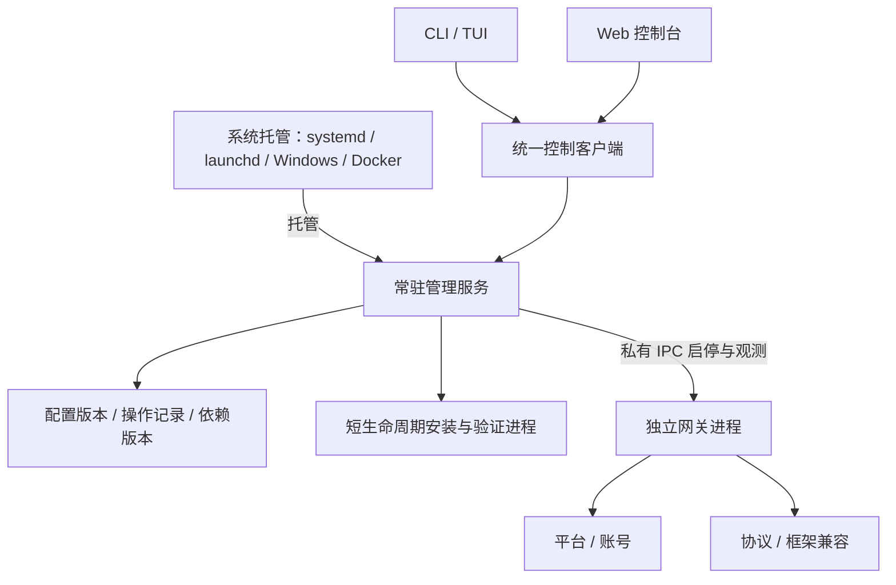
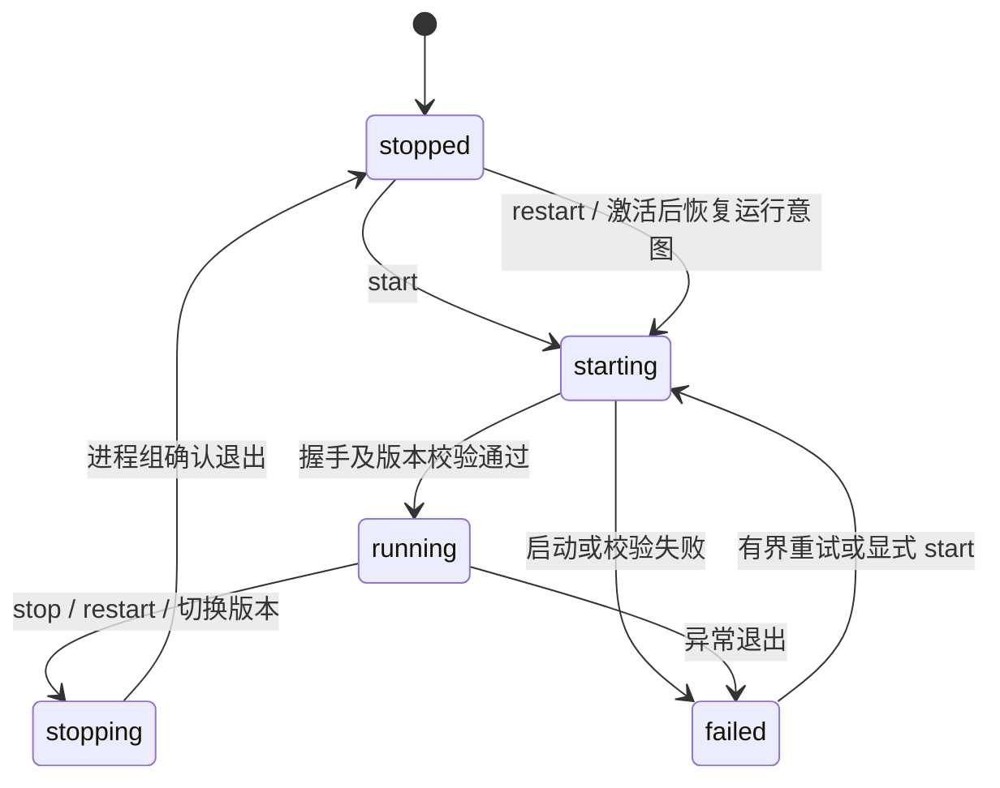

# OneBots 服务架构重构方案

状态：工程实现、系统托管验收和发布文档已完成。工作分支 `codex/service-architecture`，当前状态更新于 2026-09-10。基线整体验证 [`34461333108`](https://github.com/lc-cn/onebots/actions/runs/34461333108) 的全部 job 已通过；发布以 PR 当前提交的 required checks 为最终依据。下表区分已完成能力和仍需真实环境补充的证据。

| 阶段 | 当前状态 | 已有权威证据 | 收口前仍需完成 |
| --- | --- | --- | --- |
| 1. 控制契约与空白启动 | 已完成 | 最终 run 覆盖 Web/CLI/TUI、空白 Docker 管理端、设备配对、独立网关启停、跨入口恢复和容器重启后保留停止意图 | 物理机重启仍需单独实机验证 |
| 2. 依赖版本与凭据流程 | 已完成 | 最终 run 证明当前宿主、Mock、协议工件和 ICQQ 私有必需 peer 均走精确版本安装、授权拒绝、凭据清理、候选验证和显式激活；扩展移除也通过新候选运行版本完成 | 真实平台账号的安装后登录与运行仍需单独验证 |
| 3. 配置与客户端统一 | 已完成 | Web/CLI/TUI 共享 `ControlClient`、版本冲突和持久操作语义；动态 Schema、配置草稿、损坏配置修复、控制日志及 Web 高风险写入阻断已覆盖，安装后的 Web 工件由真实 Chromium 驱动验收 | 无工程留项 |
| 4. 系统托管与迁移 | 已完成 | systemd、launchd 和 Windows SCM 原生生命周期全部通过；验收覆盖旧服务迁移、候选管理程序升级、故障回退、冷启动恢复、停止与卸载，Windows named pipe 与 ACL 由原生宿主验证 | 物理机重启仍未验证 |
| 5. 产品验收与清理 | 已完成 | 受管协议回归覆盖根目录全部 21 个协议套件，12 个框架使用真实框架进程实跑；旧 `App`、旧服务控制器、旧运行入口和旧扩展安装器已删除；README、文档、常规 CI、Docker linux/amd64 和 Cloudflare Pages 均纳入发布门禁 | 真实外部平台账号证据另行补充 |

## 1. 目标与明确决策

OneBots 是完整的自托管产品。安装、配置、平台接入、协议输出、框架兼容、启停、升级和修复应在同一套产品模型中完成。

采用 **常驻管理服务 + 独立网关进程 + 系统托管 + CLI/TUI/Web 客户端**。停止或损坏网关，不得导致管理端不可用。允许替换现有内部架构；不长期保留两套安装器、配置写入者或进程控制器。

用户侧仍只有一个 `onebots` 命令、一套 Web 控制台、一个 Docker 容器。内部模块划分不要求用户分别安装多个产品。继续开源完整自托管能力，不引入云端控制台、计费或多租户作为前提。

确定以下产品行为：

1. Docker 空数据卷直接启动，Web 可访问；网关可空载运行，平台、账号、协议、框架选择均为空。
2. 用户无需先运行宿主脚本。CLI、TUI、Web 都能完成扩展安装、配置、应用与故障恢复。
3. 平台凭据和协议连接由用户填写；Schema 提供字段、校验和有意义的选项，不生成虚构账号或强制启用某协议。
4. 网关停止后，Web 仍能编辑配置、安装依赖并再次启动网关。
5. 系统托管维护管理服务，管理服务独占网关的生命周期；两者不同时争抢网关进程。
6. 安装、启用、配置、启动是不同操作。安装包不会擅自打开平台连接或协议出口。
7. 必需 peer 与宿主运行时一起解析和验证，不能把“npm 返回成功”当成可启动。
8. 所有发版仍使用 **patch**。内部破坏性重构不借机改成 minor/major，也不新增自动版本等级校验。

## 2. 旧入口清理当前态

| 范围 | 当前态 | 保留边界 |
| --- | --- | --- |
| 旧 `App` 与 Web 宿主 | 公开构造和旧管理路由已删除，管理服务是唯一控制宿主 | 协议与账号业务仍由独立网关承载 |
| 旧运行入口 | `-r/-p/-t`、`--service-runtime` 与直接启动旧 App 的公开路径已删除 | 旧参数只在历史服务定义解析中用于迁移和回退取证 |
| 旧服务控制 | install/start/stop/restart/status/logs/uninstall 已统一到管理服务与系统托管 | `LegacyServiceInspection` 只读旧定义和状态，不暴露生命周期写操作 |
| 旧扩展安装 | 活动目录原位安装已删除，依赖通过候选运行版本安装、验证和显式激活 | 私有下载凭据仅属于单次安装操作 |
| 容器专用监督与配置种子 | Docker 只运行常驻管理服务，空卷不预选扩展或账号 | 容器入口只处理卷权限、信号和管理服务启动，不复制示例业务配置 |

迁移读取器和历史服务定义是现有安装的只读取证，不是可执行回退入口。CLI、TUI 与 Web 统一写入管理服务；系统托管和 Docker 只维护管理进程，独立网关始终由管理服务控制。

## 3. 进程与模块职责



### 管理服务

承载 Web、鉴权、控制接口、配置草稿、扩展目录、安装操作、日志、状态、网关生命周期和恢复。管理服务自身不导入平台 SDK、协议插件或框架扩展，不依赖插件注册表才能启动。

只有管理服务可以提交配置版本、激活依赖版本和改变网关期望状态。配置损坏时进入可诊断的恢复界面，不能跟着网关一起启动失败。

### 网关进程

保留 Adapter → Account/ID → Protocol/Application 的业务模型，以及原始 ID 类型契约、平台事件和开放协议报文契约。只消费管理服务交付的明确运行版本和配置快照，负责接入、转发、账号生命周期与协议连接。

网关不执行包管理器，不修改系统服务定义，不保存管理凭据，不写管理服务的状态库，也不递归拉起自己。网关报告启动握手、配置版本、依赖版本、进程实例、账号状态和退出原因。

### 系统托管

systemd、launchd、Windows 托管或 Docker 只负责管理服务的存活和开机启动。管理服务内部的同一生命周期实现负责网关，Docker 不再单独实现一套网关退出码循环。

本机默认用户级服务；`--system` 明确安装系统级服务。提权仅用于安装/卸载系统定义，不让 Web 或网关以管理员身份运行。Docker 使用前台管理服务作为容器主程序，转发终止信号、回收子进程，不安装 systemd，也不挂载 Docker socket。

### CLI、TUI、Web

它们是同一控制接口的不同客户端。终端向导只是交互形式，不拥有自己的安装事务或配置保存机制。所有入口使用同一目录、Schema、安装计划、错误码、操作状态和修复建议。

系统服务的首次安装/卸载属于 CLI 引导职责；管理服务未启动时，CLI 可通过系统托管接口启动它，再连接控制接口，不能退回另一套直接修改网关的路径。

## 4. 用户命令与控制契约

下表定义公开命令的产品语义；实现状态与验收边界以上文状态表为准。

| 命令/操作 | 唯一含义 |
| --- | --- |
| `onebots install` | 引导安装完整产品和系统托管；允许空白安装，选择扩展时复用统一安装计划 |
| `onebots uninstall` | 停止进程、移除系统托管，默认保留账号数据和配置；清除数据必须显式选择 |
| `onebots start / stop / restart` | 通过系统托管启动、停止或重启管理服务；保留网关期望状态 |
| `onebots status` | 分别显示管理服务、网关期望/实际状态、账号状态和进行中操作 |
| `onebots ui` | 连接管理服务的 TUI 工作台 |
| `onebots extensions install / remove` | 安装或移除依赖版本，不隐式连接账号；被引用依赖不可直接删除 |
| `onebots config validate / apply` | 校验草稿、提交并应用配置，明确是否需要切换网关 |
| `onebots logs` | 读取系统托管的管理服务日志；网关和操作日志由 `onebots control logs` 查询 |
| `onebots control start / stop / restart` | 连接管理服务并改变网关状态；停止网关不关闭管理服务和 Web |
| `onebots serve / run` | 前台运行同一管理服务，供 Docker、系统托管和开发使用；非交互无命令启动使用相同入口 |

公开前台入口只接受工作区与管理监听参数，不再用 `-c/-r/-p/-t` 直接启动旧网关。扩展选择与账号配置由管理端保存；旧系统服务先执行 `migrate`。HF 同样启动管理服务，不再运行旧扩展恢复安装器。公开 CLI 已拒绝 `--service-runtime`，`App/createOnebots` 也不再导出；旧参数只保留在历史服务定义解析中，作为迁移和回退证据，不再形成可执行入口。

开发入口 `pnpm dev` 已统一为当前开发工作区的管理服务。网关共享的默认值合并、协议默认值注册与扩展加载使用独立运行时注册表；五个协议使用 `registerProtocolDefaults`。`mcp` 经私有控制连接访问现有网关，`send` 使用管理发送操作和结果查询，`update` 进入管理服务的运行代升级流程；三者均不读取旧管理凭据或启动旧 App。

控制接口分为状态查询、计划预检、提交操作、查询/订阅操作结果。写操作返回 `operationId`，不能把受理成功写成安装成功或重启成功。请求包含幂等键和期望配置版本；幂等键重复但内容不同必须拒绝。

本地 CLI 使用私有 Unix socket / Windows named pipe，并校验操作系统访问权限。Web 使用鉴权后的 HTTP 与事件流。远程 CLI 显式配置地址与认证。外部 HTTP 与本地 IPC 是同一管理模块的传输实现，不维护两套业务语义。

管理服务与网关使用父子进程私有 IPC，带协议版本、管理实例和网关实例标识；不开放无鉴权 TCP 控制端口。系统服务安装/卸载不暴露为远程 Web 提权功能。

## 5. 端口、入口和健康状态

默认继续使用一个对外端口 `6727`，避免要求用户重配多套端口。

- 管理服务持有公共入口：Web、管理接口、健康检查和公共静态校验文件。
- 网关的 HTTP/WS 入口只监听私有本地地址。管理入口向当前网关转发平台回调和协议流量，保留现有外部路径。
- 代理目标由当前网关握手确定，不能由外部请求指定。管理路径保留，不允许插件覆盖。
- 原始请求体、签名所需头、查询参数、上传、SSE、WebSocket、背压与断连必须完整验证。不能解析后重新序列化平台签名报文。
- 反向 WS、Webhook 等出站连接仍归网关。网关退出时关闭旧连接；下一实例不能与旧实例同时登录同一账号。
- 网关不可用时，协议入口给出明确的暂不可用响应，不能返回 Web HTML 或假的协议成功。

健康状态分开：管理服务可用、网关可用、平台账号在线。空白安装和用户主动停止网关时，容器管理健康检查仍通过；网关崩溃必须在状态界面和告警中显式呈现。不能为重启某个账号而使整个控制台消失。

系统操作的恢复门禁也单独报告：即使管理服务及网关仍在线，未完成或损坏的系统操作记录仍须明确提示待对账。状态查询只读，不通过创建日志实例触发冷恢复，不读取迁移备份中的私有正文。

首次管理认证采用本地受权限保护的初始化入口：本机 CLI/TUI 可申请配对码授权浏览器；Docker 用户可通过 `docker exec <容器> onebots auth bootstrap` 获取短时、单次的配对码，再在 Web 完成初始化。本地入口必须验证调用身份。配对码不写容器日志、不进入 URL，必须原子消费、限流并过期失效；初始化完成后不能再次无条件重置认证。初始管理接口不得因“尚未配置”而免鉴权开放。

管理认证保存在独立的私有控制目录，不随网关配置传递。Web 只保留设备码配对与浏览器会话，不再提供旧用户名/密码或根级管理 `access_token` 登录。设备码只用于短时授权，不能作为长期凭据；会话需支持退出、撤销及本机恢复授权。迁移只移除合法旧配置根级的 `username`、`password`、`access_token`，不沿用这些旧凭据创建新会话，不递归删除平台密钥或协议鉴权字段。损坏 YAML 保留原始字节，由显式修复流程处理；配置导出默认脱敏。远程用户不应为了首次登录先编写一份平台配置。控制台退出登录必须请求管理服务持久撤销当前会话，确认成功后才清除本地凭据；通信失败不能显示撤销成功。另设明确的“清除本地凭据”，只处理浏览器存储，不能冒充服务端退出。退出后仍通过本机恢复码重新授权，不重新开放首次初始化。

## 6. 生命周期与持久化状态

网关期望状态只包含 `running` / `stopped`；实际状态包含 `starting`、`running`、`stopping`、`stopped`、`failed`。两者分别存储和显示。



- 显式停止先持久化 `stopped` 再停机，管理服务或容器重启后不应偷偷启动账号。
- 显式启动先校验已选运行版本，取得工作区独占权，再创建子进程；同一工作区不得重复启动。
- 重启是一次有记录的停止与启动事务，收到新实例握手并验证配置/依赖版本后才宣告成功。
- 正常停止等待资源释放；超时按受管进程组终止，不能按一个可能复用的旧 PID 杀进程。
- 异常退出按有界退避恢复；超过阈值进入 `failed`，控制台继续运行，避免无限崩溃循环。
- 管理服务重启后从持久化记录恢复期望状态、对账未完成操作。结果不明时先核实，不能直接重放安装或重复启动。
- 管理服务终止时停止并回收网关与安装子进程。各操作系统分别验证父进程退出、强杀与重启后的孤儿进程处理。

持久化放在一个工作区：配置版本、运行数据、不可变依赖版本、操作日志和本地认证材料。操作日志先落盘再产生外部效果；小规模单实例先采用受锁保护的原子文件记录，避免为控制面引入数据库服务。需要多记录原子性时通过提交指针和恢复流程保证，不把多次写文件当成事务。

配置只允许管理服务提交。手工编辑文件视为待导入的外部变更，经过同一预检，不自动覆盖运行快照。启动采用固定快照；保留“已保存”和“已应用”的区别。

## 7. 统一安装和运行版本

安装流程统一为：

```text
选择平台/协议/框架 → 展示依赖与必需 peer → 填写必要授权 → 确认计划
→ 下载到候选目录 → 清除下载凭据 → 校验与加载预检 → 标记可用版本
→ 展示该版本 Schema → 用户填写账号与协议 → 明确应用 → 切换网关
```

依赖状态至少区分 `available`、`installing`、`installed`、`selected`、`active`、`failed`。选中包、安装完成、配置已保存、实例已生效不能混为一个“已启用”。未配置 Bot 也必须能查看适配器能力清单。

每个依赖版本包含匹配的网关宿主、唯一 `onebots`/`@onebots/core` 身份、扩展、必需 peer、锁文件和验证记录。网关从该版本自己的入口启动，不能用镜像 A 的宿主去加载安装目录 B 的另一份宿主。

验证至少覆盖：准确版本、包身份、peer 满足、宿主单例、ESM 加载、注册成功、Schema 与配置一致。包管理器退出成功只代表下载步骤结束。控制面永远不加载候选插件来生成表单；使用版本化声明式元数据，必要的动态探测交给短生命周期验证进程。

候选版本激活必须在唯一生命周期队列内，用候选宿主验证当前配置，即使网关已停止也不可跳过。安装收据只证明依赖可加载，不能替代配置兼容性验证。停止前与指针切换前复核配置摘要及候选收据；验证失败不得改变活动版本，停止后的变更则保守进入对账门禁。

禁止修改活动依赖目录。下载失败直接废弃候选版本；激活失败恢复先前运行版本与配置指针。真实数据库、聊天记录和平台会话不随依赖回滚删除，也不能承诺撤销已经发送的平台消息。

第一次安装没有旧版本：失败后管理端继续运行、保留错误和用户草稿，不能虚构“回滚成功”。下载中断可重试下载，激活结果未知必须先对账。删除依赖使用同样的候选版本机制，不原地卸载运行中的包。

更新管理程序本身与更新网关依赖分开：Docker 由用户更新镜像；本机由 CLI 和系统托管配合替换管理程序。Web 不让运行中的管理进程对自身执行 `npm update`。

## 8. 私有依赖与凭据

私有包也由 CLI/TUI/Web 提交同一种安装操作；宿主脚本不再是唯一必经入口。Web 使用 HTTPS 或可信的本地隧道提交下载授权，不通过 URL、命令行参数或日志传递 Token。

信任角色明确：管理服务是用户授权的控制面，可以短暂接收下载凭据；网关和平台插件不应收到下载凭据。安装器只接收本次下载需要的授权，使用范围受限的临时凭据通道。下载阶段禁用生命周期脚本，完成后终止下载进程、清除临时认证材料，再启动不携带凭据的验证进程。失败、取消和控制服务恢复都要清理临时文件。

不把 Token 放进镜像层、依赖版本清单、配置导出、操作记录或运行时环境。需要跨重启重试时重新输入授权，默认不长期保存私有仓库凭据。原生模块需要构建时，在无下载凭据的独立构建阶段执行；缺少构建依赖应明确失败，不能标记已完成。

**安全承诺的限制**：普通子进程和清空环境变量不是安全沙箱。同一用户身份下的恶意已安装代码可能读取同用户文件或进程信息。默认产品面向用户信任的扩展，保证凭据生命周期与不意外传播；不能宣称抵御恶意同权限插件。强隔离需要不同系统身份、ACL/容器隔离及网络限制的实际实现，并通过对应环境验证，不能用 `--network` 字样或环境变量代替。

控制面不暴露任意 shell、任意下载地址或任意 npm 包执行接口。可信扩展目录、安装版本、依赖计划与已有鉴权/并发保护继续保留。

## 9. 源码组织与删除清单

先在现有发布包内保持清晰的逻辑边界，避免为了目录外形拆出一批 npm 包。当前主要边界为：

```text
packages/onebots/src/
  control/       # 常驻宿主、工作区状态、配置提交、操作调度
  gateway/       # 网关子进程入口、IPC、生命周期
  installation/  # 计划、候选依赖版本、下载、验证、激活与恢复
  configuration/ # Schema、草稿、校验与配置应用
  verification/  # 候选和运行环境的隔离验证
  manager-runtime/ # 管理程序运行工件
  client/        # CLI/TUI/Web 共用的控制契约和客户端
  cli/ commands/ # 命令解析、系统托管和迁移入口
  tui/           # 终端交互
packages/web/    # 控制客户端的 Web 呈现
packages/core/   # 保留平台/协议/账号/ID 内核
```

共享契约不得依赖 `App`、平台 SDK 或 CLI 渲染框架。Web 可通过构建共享契约入口消费，无须引入服务器实现。只有出现真实独立发布/复用需求时才拆包。

替换或删除：

- `App.start()` 中的管理路由、Web 宿主及管理鉴权状态，迁移到管理模块。
- Web 通过网关 `process.exit(75)` 实现自重启的路径，改为统一生命周期操作。
- TUI、Web、Docker 分别直接执行安装、保存配置、切换进程的逻辑。
- Docker 入口中的固定插件参数、示例配置复制、等待用户脚本才启动的分支。
- 服务定义中重复存储插件选择，与配置不一致时的多套修补逻辑。
- 活动目录在线 `npm/pnpm install`、卸载后还原锁文件的补救流程。
- 独立的 Docker supervisor 实现；容器入口只托管管理服务。

保留并迁移已有价值：扩展可信目录、能力清单、Schema、原始 ID 契约、包身份检查、实例/配置版本前置条件、凭据脱敏、账号预检、跨平台系统服务安装权限检查。

## 10. 迁移与兼容策略

允许替换内部模块和管理接口，但必须公开迁移行为，不以 patch 版本掩盖风险。

- 保持 OneBot/Satori/Milky/MCP 等对外协议报文与连接路径；框架选择保留为配置概念，不再作为启动参数，也不强制开启其依赖协议，缺失时给出明确配置引导。
- CLI/Web 同批切换到新控制契约。版本不匹配应拒绝写操作并提示更新，不维护第二套旧控制器。
- 配置引入结构版本。识别旧 YAML，备份后单向导入；旧插件参数与 YAML 冲突时展示差异，不猜测丢弃。
- 迁移系统服务时先确认旧网关停止，再切换服务定义并验证新管理端；失败恢复原服务定义。账号不能双开。
- 原账号数据库、ID 映射、媒体、密钥和登录态保留；不为了布局整齐重建 ID 或清空数据目录。
- 升级失败需要能恢复旧程序、配置和服务定义。回退到旧版本前检查数据格式兼容性，不承诺无条件降级。
- Docker/HF/1Panel/本机安装文档及生成的服务定义同时更新，旧安装脚本要么退役，要么仅调用新入口，不能继续拥有独立业务实现。

## 11. 分阶段交付与验收

五个阶段按依赖顺序推进，但最终只交付一套架构。分支内可以存在临时过渡代码；进入 `master` 前，被替代的运行入口、安装器、配置写入器和生命周期控制器必须删除。

| 阶段 | 稳定交付物 | 阶段验收 |
| --- | --- | --- |
| 1. 控制契约与空白启动 | 管理服务、独立网关、私有 IPC、统一状态和公共入口 | 空卷直接访问管理端；网关停止或崩溃后管理端在线；重启管理服务保持网关期望状态 |
| 2. 依赖版本与凭据流程 | 统一安装计划、不可变候选版本、必需 peer、私有下载和显式激活 | CLI/TUI/Web 使用同一计划；安装失败不破坏活动版本；凭据不进入运行环境、日志或工件 |
| 3. 配置与客户端统一 | 动态 Schema、草稿、校验、应用、操作与日志接口 | 未配置 Bot 也能查看能力；网关离线可编辑；三个客户端共享冲突、幂等和恢复语义 |
| 4. 系统托管与迁移 | systemd、launchd、Windows、Docker 托管和旧安装迁移 | 启停语义一致；管理服务重启保留意图；迁移不双开账号；失败可按持久证据恢复；物理机重启另做实机验收 |
| 5. 产品验收与清理 | 故障注入、部署验收、协议回归、文档、发布工件和旧实现删除 | 下列矩阵全部闭合；最终提交 CI 通过；所有变更集均为 patch |

### 11.1 产品验收矩阵

| 范围 | 必须证明的行为 | 合格证据 |
| --- | --- | --- |
| 空白安装 | 不选择平台、协议或框架也能启动并进入 Web；之后可从 Web 完成安装与配置 | 全新工作区或空数据卷上的实际进程与 HTTP 验收 |
| 多客户端一致性 | CLI、TUI、Web 读取同一状态并提交同类操作；并发写入遵守版本和幂等约束 | 跨入口集成测试和持久操作记录 |
| 生命周期 | 网关停止、崩溃或配置失败不影响管理服务；管理服务重启后按期望状态恢复 | 真实进程故障注入、重启和孤儿进程检查 |
| 依赖安装 | 公开包、私有包和必需 peer 使用精确版本；候选验证后才可激活；移除也生成新版本 | 实际包管理器、候选加载、失败回退和凭据清理证据 |
| 配置 | Schema、草稿、秘密字段、校验、应用和损坏配置修复使用同一事务边界 | CLI/TUI/Web 集成测试及中断恢复测试 |
| 数据契约 | 账号数据、原始 ID 类型、ID 映射、登录态和外部协议报文保持兼容 | 升级前后数据快照及全部协议回归 |
| 网络入口 | 平台签名原始体、上传、HTTP、WS、反向 WS、SSE、Webhook 和鉴权均可工作 | 受管网关端到端协议测试 |
| 系统托管 | Linux、macOS、Windows 和 Docker 的安装、启停、重启、卸载与失败恢复符合相同语义 | 对应平台上的原生服务或容器实测；模拟驱动不能替代 |
| 旧安装迁移 | 原定义和配置先备份；账号不双开；中断后可对账或显式回退；数据不丢失 | 真实旧服务迁移和各关键阶段故障注入 |
| 发布边界 | 源码构建、测试、npm tarball、镜像、文档和最终提交 CI 分别通过 | 与最终提交一致的工件和 CI；CI 通过不等于已经发布 |

### 11.2 证据规则

- 单元测试证明模块规则，集成测试证明组件协作；两者不能替代原生系统服务、真实容器或真实平台账号证据。
- 每项证据必须绑定明确提交、工件版本和运行环境。早期提交的成功不能自动覆盖后续改动。
- 结果未知的外部效果保持待对账，不通过重试制造“成功”。测试跳过、无权限或无可用环境必须明确记录为未验证。
- 基线整体验证 run [`34461333108`](https://github.com/lc-cn/onebots/actions/runs/34461333108) 已覆盖综合验收、Windows SCM、systemd、launchd 和全部框架互操作 job；同一提交的[常规 CI](https://github.com/lc-cn/onebots/actions/runs/34461338319)、[Docker linux/amd64 构建](https://github.com/lc-cn/onebots/actions/runs/34461338375)与 Cloudflare Pages 检查也已通过。Windows 空白安装器的成功、幂等、凭据隔离和失败保留路径已加入同一服务架构工作流；最终发布证据必须使用 PR 当前提交的实际结果，不能沿用基线结果。
- GitHub 托管 runner 能证明原生服务安装、迁移、进程异常后的服务管理器冷启动恢复、停止和卸载，但没有执行宿主操作系统的物理重启。Docker 重启也不能替代这项证据。
- Mock、协议工件、ICQQ 私有必需 peer 和真实框架进程的验收不能证明真实外部平台账号已成功登录。真实账号安装后登录、事件接收和协议输出仍是环境验收留项，不应在 CI 结果中推断为通过。
- 工程实现、自动化验收定义和仓库首页已闭合；最终发布审计通过后才可进入 `master`。物理机重启和真实外部账号的未验证边界仍须保留在发布说明中。
