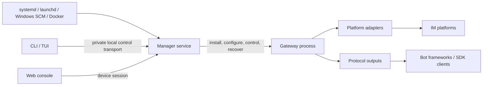
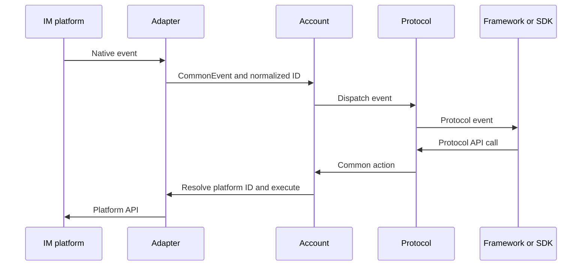

# OneBots runtime architecture

OneBots consists of a persistent manager process, a separate gateway process, an operating-system service, and management clients. Platform accounts and protocol outputs run only in the gateway. The manager remains available when the gateway is stopped, configuration is damaged, or an extension candidate fails verification.

## Process and control boundaries

- The **system service** starts, stops, and recovers the manager. `onebots install/start/stop/restart/status/logs/uninstall` control this service; add `--system` for a system-wide installation.
- The **manager** owns installation, configuration, authentication, logs, and gateway lifecycle. Operations with external effects are persisted. If a result is unknown, query or recover the original operation ID instead of dispatching another operation.
- The **gateway** loads the activated adapters, protocols, and framework extensions, connects platform accounts, and exposes protocol endpoints. Gateway controls in TUI or Web do not stop the manager.
- **CLI, TUI, and Web** use the same manager API. They do not keep separate configuration copies or replace live dependencies directly.

Foreground and container deployments run `onebots serve --data-dir <workspace>`. Native Linux and macOS service hosting uses `onebots install --data-dir <workspace>` followed by `onebots start`; migrate an existing legacy service with `onebots migrate` first. Windows uses `install.ps1` for blank bootstrap and provides the same manager lifecycle through its SCM host, named-pipe transport, and ACLs. Bootstrap and full lifecycle acceptance run in Windows CI.

## Authentication and configuration

The Web console pairs with a one-time device code and then uses a revocable device session. Root-level `username`, `password`, or a management `access_token` are not current manager login settings. Protocol-specific access tokens still protect their OneBot, Milky, Satori, or MCP connections.

The manager reads, validates, and applies business configuration. Web and TUI save and validate a draft before explicitly applying it; do not write `config.yaml` directly as a runtime control mechanism. An empty workspace can run the manager without any platform, protocol, or framework selection.

## Gateway data flow

- An **Adapter** owns a platform connection, normalizes events, and executes platform actions.
- An **Account** maintains account state, unified ID mapping, and event distribution.
- A **Protocol** exposes OneBot v11/v12, Satori, Milky, or MCP over supported HTTP, WebSocket, Webhook, and SSE transports.
- A **framework extension** adds compatibility APIs and connection guidance for a registered protocol. Selecting a framework does not implicitly enable a protocol or account.

## Extension installation

An installation plan resolves adapters, protocols, framework extensions, and required peers together. Downloading creates a candidate runtime. A later gateway instance loads it only after verification and explicit activation. Private registry authorization is scoped to that installation and is not stored in business configuration or passed to the long-running gateway.

Implement and register an Adapter for a new platform, a Protocol for a new output, or an Application for framework compatibility. See [Solutions](/en/solution/), [Quick start](/en/guide/start), and [Production deployment](/en/guide/production) for setup and troubleshooting.
