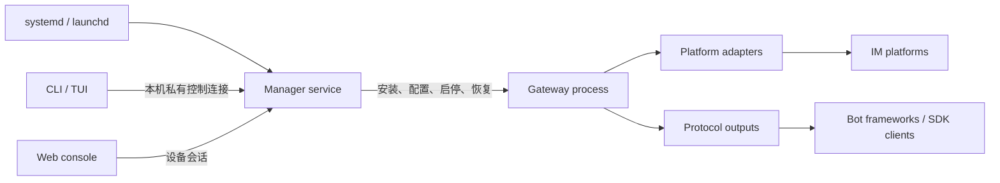
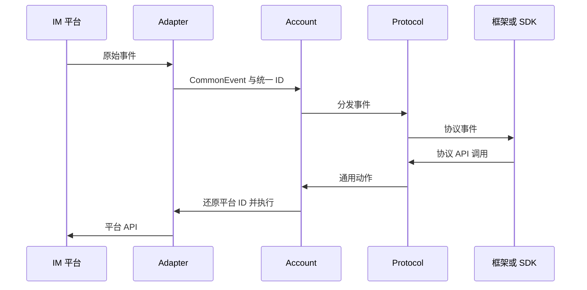

# OneBots 运行架构

OneBots 由常驻管理进程、独立网关进程、操作系统服务和管理客户端组成。平台账号与协议出口只在网关中运行；网关停止、配置损坏或扩展验证失败时，管理端仍可用于诊断和修复。

## 进程与控制边界

- **系统服务**只维护管理进程的启动、停止和异常恢复。`onebots install/start/stop/restart/status/logs/uninstall` 操作的是这项服务；系统级安装增加 `--system`。
- **管理进程**持有安装、配置、认证、日志和网关生命周期的控制权，并把有外部副作用的操作写入持久记录。命令结果未知时，使用原操作 ID 查询或恢复，不创建新操作盲重试。
- **网关进程**加载已激活的适配器、协议和框架扩展，连接平台账号并暴露协议接口。TUI 与 Web 的网关启停不会关闭管理进程。
- **CLI、TUI 与 Web**共享管理服务 API。它们不会各自维护配置副本，也不会绕过管理服务直接替换运行依赖。

前台或容器部署使用 `onebots serve --data-dir <工作区>` 运行管理进程。Linux/macOS 原生系统托管先执行 `onebots install --data-dir <工作区>`，再执行 `onebots start`。这两个平台的已有旧服务必须先执行 `onebots migrate`。

Windows SCM 宿主与命名管道目前只提供受限基础。顶层 `install/start/stop/restart/migrate` 在恢复闭环和 Windows 实机验收完成前保持禁用；Windows 用户使用 Docker Desktop。

## 认证与配置

Web 管理端通过一次性设备码配对，配对后使用可撤销的设备会话。根级 `username`、`password` 或管理 `access_token` 不属于当前管理登录协议；协议内部的 `access_token` 仍用于保护对应的 OneBot、Milky、Satori 或 MCP 连接。

业务配置由管理服务读取、校验和应用。Web/TUI 先保存草稿并校验，再显式应用；不要在运行时直接写 `config.yaml` 作为控制手段。空工作区允许管理服务单独运行，不要求预装平台、协议或框架。

## 网关数据流

- **Adapter**负责平台连接、原始事件归一化和平台动作。
- **Account**维护账号状态、统一 ID 映射与事件分发。
- **Protocol**提供 OneBot v11/v12、Satori、Milky、MCP 等 HTTP、WebSocket、Webhook 或 SSE 接口。
- **框架扩展**补充已注册协议面向特定下游框架的兼容 API 与连接说明；选择框架不会隐式开启协议或账号。

## 扩展安装

安装计划同时解析适配器、协议、框架扩展及必需 peer。下载完成只得到候选运行版本；验证成功并显式激活后，后续网关实例才会加载它。私有 registry 授权只传给对应安装操作，不进入业务配置或长期网关环境。

新增平台实现并注册 Adapter；新增输出实现并注册 Protocol；框架兼容能力注册为 Application。面向下游的接入步骤见[解决方案](/solution/)，安装、配置和故障处理见[快速开始](/guide/start)、[工作台](/guide/tui)与[生产部署](/guide/production)。
